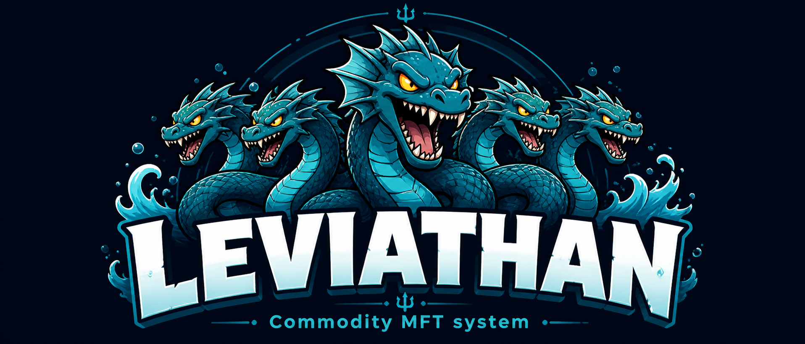

# Leviathan

<p align="center">
  
</p>

Leviathan is an AWS-native commodity data platform. It ingests weather and production data for agricultural commodities, transforms it through a medallion lakehouse (raw → bronze → silver), and prepares ML-ready datasets for crop yield modelling.

The first commodity is **cocoa** — 14 growing regions across 5 countries (Côte d'Ivoire, Ghana, Nigeria, Cameroon, Ecuador), with daily weather from 1981–2024 and annual production statistics from 1961–2023.

---

## Architecture

```
NASA POWER API ──┐                                         ┌─► Glue (raw→bronze) ──► S3 bronze/ ──► Glue (bronze→silver) ──┐
FAOSTAT bulk ───┘──► S3 raw/  ─────────────────────────────┤                                                               ▼
                                                            │                                                         S3 silver/
CHIRPS COG ──────────────────────────────────────────────────► Batch Fargate (→bronze) ──► S3 bronze/ ──► Batch (→silver) ──┘
                                                                                        (Athena / DuckDB ready)
CPC Soil Moisture ──► S3 raw/ ─────────────────────────────────► Batch Fargate (→bronze) ──► S3 bronze/
```

| Layer | Format | Partitioning | Contents |
|---|---|---|---|
| `raw/` | JSON (weather) / ZIP (FAOSTAT) | `source/commodity/country/region/year/month/` | API responses, unmodified |
| `bronze/` | Parquet (Snappy) | `source/commodity/country/region/year/month/` | Parsed, typed, no transformations |
| `silver/` | Parquet (Snappy) | `source/commodity/country/region/year/month/` | Cleaned, validated, ML-ready |

**Compute:**
- **Ingestion** — AWS Batch Fargate (parallel fan-out per region/year/month)
- **Transformation** — AWS Glue Python Shell (NASA POWER, FAOSTAT) and AWS Batch Fargate (CHIRPS, CPC Soil Moisture)
- **Querying** — Amazon Athena with Hive partitions registered in Glue Data Catalog

**Infrastructure** is fully managed by Terraform (`infra/terraform/`). Environments: `dev`, `prod`.

---

## Repository layout

```
configs/
  commodities/        # Per-commodity modelling config (targets, grain, sources)
  geographies/        # Region definitions with lat/lon coordinates
  sources/            # Source-specific config (NASA POWER parameters, FAOSTAT codes)

docker/
  leviathan_worker/   # Fargate container image for batch ingestion

infra/terraform/
  envs/dev|prod/      # Environment entrypoints
  modules/            # batch, cloudwatch, ecr, glue, iam, s3, secrets, step_functions

jobs/
  batch/              # AWS Batch Fargate task entrypoints (CHIRPS, CPC Soil Moisture)
  glue/               # Glue Python Shell scripts (NASA POWER, FAOSTAT; legacy for CHIRPS)
  ingest/             # Local ingestion scripts (NASA POWER, CONAB, FAOSTAT, etc.)
  orchestrate/        # Pipeline orchestration scripts
  submit/             # Batch job submission helpers
  submit_batch_*.py   # Top-level Batch submission scripts (CPC, CHIRPS)

src/leviathan/
  common/             # Logging, config loading
  ingestion/          # NASA POWER and FAOSTAT ingestion clients
  storage/            # S3 helpers, path builders
  transforms/         # raw→bronze and bronze→silver transform logic

sql/
  athena/             # DDL and query templates
  dbt/                # (Planned) dbt models for Snowflake serving layer

tests/
  unit/               # Transform and utility tests
  integration/        # End-to-end pipeline tests
  data_quality/       # Silver layer quality assertions
```

---

## Local setup

**Requirements:** Python 3.11+, AWS CLI configured, Terraform 1.5+

```bash
# 1. Clone and create virtual environment
git clone <repo-url>
cd Leviathan
python -m venv .venv

# 2. Activate
.venv\Scripts\activate          # Windows
source .venv/bin/activate       # macOS / Linux

# 3. Install the package in editable mode
pip install -e .
```

AWS credentials must have access to the S3 bucket, Glue, Batch, and Athena. The bucket name and region are configured in `infra/terraform/envs/dev/terraform.tfvars`.

---

## Infrastructure

```bash
cd infra/terraform/envs/dev
terraform init
terraform plan
terraform apply
```

This provisions: S3 bucket (versioned), IAM roles, ECR repository, Batch compute environment and job queue, Glue jobs, and CloudWatch log groups.

Glue scripts and the `leviathan` wheel are uploaded to S3 as `aws_s3_object` resources and re-deployed automatically on content change (`etag = filemd5(...)`).

---

## Running the pipeline

### 1. Ingest raw weather (NASA POWER)

Historical backfill via Batch Fargate (parallel, one task per region/year/month):

```bash
python jobs/submit/submit_batch_backfill_nasa_power.py --commodity cocoa --start-year 1981 --end-year 2024
```

The current ingest ceiling is **2024**.

### 2. Ingest raw production (FAOSTAT)

```bash
python jobs/upload_raw_faostat_qcl.py --file /path/to/Production_Crops_Livestock_E_All_Data_(Normalized).zip
```

Uploads the FAOSTAT QCL bulk export as a **single shared ZIP** to:
```
s3://…/raw/production/source=faostat/dataset=QCL/Production_Crops_Livestock_E_All_Data_Normalized.zip
```

All 31 commodities read from this one file. The Glue raw→bronze job receives a `--fao_item_name` argument (the exact FAO CSV "Item" string) and filters to only that crop's rows at runtime.

#### FAOSTAT derived product mapping

Several commodities traded on futures markets are processed products derived from a parent crop. Because FAOSTAT publishes primary crop production statistics (not meal/oil/refined volumes), these commodities are mapped to their parent crop's FAO item. The silver production table for each derived commodity will therefore reflect the **parent crop's area harvested, production quantity, and yield**.

| Commodity code | FAO item used | Relationship |
|---|---|---|
| `soybean_meal_cbot`, `soybean_meal_dce` | `Soya beans` | Meal is a soy crush by-product |
| `soybean_oil_cbot`, `soybean_oil_dce` | `Soya bean oil` | Direct FAO item (primary oil stats) |
| `rapeseed_oil_zce` | `Rapeseed or canola oil, crude` | Direct FAO item |
| `rapeseed_meal_zce` | `Rape or colza seed` | No separate FAO meal item; parent crop used |
| `white_sugar` | `Sugar cane` | Refined sugar; cane production used |

All mappings are defined in `configs/sources/faostat_item_map.yaml`.

### 3. Run Glue transform jobs

```bash
# raw → bronze
aws glue start-job-run --job-name leviathan-dev-raw-to-bronze-nasa-power
aws glue start-job-run --job-name leviathan-dev-raw-to-bronze-faostat

# bronze → silver
aws glue start-job-run --job-name leviathan-dev-bronze-to-silver-nasa-power
aws glue start-job-run --job-name leviathan-dev-bronze-to-silver-faostat
```

Jobs are idempotent — existing partitions are skipped unless `--force_overwrite true` is passed.

### 4. Validate

Run the generic Glue job checks or query the silver layer via Athena to validate shape, types, coverage, and ML join completeness.

---

## Current data state

Full data state is tracked in `currentstate.md` (gitignored). Summary as of May 2026:

- **31 commodities** across grains, oilseeds, and softs
- **NASA POWER** weather: backfilled 1981–present for all 31 commodities
- **CHIRPS v3** weather: backfilled 1981–present for all 31 commodities (bronze + silver complete)
- **CPC Soil Moisture**: raw backfilled 2000–2026; bronze backfill in progress
- **FAOSTAT QCL**: bronze + silver complete for all 31 commodities
- **Production sources** (CONAB, UNICA, MPOB, MPOC, FNC, USDA PSD/NASS/WASDE/WAP/GAIN): raw backfilled; bronze not yet built

---

## Building the leviathan package

The `leviathan` package is distributed as a wheel and bootstrapped into Glue at runtime:

```bash
pip install build
python -m build --wheel
# outputs dist/leviathan-0.1.0-py3-none-any.whl

aws s3 cp dist/leviathan-0.1.0-py3-none-any.whl \
  s3://<bucket>/glue-libs/leviathan-0.1.0-py3-none-any.whl
```

The wheel is also managed as a Terraform `aws_s3_object` resource and re-uploaded on content change.

---

## Adding a new commodity

1. Add `configs/commodities/<commodity>.yaml` — define targets, modelling grain, and sources.
2. Add `configs/geographies/<commodity>_regions.yaml` — define countries, regions, and coordinates.
3. Pass `--commodity <name>` to all Glue jobs and backfill scripts — the pipeline is parameterised throughout.
4. Update `MAX_INGEST_YEAR` in the relevant backfill script after validating the overlap window.