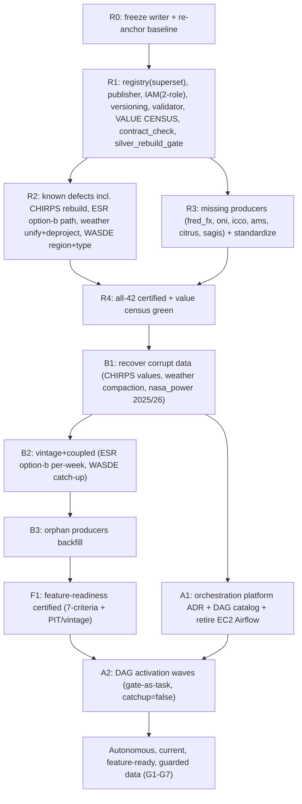

# The Ultimate Data Plan

## Document control

- **Status:** proposed end-to-end execution plan. No remediation, backfill, schedule activation, or production mutation is authorized merely by this document. Every user-gated action is enumerated in the "User-gated actions" section and must be separately approved.
- **Supersedes:** `docs/ops/SILVER_BACKFILL_READINESS_MASTER_PLAN.md` (1,465 lines, audit anchor `origin/main @ 0a10ef7c`, live audit 2026-07-10). That plan is the direct ancestor of this one; its good work packages are carried forward by reference and corrected where the ground has moved.
- **Audit anchor (this plan):** live `leviathan_dev` Glue / `leviathan-dev-shahem-001` S3 / Athena control-plane audit performed 2026-07-12 against worktree `C:\Users\User\AppData\Local\Temp\leviathan-e4-wt` branch `p65-impl` HEAD `02320643` (all Phase D commits landed: `788e0edc`, `07681d22`, `d0f46bfd`, `eb4236a5`, `023657f9`, `977465f9`, `38f7dc35`). Account `668891723125`, us-east-1. **Anchor drift (adversarial pass, both pipeline + consumer verifiers):** the worktree HEAD has since advanced +1 commit to `7cbbf58a` (`fix(eval): lock the lazy bge load`, an eval-only fix). Immaterial to every data/catalog claim below, but the `02320643` pin is one commit stale; re-verify against `7cbbf58a` when re-anchoring at F001.
- **Catalog boundary:** 42 live `silver_*` Glue external tables, plus one new gold consumer `gold_weather_z` created 2026-07-12 (Phase D `d0f46bfd`) that the original plan's 42-table boundary does not track. Forty-one non-ML silver tables require a reproducible rebuild/backfill path; `silver_model_predictions` receives catalog/test-isolation hygiene only.
- **Scope of ambition (the delta):** the original plan stops at *readiness* (R4) and defers backfill execution, Airflow activation, and feature-engineering readiness to "separately authorized" future programs. This plan carries the campaign all the way to the owner's real end-state: repaired data (including defects born upstream of bronze), caught-up-to-latest data, autonomous Airflow orchestration, feature-engineering-ready silver, full consumer-awareness of every change, deliberate query/partition/schema/Glue design, and permanent data-quality + schema contract tests. It reaches goals **G1-G7** (defined in the Acceptance section), not merely readiness.
- **Change policy:** platform primitives (Milestone R1) promote to `origin/main` and verify before dependent fixes begin. Per-table producer fixes (R2-R3) batch by source family behind a single shared CI gate rather than serializing 50 packages one-at-a-time (see Corrections C-BETTER-2).

---

## THE DELTA: how this plan supersedes the original

The original plan was correct in its bones -- one operational registry, generated DDLs, exact registered-partition publication, shadow-first writes, fail-closed test isolation, the LIST-storm doctrine -- and this plan keeps all of it. Three things changed:

1. **The audit moved.** The original pinned its numbers to the 2026-07-10 `origin/main @ 0a10ef7c` state. Between then and 2026-07-12, Phase D landed ~10 commits that partly built what the original proposed (ESR compact repoint, `week_ending_date` natural key, `publication_lag_days=7` guard) and independently surfaced defects the original never named (CHIRPS silver value all-NaN; `gold_weather_z` as a new live weather consumer; `silver_nasa_power` stale at 2024). A live 2026-07-12 re-census invalidated several specific counts. This plan re-anchors to `p65-impl` HEAD.

2. **The goal moved.** The owner's real end-state is not "readiness" -- it is clean, current, autonomously-orchestrated, feature-ready data with permanent guardrails. The original explicitly excludes backfill execution (L54-59), Airflow deployment (L59), and feature engineering (L63). This plan folds those in as first-class milestones (B1-B3, A1-A2, F1) because "readiness" delivers only the *capability*; a table can be certified `BACKFILL_READY` while shipping 100% NaN values (CHIRPS) or a single collapsed vintage (ESR).

3. **What Phase D already landed** (so this plan does not re-derive it):
   - ESR cert contract repointed `silver_esr` -> `silver_esr_compact` with `athena_mode=full` (`07681d22`); `week_ending_date` added to the ESR natural key; a real cert reconcile ran on `silver_esr_compact` (753,062 rows, 8/8 checks, `023657f9`) with a b2s freshness top-up from bronze `as_of=20260528` + pg-mirror reload.
   - ESR PIT v1: `publication_lag_days=7` RHS as-of shift + `_resolved_country()` single-source country-partition fix (`788e0edc`), living in the GraphRAG numbers-agent `TableSpec` (NOT the proposed `configs/silver/tables/*.yaml`, which does not exist).
   - `gold_weather_z` transform + Glue table + registry wiring + pg-mirror inclusion (`d0f46bfd`), built with no cloud run. It is now the sole weather serving surface; the cascade weather leg no longer reads `silver_nasa_power`.
   - `silver_esr`/`silver_wasde` deprojected from the sparse projection grids that caused the July 2026 $134 LIST storm to registered Glue partitions (370 / 461). These two are the *templates* for the endgame, not open problems.
   - Weekly ESR ingest scaffold (`usda_esr_fetch` Batch jobdef + DISABLED weekly EventBridge Scheduler), landing `raw/.../as_of=20260712/` with no bronze promotion.

---

## Executive outcome

This plan replaces the current collection of matching-but-fragmented DDLs, inconsistent writers, partially registered partitions, table-specific scripts, an orphaned producer estate, corrupt canonical data, an unorchestrated pipeline, and a consumer graph that only Phase-D-by-hand keeps in sync -- with one coherent system that takes raw sources all the way to feature-ready, autonomously-orchestrated, permanently-guarded silver.

At the terminal milestone the following are all true:
1. Every silver surface is schema-correct, path-correct, partition-correct, AND **value-correct** (no all-NaN column, no collapsed vintage, no parse-junk axis) -- proven by the canonical value census, which the original plan could not produce.
2. Every source has a deterministic, idempotent, bounded replay entrypoint, and every table has been **caught up to the latest available source release** (not merely made ready).
3. One operational registry generates DDL, validates writers, and **reconciles against the live numbers/cascade/feature consumers** rather than being a parallel authority they ignore.
4. Every silver change propagates to the pg mirror, cascade census, cascade map, config lints, and eval pins through one automated gate -- "consumer-sync-or-it-did-not-happen."
5. The storm-class projection tables are deprojected + compacted; query performance is gated on the existing planning-p95 + enumeration-cancel + cascade-zero-Athena machinery.
6. Autonomous Airflow (or the honest EventBridge+SFN equivalent) runs the whole pipeline with the quality gate as a blocking task, so the owner takes zero routine action.
7. Data-quality + schema + vocabulary + value contract tests are permanent regression guards in CI and in the DAGs.

## Baseline facts the plan must preserve (verified 2026-07-12)

- Canonical catalog count is 42 silver tables (+ gold_weather_z, a new consumer). Partition modes: 28 flat, 10 projected, 4 registered.
- Registered partition counts reconcile: `silver_esr` 370, `silver_esr_compact` 10, `silver_wasde` 461, `silver_model_predictions` 14 (up from the original's 12).
- 26 projection tables exist catalog-wide; 10 are silver; **three share the storm-class shape** (nasa_power, chirps, cpc_soil). ESR and WASDE -- the two that caused the July 2026 $134 storm -- are already deprojected to registered partitions; they are the templates.
- Bucket versioning is **Suspended** -- rollback cannot yet rely on prior object versions.
- `silver_esr_compact` is single-vintage (`as_of_date=20260528`, 753,062 rows); `silver_esr` is single-vintage (`as_of=20260524`).
- CHIRPS bronze is 100% real precipitation (re-ingested 2026-06-16); CHIRPS silver `value` is NaN wherever silver predates that bronze (written 2026-05-16) -- exact commodity scope is OP-1.
- `silver_nasa_power` silver ends at 2024 (WIDE); `silver_chirps` runs to 2026 (LONG). WASDE `region` axis carries a long tail of malformed **distinct** tokens (roughly a fifth-to-half of ~562 distinct values -- month-prefixed numeric concatenations, header/attribute leaks, single letters) that are only **~1-6% of ROWS** (top-15 regions by row count -- united_states, china, brazil, world, major_importers... -- are all legitimate and dominate row-weight). The draft's "~50% of rows junk / 261 distinct" was refuted by a live 52-partition / 72,780-row re-census (Attack 1, finding #1); the defect is distinct-value pollution, not a row-count majority. WASDE `attribute` is a clean 19-term snake_case vocabulary.
- The only enabled schedule is `leviathan-dev-morning-brief` (serving). `mwaa`/`stepfunctions` are empty. A dormant single-EC2 SQLite Airflow host exists, stopped by default.
- Six producers are orphaned: `fred_fx`/`oni` (full), `icco_cocoa`/`ams_cotton_quality`/`nass_citrus`/`sagis_cec`/`sagis_deliveries`/`sagis_weekly_exports` (half).

No automated change may recreate the sparse ESR/WASDE projected grids that caused the July 2026 storm.

## CORRECTIONS TO THE ORIGINAL PLAN

The owner explicitly asked for this section. Three parts: (a) claims the recon refuted or Phase D invalidated; (b) additions the original lacks versus G1-G7; (c) designs that are overweight, underweight, or mis-sequenced.

### (a) WRONG CLAIMS (each with the live 2026-07-12 evidence)

- **C-WRONG-1 -- "12 current Glue partition definitions" for `silver_model_predictions`** (original F003 L265). Live `get-partitions` = **14**. Grew +2 since 07-10. The prune plan's "12" is a moving target.
- **C-WRONG-2 -- "the six partitions whose locations use the placeholder `s3://bucket/...` path"** (F003 L267, F018 L484). Live = **8** placeholder partitions: `psd_production_anomaly/prediction_date=` for 2026-07-05..07-12, all pointing at literal `s3://bucket/...`. The 07-11 and 07-12 placeholders postdate the audit -- **a live daily writer is still minting one placeholder partition per day.** F003's "exactly six" prune plan is wrong on arrival and drifts +1/day. This is direct evidence that F002/F004 (test-isolation/kill-switch) are unexecuted and the pollution is ongoing.
- **C-WRONG-3 -- "silver_nasa_power ... the surviving projection table" (implicit in F021/F062 treatment).** FALSE. Live `get-tables ... projection.enabled` = **26 projection tables** (11 gold_*, 4 graphrag_*, 1 metadata, **10 silver_***). The 10 silver: chirps, cpc_soil, fgis, 3x fnc_colombia, nasa_power, nass_annual, nass_crop_progress, production. **Three share the exact storm-class shape** (enum commodity x injected country x injected region x integer-range year x integer month): `silver_nasa_power`, `silver_chirps`, `silver_cpc_soil`. nasa_power is unique only in being (a) still in the serving registry and (b) highest-fanout. The original's CHIRPS/CPC treatment as mere "F062 adapter" work misses that they are two loaded projection guns in the drawer.
- **C-WRONG-4 -- CHIRPS scope framing (F044 "stop unavailable-date scaffolding").** F044's premise is that CHIRPS's only defect is all-null files written for 404/not-yet-published dates. The real, larger defect (Phase D `977465f9`; confirmed by lanes B/C/D): the silver `value` column is **NaN on published historical dates** because the silver partitions were written 2026-05-16 from an older bronze vintage whose precipitation was null, and were **never rebuilt** after the bronze was re-ingested 2026-06-16 with real precipitation. Bronze is 100% real everywhere sampled (`precipitation_mm` 31/31 non-null). The current transform (`src/leviathan/transforms/bronze_to_silver/_weather_long.py:63` `dropna(subset=["value"])`) *cannot* emit NaN -- proving the on-S3 silver predates current code. F044 guards partition *existence*, never value *validity* inside partitions that legitimately exist. It leaves the real defect untouched. (Exact commodity blast radius is an OPEN PROBE -- see below.)
- **C-WRONG-5 -- ESR "second interpretation" framing (F030-F032).** The original proposes to *build* the ESR contract Phase D partly *already shipped*: compact is now the certified serving table, `week_ending_date` is in the natural key, `publication_lag_days=7` is live. F030-F032 must be re-baselined against `p65-impl` HEAD before spending effort, not authored against the 07-10 state.
- **C-WRONG-6 -- WASDE "int32/int64 fragment drift" (F033-F036 premise).** The fragment-vs-fragment drift was **resolved** by a single 2026-06-23T18:05-18:09 rebuild (all `silver_wasde` fragments now share a 21-column schema, `months_to_marketing_year_end=int64`, `marketing_year=string`). The **surviving** drift is Glue-catalog-vs-physical: Glue declares `months_to_marketing_year_end=int` (int32) while physical parquet is **int64** -- a genuine Athena read hazard on the exact column feeding revision timing. Also live -- **corrected by the adversarial pass (Attack 1, finding #1, CONFIRMED-BROKEN)**: the draft asserted the `region` axis is "~50% parse junk (261 distinct; 10,405/20,595 rows junk)." A live 52-partition even sample (1987-2026, 72,780 rows) refutes the magnitude: **562 distinct region values** (not 261 -- 261 was an artifact of the narrower 20,595-row sample), of which a fifth-to-half are malformed tokens (`i`, `item`, `february_0_30_4_58_0_62`, header/attribute leaks, numeric strings), but junk is only **~1-6% of ROWS** (the clear `>=2 underscore-separated numeric groups` signature is 0.6%; the loosest any-digit signal, which over-counts legit `eu_27`/`fsu_12`, is 5.8%; single-char and pure-numeric are ~0.0%). The top-15 regions by row count are all legitimate (united_states 7050, china 3841, brazil 3735, world 3681, major_importers 3588...) and dominate row-weight. So the defect is a **long tail of low-frequency malformed distinct values**, NOT a ~50%-of-rows corruption. The original's "bare month becomes region" (F033) is one instance of this distinct-value pollution. Caveat: a specific commodity/table_type subset the recon happened to sample may still be ~50% broken -- worth confirming before freezing the key -- but it is not true of the axis as a whole. Consequence for F033: the region-cleanliness gate must be calibrated on **distinct-value pollution + low row prevalence**, never a ~50%-of-rows floor (which would never trip and would misprioritize the fix).
- **C-WRONG-7 -- `silver_nasa_power` freshness.** New finding, not in the original: nasa_power silver **ends at 2024** -- no 2025/2026 partitions -- while chirps/cpc_soil/modis run to 2026. It feeds the largest weather fan-out (7 feature families), so the current and prior crop years have zero temperature-derived features across all 31 commodities. The original treats nasa_power as a schema-shape problem (F021) and never flags the coverage gap.
- **C-WRONG-8 -- fred_fx / oni "producer restoration" (F040 / F057).** The original assumes a producer exists to restore. Live estate audit: **no `fetch_fred*` exists at all**, no fred_fx bronze->silver module, no Batch task. Same for ONI: `fetch_noaa_iod.py` is IOD-only; there is **no** `fetch_noaa_oni` and **no** ONI bronze->silver module. Both `silver_fred_fx` and `silver_noaa_oni` are **orphan tables** -- consumed widely, produced by nothing in the tracked estate. F040/F057 must build a producer from scratch, not restore one. Likewise `icco_cocoa`, `ams_cotton_quality`, `nass_citrus`, `sagis_cec`, `sagis_deliveries`, `sagis_weekly_exports`: fetcher exists but **no bronze->silver transform** in the estate -- silver cannot be regenerated deterministically with tracked code today.
- **C-WRONG-9 -- the parallel registry omits the live consumer stack.** The original's registry (`configs/silver/tables/*.yaml`) is proposed as the single authority that generates DDL and validates writers (L101), but it never mentions the actual serving consumers: the numbers `TableSpec` (`configs/graphrag/numbers/tables.yaml`), `cascade_map.yaml`, the `cascade_census`, the in-VPC **pg mirror** (`load_pg_numbers.py`, `EVIDENCE_BACKEND=pg` default), `config_check`, or `numbers_parity`. A silver schema change certified under the original plan could silently desync the pg mirror (a stale mirror is masked by the per-request Athena fallback in `pgnumbers.py:54-71`, which only catches a *missing* mirror) or strand a census leg. Phase D changes these consumers *with* every silver edit (cert reconcile -> pg reload -> census flip in one commit); the original has no equivalent coupling.
- **C-WRONG-10 -- versioning (F017).** VERIFIED still true: `get-bucket-versioning leviathan-dev-shahem-001` = `Status: Suspended`. Rollback cannot currently rely on prior object versions. Kept unchanged.

**Claims the recon CONFIRMED (carried forward unchanged):** the canonical catalog count is 42; partition modes are 28 flat / 10 projected / 4 registered; S3/Glue partitions reconcile for esr (370) / esr_compact (10) / wasde (461); `run_athena_ddl.py` applies only 4 silver DDLs; `generate_silver_ddls.py` covers ~24 and infers from the first parquet file; 36 physical `canola_ice` parquets are hidden by the projection enum omission (F020); versioning suspended (above).

### (b) ADDITIONS (what the original lacks versus G1-G7)

- **C-ADD-1 (G1) -- no value-validity gate for existing canonical data.** The original fingerprints *schema* (footer types) and runs quality rules on *shadow/fixture* output only (L446: "validate only newly declared/written manifest objects incrementally"). `source_certification.py` checks column presence + `row_count >= expected_min_rows`, never the null-fraction or range of the measurement column (`SourceObservation` at `certification/source_certification.py:55-70` has no such field). **CHIRPS all-NaN certifies GREEN.** This plan adds a canonical **value census** (null-fraction, all-constant-column, sentinel-saturation per numeric column per table) as a hard R4 exit criterion (SILVER-V001) and a `value_nonnull` check in the certification contract (SILVER-V002).
- **C-ADD-2 (G1) -- no bronze/raw correctness workstream, and no freshness contract.** CHIRPS is a bronze->silver *staleness* defect: silver `ingest_date=2026-05-16` predates bronze `ingest_date=2026-06-16`, and the b2s runner skip-existing (`base_jobs.py:338-356`) silently declines to refresh. The original has no gate asserting `silver.ingest_date >= bronze.ingest_date`, and no bronze value-range validation. Added as SILVER-V002 (freshness contract) and SILVER-F045 (the CHIRPS repair itself).
- **C-ADD-3 (G2) -- backfill EXECUTION is deliberately excluded.** The original hard-stops at R4 and defers catch-up to "a separate user-authorized decision." That leaves the owner's real goal (current data) undelivered. It also under-specifies the seam: it never sizes how many tables carry wrong/NaN/stale canonical rows (CHIRPS all-NaN, ESR single-vintage, nasa_power 2024). This plan adds authorized backfill waves B1-B3, each gated and reconciled.
- **C-ADD-4 (G3) -- Airflow is deferred to interface-only, and the platform decision is dishonest about cost.** The original's Phase 10 front-loads a full MWAA-vs-self-managed ADR into a readiness campaign that runs no data task. This plan scopes, provisions, and *activates* the orchestration (A1-A2) with the honest three-way cost decision the recon produced: EventBridge Scheduler + Step Functions (~$0-5/mo, extends the pattern already live), MWAA (~$350-450/mo, delivers literal Airflow DAG UX), self-hosted Airflow (avoid). The owner asked for "Airflow DAGs"; the plan recommends accordingly but states the trade honestly.
- **C-ADD-5 (G4) -- feature-engineering readiness criteria are absent.** Feature engineering is out of scope in the original (L63), yet the platform's real consumers are the feature spine and the numbers agent. The original never states what "silver ready for feature engineering" means. Concrete cost: ESR retains one vintage (`as_of_date=20260528`), fine for latest-snapshot serving but fatal for point-in-time backtesting. This plan adds a per-source feature-readiness acceptance checklist (F1 / FR-001, seven criteria) and a vintage/PIT retention contract (INV-4).
- **C-ADD-6 (G5) -- no consumer-sync contract for the live serving stack.** The original omits the pg mirror, cascade_census, cascade_map, tables.yaml, config_check, and numbers_parity entirely. This plan institutionalizes the change-propagation pipeline as a first-class stage: the **`silver_rebuild_gate`** (SILVER-C001) chaining pg reload -> parity -> contract_check -> census --diff -> config_check -> eval-subset, and a `contract_check` module (SILVER-C002).
- **C-ADD-7 (G6) -- the projection endgame is under-scoped.** The original treats the weather trio as F062 adapter migrations. The recon shows they are the storm class (3 tables) *and* the lake's worst small-file offender. **Corrected magnitude (Attack 1, finding #2):** the draft's "~150-250k files" is the PER-TABLE count, not the trio total. Live `--summarize`: nasa_power **222,000** objects (2.82 GB), chirps **230,449** (1.55 GB), cpc_soil **133,774** (0.94 GB) -- **trio total ~590k tiny files**, ~2.3-3.9x above the stated ceiling, at ~9 KB blended avg (nasa_power alone ~12.7 KB, matching the "~12.6 KB" claim; chirps 6.7 KB, cpc_soil 7.0 KB), still ~4 orders of magnitude below a healthy parquet target. This UNDERSTATES the problem and strengthens the thesis, but the number is load-bearing for F047/BF-W1 compaction sizing. This plan adds explicit deproject+compact packages (SILVER-F047), immediate `nasa_power` quarantine from `tables.yaml` (config-only, near-zero cost), and the query-performance acceptance gates the recon extracted from the existing machinery.
- **C-ADD-8 (G7) -- contract tests are partial and shadow-only.** The original has strong structural contract tests but nothing catches "a producer silently emits all-NaN" or "a vintage collapsed to one snapshot." Added: the I1 registry-vs-physical-vocabulary contract test (SILVER-C002), the value-validity tier (SILVER-V001/V002), the producer-coverage contract test (would flag the fred_fx/oni/icco/sagis/ams/citrus orphans), and a conftest-level autouse AWS guard (the LIST-storm-in-tests tripwire the current suite lacks structurally).

### (c) BETTER APPROACHES (overweight / underweight / mis-sequenced)

- **C-BETTER-1 -- freeze the writer before the census.** The original runs F001 (all-42 census) before F002/F004 (test isolation / kill-switch). But `silver_model_predictions` placeholder partitions drift +1/day because a live writer is unpaused, so F003's "exactly six" is wrong on arrival. **Resequence: F004 (freeze) and F002 (isolation) FIRST, then F001 re-census** against a frozen writer and the `p65-impl` anchor.
- **C-BETTER-2 -- collapse the per-fix ceremony to milestone-level attestation.** The original's 12-step promotion gate + KMS-signed external attestation + separate evidence-only `E` commit + fencing tokens applied uniformly to ~50 packages is enterprise multi-tenant ceremony for a single-operator dev account. Keep branch protection + required CI + a just-in-time pre-mutation Glue/S3 snapshot per fix, and move the KMS-signed attestation to milestone boundaries (R1, R4, and each backfill-wave completion). This is the biggest schedule lever.
- **C-BETTER-3 -- two IAM roles, not five.** A read-only validator + a single gated deployer/publisher (with an explicit deny on canonical `silver/` roots until a signed approval flips it) delivers ~95% of the protection of the original's five-role design (validator, catalog-deployer, data-publisher, repair, readiness-canary) for one operator.
- **C-BETTER-4 -- registry as a superset that REFERENCES the numbers stack, not a parallel authority.** Build `configs/silver/tables/*.yaml` to reference and reconcile against `tables.yaml` / `cascade_map.yaml` / `source_contracts.yaml` / `features.yaml`, with a reconciliation lint that fails if `publication_lag`/PIT semantics diverge between the numbers `TableSpec` and the silver registry. Never mint a second source of truth the pg mirror ignores.
- **C-BETTER-5 -- defer the Airflow control-plane decision to post-first-backfill.** Deciding the production orchestrator before a single backfill has exercised the job interfaces is premature. Sequence A1-A2 after B1 proves the interfaces.
- **C-BETTER-6 -- deproject the whole weather trio together with the CHIRPS re-ingest (but NOT in a single force-overwrite pass).** Do nasa_power + chirps + cpc_soil together; do not deproject nasa_power in isolation and leave two loaded guns. **Corrected (Attack 2, finding #2):** re-ingesting chirps to fix the value column and compacting/deprojecting it are NOT the same write pass -- the current `bronze_to_silver_chirps_task.py` has only the projected month-grain writer, so a plain `--force-overwrite` fixes values but re-mints ~590k tiny files. F047 must first build a registered-compaction (within-year) writer and F045's rebuild must write through it; the two operations are sequenced, not conflated.
- **C-BETTER-7 -- loosen the strict serialization.** The original's "every atomic fix must reach `origin/main` before the next dependent fix" combined with the 12-step gate forces a near-fully-serial pipeline. Serialize only platform primitives (R1); batch per-table producers (R2-R3) by source family behind one shared CI gate.

---

## Non-negotiable invariants (priority-ordered)

These bind every package below. INV-1 and INV-2 are the owner's two dictated invariants, folded verbatim in spirit.

### INV-1 -- The semantic registry must never drift from the physical table vocabulary

**Requirement (owner-dictated I1, intact):** for every registry attribute/metric/slug/country string in any consumer config (`tables.yaml`, `cascade_map.yaml`, `source_contracts.yaml`, `features.yaml`, `node_silver_map`), a contract test asserts that string exists in the physical DISTINCT vocabulary of its table and, for tall tables, returns >= 1 row. Wide tables assert the string is a real Glue column (free, no scan). This is the single check that would have caught the WASDE Title-Case->snake_case bug (a prior `'Ending Stocks'` registry matched zero `ending_stocks` rows and every WASDE lookup silently returned "not yet published"), and the `drought_z`-declared-but-zero-rows drift.

**Mechanism -- corrected (Attack 3, finding #2, CONFIRMED-BROKEN).** The draft named ONE mechanism -- `_distinct_set` on the pg mirror -- for ALL of those configs. That is physically impossible: the pg mirror holds only 7 tables, so `features.yaml` sources (chirps, cpc_soil, modis_ndvi, cot, pink_sheet, sagis*, conab, mpob, futures, wap, fgis, nass_*, ams, unica...) and most `source_contracts.yaml`/`node_silver_map` entries are NOT reachable by it; and several of those feature sources are **projection** tables (fgis, nass_crop_progress, nass_annual, cpc_soil, 3x fnc_colombia, production) whose commodity axis is a projected partition column that INV-3 + `query.py:43-55` forbid DISTINCT/CAST against (the storm mechanism). The requirement holds; the mechanism **branches**:
- **Numbers / pg-served tables** (WASDE/ESR/PSD/weather-z/FX/ONI/production -- the tall tables that ARE in pg): `contract_check`'s `_distinct_set` against the pg mirror is cheap + safe. This is where drift classes A-H the plan actually lists are coverable and sound.
- **Feature-layer / flat / projection tables**: use **footer-derived distinct-value extraction on the feature layer's own S3 prefixes**, run inside the FR-001 feature-readiness harness (which already reads those prefixes) -- never the pg `contract_check`, never an Athena DISTINCT on a projected partition column. Projection-trio (nasa_power/chirps/cpc_soil) uses S3 footers only.

Institutionalized as `contract_check` (SILVER-C002, numbers subset) + the FR-001 footer-vocabulary check (feature subset), wired into CI and the DAGs. Priority: **highest** -- vocabulary drift is silent and corrupts answers.

### INV-2 -- Explicit writer schemas everywhere; partition metadata does not launder physical inconsistency

Every silver/gold parquet writer must pin an explicit `pyarrow` schema at the write step (int64 years, float64 measures, ISO-string dates, TEXT-with-`COLLATE "C"` for byte-order parity with Presto). pandas/pyarrow dtype inference must never differ across write eras. **Partition metadata tells you where files are; it does NOT make physically inconsistent files consistent** -- the int32/int64 fragment drift (`silver_production.year`), the Arrow-`null`-typed all-null columns (`silver_wasde`), and the Glue-vs-physical `months_to_marketing_year_end` mismatch all prove this. The `_WIDE` widen-to-int64-on-read shim (`load_pg_numbers.py:100-140`) is the **transition shim only**; it retires the moment every writer emits an explicit schema. Today exactly one explicit `pa.schema(...)` writer exists in the whole transform tree (`transforms/text_to_graphrag/writer.py:35-80`); every other writer is `df.to_parquet(...)` with inference. Priority: **highest** -- this is the class of bug that recurs silently.

### INV-3 -- LIST-storm doctrine

Never re-enable partition projection for `silver_esr` or `silver_wasde`. Never CAST a projected partition column (defeats pruning; the storm mechanism). The storm class is **three tables** (`silver_nasa_power`, `silver_chirps`, `silver_cpc_soil`), not one. Validate any deprojection only via `get-partitions` count + a single sargable Athena probe **on the registered table**, never a `start-query-execution` against a projection.* table. Hard gates: Athena planning-time **p95 < 3000 ms** (the projection-enumeration signature is 26,000-31,000 ms planning while scanning KBs); zero enumeration-class 180s cancels; the cascade serving path must issue **ZERO** Athena queries (`cascade_census` asserts `Q.STATS` empty end-to-end). A projection range such as `2035` is never evidence of physical data coverage.

### INV-4 -- PIT and vintage discipline

An absent source measure stays **null**; it is never synthesized as zero. Every table declares a `vintage_retention` policy in the registry: `latest-only` | `per-vintage` | `per-week`. The `+7d publication_lag_days` guard (Phase D `788e0edc`) is the correct interim PIT approximation and stays until per-week vintage lands. The weekly-ESR per-week landing (`raw/.../as_of=20260712/`) must be given a defined promotion path (SILVER-F031 / BF-W2). A table can be schema-clean and still PIT-useless (ESR single vintage) -- vintage adequacy is a named feature-readiness criterion (INV-5, FR-001).

### INV-5 -- Value-validity: schema-clean is not usable

A table is not "ready" until its measurement columns pass a **non-null-fraction floor** (per commodity, e.g. > 0.5) and a **range assertion** against source. Schema/path/partition/idempotency gates all pass on 100% NaN data (CHIRPS); the value census (SILVER-V001) and the certification `value_nonnull` check (SILVER-V002) are the gates that distinguish "present + certified" from "actually usable."

### INV-6 -- Shadow-first publication

New or rebuilt data lands in a run-scoped shadow prefix **outside every recursively scanned live table root** before validation; publication is an atomic pointer switch (flat active-release manifest, or registered-partition location swap by the repair path) after validation. The silver/bronze S3 writers currently have **no `--shadow-prefix` option** (replay writes in place, guarded only by skip-existing) -- SILVER-F015 adds it. A failed run never changes the current Glue pointer/partition and never deletes the last good object.

### INV-7 -- Fail-closed gates

Unit tests cannot mutate live AWS (default-deny AWS guard + autouse conftest credentials/network guard -- the current suite relies on per-author `@mock_aws` + fake bucket names, with no structural tripwire). Canonical publish requires a signed approval artifact bound to environment/table/registry-hash/git-SHA/expiry. Default `--publish-mode` is `dry-run`; readiness roles cannot select `canonical`. Fail-closed account-ID/bucket/database/prefix/role-ARN checks precede any AWS mutation.

### INV-8 -- Consumer-sync-or-it-did-not-happen

No silver change is complete until its downstream consumer graph is reconciled -- but "its consumer graph" differs by table class, so the gate **dispatches by consumer class** (corrected per Attack 3 finding #1; the draft's single fixed chain crashes on the ~34 feature-only tables). For a **numbers-registry / pg-served table**: pg mirror reloaded, `numbers_parity` clean, `contract_check` (INV-1 + value floor) green, `cascade_census --diff` shows no new un-waived DARK, `config_check` green, eval pins hold, serving image content-checked (never trust `:latest`). For a **feature-only table** (sole consumer = `extractors.py`): the feature-extractor probe (`probe_source` + `_check_contract`) passes, the value census (V001) passes, and `config_check` is green -- these tables are NEVER routed through `load_pg_numbers`/`numbers_parity` (which raise `KeyError`/`SystemExit(1)` on a non-registry table). This is the `silver_rebuild_gate` (SILVER-C001), fired automatically after every rebuild. `UNCERTIFIED_TABLES` (`cascade_census.py:61`) and `deferred:true` in `cascade_map.yaml` must land together or `check_cascade_map` fails closed.

### INV-9 -- origin/main promotion (lightened)

Every package promotes to `origin/main` behind branch protection + required CI, with a just-in-time pre-mutation Glue/S3 snapshot. Rollback is always a new revert/fix commit; never rewrite shared history. The KMS-signed external attestation is required at **milestone boundaries** (R1, R4, each backfill wave, each DAG activation wave), not on every metadata tweak.

---

## Target-state architecture

This plan is self-contained; the architecture the invariants assume is spelled out here so no reference to the original is required.

### Layer and code decoupling

Every pipeline separates: source adapter/fetch -> immutable Raw -> pure Raw-to-Bronze transform -> validated Bronze -> pure Bronze-to-Silver transform -> shadow Silver output -> contract + quality + **value** validation -> controlled publisher -> Glue partition/table verification -> Athena smoke + run manifest -> **silver_rebuild_gate (consumer sync)**. Orchestration (Airflow/EventBridge, later) invokes stable job interfaces and carries only small metadata -- never data frames or transformation logic.

```mermaid
flowchart LR
    A["Source adapter / fetch"] --> B["Immutable Raw"]
    B --> C["Pure Raw-to-Bronze transform"]
    C --> D["Validated Bronze"]
    D --> E["Pure Bronze-to-Silver transform (explicit pyarrow schema)"]
    E --> F["Shadow Silver output (--shadow-prefix)"]
    F --> G["Contract + quality + VALUE validation"]
    G --> H["Controlled publisher (atomic pointer switch)"]
    H --> I["Glue partition/table verification"]
    I --> J["Athena smoke + run manifest"]
    J --> K["silver_rebuild_gate: pg reload + parity + contract_check + census + config_check + eval"]
    L["Orchestration (later)"] -. invokes stable job interfaces .-> A
    L -. does not implement transforms .-> E
```



- Pure transforms accept bytes/data frames + explicit parameters and perform no AWS calls.
- Storage adapters own S3 reads/writes; catalog adapters own Glue operations.
- Jobs compose transforms + adapters through stable CLIs.
- All dates, run IDs, source snapshots, and output roots are explicit arguments; production logic must not depend on implicit `today()` for replay behavior (this is also the future-DAG requirement).

### Publication and rollback doctrine

- Every run receives `run_id`, `git_sha`, `schema_version`, input manifest/hash, row count, key statistics, schema fingerprint, output objects, status.
- New/rebuilt data first goes to a run-scoped shadow prefix **outside every recursively scanned live table root** (INV-6). Staging, candidates, backups, archives, manifests, and quarantined parquet never sit beneath a live flat-table location.
- The registry declares `location_mode=static` (must match Glue + generated DDL literally) or `location_mode=active_release` (an allowed versioned-location pattern + a signed active-release manifest; live Glue matches the manifest; recovery resolves the last certified manifest). This is the only allowed dynamic-location exception.
- A flat single-object table publishes with one atomic S3 PUT. A multi-object flat table uses the active-release model + one Glue location-pointer switch after validation. A projected table publishes one complete deterministic object per partition; versioning or a backup manifest provides rollback. A registered table writes + validates the object first, then creates/verifies the exact partition location, then runs a partition-filtered Athena smoke. Ordinary release partitions are immutable; correcting a location requires the repair capability + rollback plan.
- A failed run never changes the current Glue pointer/partition and never deletes the last good object. Automated catalog application may not issue `DROP TABLE` or destructive schema changes; breaking changes require a shadow table/version + explicit migration.

### Schema evolution

- Additive nullable columns are the default compatible evolution. Type narrowing, column removal/rename/reorder, partition-key changes, and semantic repurposing are breaking changes requiring an ADR, shadow build, dual-read/compatibility view where needed, consumer verification (the silver_rebuild_gate), and explicit rollback.
- Every physical parquet written after R1 must match the registry fingerprint; first-file inference is prohibited (INV-2). Existing heterogeneous data is certified by exhaustive footer fingerprinting in a bounded Batch job, cached once, then checked incrementally.

### Security and environment isolation

- Unit tests receive no production AWS credentials; network/AWS clients are denied unless explicitly mocked (INV-7, the autouse conftest guard SILVER-F002).
- Integration tests use a run-scoped database (`leviathan_ci_<run_id>`), a dedicated CI bucket/prefix, an isolated Athena workgroup/results prefix, and a short-lived role; a subprefix in the production bucket is insufficient.
- Two IAM roles (SILVER-F014): a read-only validator; a gated deployer/publisher with an explicit deny on canonical `silver/` roots until a signed approval flips it, and `UpdatePartition`/delete/prune behind an approval flag.
- Serving remains read-only; the shared Batch/serving role must not retain catalog mutation permissions. CloudTrail/CloudWatch record + alarm on unexpected Glue table/partition mutations.

## Milestones and hard stop gates

| Milestone | Result | Hard stop condition |
|---|---|---|
| **R0** -- Writer frozen, baseline re-anchored | Live writers paused; reproducible evidence + rollback snapshots exist at the `p65-impl` anchor | No Glue/S3/catalog mutation before R0; no census before the placeholder-minting writer is frozen |
| **R1** -- Platform coherent | Registry (superset), migration tool, shadow publisher, versioning, 2-role IAM, expanded validator, value census, contract_check, and the consumer-sync gate are merged | No table fix before its platform dependency is on `origin/main` |
| **R2** -- Known defects closed (incl. upstream-of-bronze) | Every named metadata/schema/parser/quality defect certified in shadow, including the CHIRPS silver rebuild, ESR option-b path, weather unification/deprojection, WASDE region + type repair | No full-table rebuild with an unfixed producer |
| **R3** -- Producers complete | Every non-ML table has a replayable producer (incl. the six orphans built from scratch); generated outputs catalog-clean | No table backfill-ready without a shadow replay |
| **R4** -- All-42 certified + value census green | One readiness bundle proves every table passes all gates INCLUDING the value census; consumer-sync gate green | **Authorization boundary for backfill execution** |
| **B1** -- Backfill wave 1 (recover corrupt data) | CHIRPS silver rebuilt (real values), weather trio deprojected+compacted, drought_z un-deferred, nasa_power 2025/2026 caught up | No wave 2 until wave 1 is reconciled and consumer-sync green |
| **B2** -- Backfill wave 2 (vintage + coupled) | ESR option-b per-week vintage live; WASDE/ESR/coupled tables caught up to latest | No wave 3 until wave 2 reconciled |
| **B3** -- Backfill wave 3 (orphan producers) | fred_fx, oni, icco, ams, citrus, sagis producers built and caught up | Stop; all 41 non-ML tables current |
| **F1** -- Feature-readiness certified | Per-source feature-ready checklist green; vintage/PIT contract satisfied; the two tight gates (CHIRPS value, ESR per-week) closed | No feature-engineering build before F1 sign-off |
| **A1** -- Orchestration platform provisioned | Platform decision ADR ratified; DAG catalog authored with quality gates as tasks; dormant EC2 Airflow retired | No DAG unpaused before A1 |
| **A2** -- DAGs activated autonomously | One DAG per source family running on schedule with the silver_rebuild_gate as a task, catch-up disabled, alerts wired; owner-zero-interference achieved | Wave-gated activation; any gate failure returns the DAG to paused |

---

## Standard work-package contract

Every package produces: problem statement + target contract; code/config/DDL/migration changes (with `file:line` where recon pinned it); unit + contract tests; isolated integration and shadow/canary evidence; idempotency + failure-injection evidence; catalog/S3/Athena verification; rollback procedure and artifacts; **consumer-propagation steps** (the silver_rebuild_gate stage that applies); the recon finding it closes; and completion of the lightened `origin/main` promotion gate (INV-9). No package is complete with waived red tests, an unreviewed manual Glue change, an undocumented data deletion, or evidence from code not in `origin/main`.

**Execution ledger** (per package): Fix ID + scope; Status (`NOT_STARTED` / `IN_PROGRESS` / `IN_REVIEW` / `MERGED` / `VERIFIED` / `ROLLED_BACK` / `BLOCKED`); owner + independent reviewer; dependencies (fix IDs + verified remote SHAs); branch/PR; merge SHA (verified in `origin/main`); artifact/image digest; registry/DDL/catalog hashes before/after; evidence bundle; **consumer-sync gate result**; AWS actions (role/actor/plan-ID/resources/timestamp, or `none`); rollback (revert SHA + Glue/S3 restoration artifacts); final disposition (never "mostly complete").

### The lightened promotion gate (per fix)

The original's 12-step per-fix gate with KMS-signed external attestation and a separate evidence-only `E` commit is replaced (C-BETTER-2) by this per-fix procedure, with the KMS attestation moved to milestone boundaries (INV-9):

1. Start from a clean, current baseline: fetch `origin`, confirm the previous required fix is already in `origin/main`, create one scoped branch.
2. Implement only that fix plus its tests, registry/DDL/migration changes, runbook, and evidence updates.
3. Run the package-specific unit, contract, integration, dry-run, and canary gates locally.
4. Review the diff for unrelated/user-owned changes and secrets. Never stage unrelated dirty-worktree files.
5. Commit one coherent implementation fix and push the branch.
6. Open and merge a reviewed PR with required CI checks. Call the merge SHA `I`. If repository policy uses direct main pushes, update a clean local `main` with `--ff-only` and `git push origin main`; never bypass protections or force-push.
7. Fetch again, verify `I` is contained in `origin/main`, build/select the immutable artifact for exactly `I`.
8. For an AWS metadata/infrastructure apply: acquire the governed catalog lease/fencing token, capture the pre-mutation Glue/S3 snapshot immediately, apply only the approved plan from artifact `I`, run postflight, release the lease. On failure, restore under the lease, keep the package failed, push a revert/fix.
9. Run the documented post-merge read-only/isolated-canary smoke against artifact `I`.
10. **Run the silver_rebuild_gate (SILVER-C001)** if the fix touches any served table's schema/vocabulary/data; attach the artifact bundle to the ledger row (INV-8).
11. Record the ledger row as `VERIFIED`. The KMS-signed external attestation is produced once per milestone (R1, R4, each B-wave, each A-wave), binding the set of merge SHAs, registry/DDL/catalog hashes, evidence-bundle hash, actor, timestamp, and named reviewer.

Rollback is always a new revert/fix commit pushed to `origin/main`; never rewrite shared history. Production catalog/data rollback uses the package's just-in-time pre-change Glue JSON, partition-location map, and S3 version/backup manifest.

---

## Milestone R0 -- Freeze the writer, re-anchor the baseline

### SILVER-F004 -- Enforce the readiness kill switch AND freeze the placeholder-minting writer (RESEQUENCED FIRST)

**Problem:** a live daily writer is minting `s3://bucket/...` placeholder partitions on `silver_model_predictions` (8 as of 2026-07-12, +1/day). Any census taken before this is frozen is a moving target (closes C-WRONG-2, C-BETTER-1).

**Steps:**
1. Identify and pause the daily predictions writer (the source of the `psd_production_anomaly/prediction_date=` placeholders). Record the prior enabled state in the ledger. Do not trigger any job to test this.
2. Verify no new placeholder partition appears for 48h (control-plane `get-partitions` recheck).
3. Create the readiness kill switch: `--publish-mode dry-run|shadow|canonical`, default `dry-run`; readiness roles cannot select `canonical`. Fail-closed account/bucket/database/prefix/role-ARN checks before any mutation.
4. Reserve `canonical` for a later signed approval artifact bound to environment/table/registry-hash/git-SHA/expiry.

**Tests:** an attempted canonical write from a readiness role is denied before data mutation; the kill switch rejects a caller-supplied `--publish-mode canonical` from a readiness role.

**Evidence:** ledger records writer pause state; `get-partitions silver_model_predictions` shows a stable count over 48h.

**Acceptance:** an attempted canonical write or shared-dev task trigger from readiness CI is denied before data mutation; untrusted PRs receive no AWS credentials; CloudTrail/audit evidence proves no backfill/canonical-publish/DAG-task occurred during the campaign; the placeholder-partition count is stable over 48h.

**Rollback:** only a separately approved post-R4 authorization restores the writer/canonical authority; never silently weaken the deny.

**Consumer-propagation:** none (freeze only). **Closes:** C-WRONG-2, C-BETTER-1.

### SILVER-F002 -- Block live AWS mutation from unit tests + add the autouse guard

**Problem:** the current suite is isolated *by convention* (per-author `@mock_aws` + fake bucket `test-leviathan`), not structurally. `tests/conftest.py` has **no autouse AWS-credentials/no-network guard** (code lane D5). A future test that news up a real `boto3.client` against the literal `"leviathan-dev-shahem-001"` (which appears throughout `src/` and submit scripts) and calls `put_object`/`start_query_execution` would hit prod -- the $134 LIST-storm class has no structural tripwire in the harness.

**Steps:**
1. Add an autouse `conftest.py` fixture setting fake AWS credentials + `AWS_EC2_METADATA_DISABLED=true` + a default-deny botocore guard (mocked clients required for unit tests; live clients fail closed absent the integration marker + allowlist).
2. Fail tests if the database/bucket does not match the explicit test allowlist.
3. Remove import-time global boto3 clients that defeat mocking.
4. Add regression tests proving Glue/S3/Athena write calls fail closed without the marker.

**Tests:** the historical live-partition pollution test cannot mutate `leviathan_dev`; unit tests pass with network disabled; a synthetic test that targets the real bucket name fails closed; a CI job with no production credentials + a separate manually-approved integration role.

**Acceptance:** integration cleanup is idempotent + restricted to its run prefix/database; the fix + evidence reach `origin/main` before further catalog work. **Rollback:** revert the guard only through a reviewed replacement; never restore live credentials to unit tests. **Closes:** code lane D5 (conftest gap), original F002.

### SILVER-F001 -- Re-census all-42 from the p65-impl anchor + open the execution ledger

**Problem:** the original baseline is pinned to the stale 07-10 anchor; several counts have moved (C-WRONG-1/2/3/6/7).

**Steps (run only after F004 + F002):**
1. Re-run the exhaustive Glue/DDL/S3/parquet/Athena control-plane census from `p65-impl` HEAD `02320643`. No `start-query-execution` against any projection.* table.
2. Export all 42 Glue table definitions + registered partitions/locations + projection properties + catalog hashes. Record the new `gold_weather_z` table (outside the original 42-boundary).
3. Capture S3 partition IDs, object/version IDs where available, schema fingerprints, row/key summaries, orphan-prefix inventory. Record the three stray `.json` objects inside `silver_pink_sheet` / `silver_psd` / `silver_wap_table01` table prefixes (SerDe reads parquet, but a re-crawl could misclassify).
4. Create `reports/silver_readiness/<baseline_id>/` with one machine-readable record per table + a 42-row ledger. Mark all `NOT_READY`.
5. Record consumer queries and known writer entrypoints without changing them, including the numbers `TableSpec`, `cascade_map`, pg mirror `P1_TABLES`, and `features.yaml` families.

**Acceptance:** exactly 42 silver records + 1 gold record; every table + registered partition has a rollback snapshot; baseline reproducible from a documented command, no credentials; all tables marked `NOT_READY` (prior clean results are evidence inputs, not certification); baseline evidence reviewed + pushed under the promotion gate. The baseline anchors the six open probes (below) as explicit tasks, not assertions.

**OPEN PROBES to record in the baseline (never asserted):**
- **OP-1 CHIRPS blast radius.** Lanes disagree on scope: S3 lane sampled 15 corn/soy/cotton/sugar/cocoa probes all-NaN; code and consumer lanes found `arabica_coffee` real (silver rewritten 2026-06-16). Reconciling hypothesis: NaN is bounded to partitions whose silver `ingest_date` predates 2026-06-16. **Probe:** an S3 `ingest_date` census across all commodity/region silver-chirps partitions to bound the exact set. Do not assert "all" or "subset" until measured.
- **OP-2 drought_z=0 cause (NARROWED -- Attack 2 finding #7).** `gold_weather_z` has zero `drought_z` rows. The pipeline verifier found `cascade_map.yaml:213-219` already declares drought_z **data-gated** (the gold transform yields zero rows), with `deferred:true` as a *consequence* of that, not an independent config gate -- so OP-2's config-vs-data question is effectively answered (data-gated) and F045's un-defer path is valid. Attack 1 (census verifier) confirmed drought_z=0 rows but recommended keeping the gating cause open. **Residual probe (lightweight):** confirm the gold transform yields zero drought_z rows purely from the (currently NaN) CHIRPS data before crediting the CHIRPS rebuild with un-deferring it; then close OP-2.
- **OP-3 Pink Sheet 36 vs 18** (F023) -- not re-verified this session; confirm via Glue schema + producer read.
- **OP-4 CONAB 22 vs 10 + orphan EAV** (F024/F060) -- not re-verified; confirm via Glue + bounded `s3 ls silver/production/source=conab/`.
- **OP-5 modis_ndvi / cpc_soil silver populated?** -- bronze prefixes + DDLs exist; value-populatedness not verified.
- **OP-6 fred_fx source identity** -- rows report `source='frankfurter'` under FRED-named paths (F040 ADR); reconcile before freezing the contract.

**Closes:** C-WRONG-1/3/6/7, original F001.

### SILVER-F003 -- Prove and (later) prune the model-prediction placeholder partitions

**Problem:** placeholder partitions point at literal `s3://bucket/...`. Count is dynamic; freeze (F004) makes it stable.

**Steps:** back up the current partition set (14 as of 2026-07-12); identify the placeholder set by live query (do not hard-code "6" or "8"); prove no approved S3 objects depend on them; generate an exact reviewed prune plan + regression test; add a temporary read/query guard that excludes invalid placeholder partitions where operationally necessary; do not mutate Glue in R0. Actual cleanup is SILVER-F018 (R1), after the governed reconciler/repair path exists.

**Acceptance:** the invalid partition set + nondependence proof are exact + independently reviewed; the F002 test-isolation regression prevents recurrence; cleanup plan/tooling/tests/runbook reach `origin/main`; no catalog mutation until F018. **Rollback:** code/evidence-only in this package. **Closes:** C-WRONG-1/2, original F003.

---

## Milestone R1 -- The coherent platform (superset registry, gates, consumer-sync)

### SILVER-F010 -- Operational registry as a SUPERSET referencing the numbers stack

**Problem/target:** the original proposes `configs/silver/tables/<table>.yaml` + `table_contract.schema.json` as the single authority but ignores the live consumers (C-WRONG-9). Build the registry to **reference and reconcile against** `configs/graphrag/numbers/tables.yaml`, `cascade_map.yaml`, `configs/datasets/source_contracts.yaml`, and `configs/features/features.yaml` -- not a parallel authority.

Each contract includes (extends the original's field list): table name, domain, lifecycle class, owner, schema version; ordered Glue/Athena non-partition columns, ordered partition columns, ordered physical parquet columns with types/nullability/deprecation; the in-file-vs-partition-column reconciliation policy; natural key/grain, required non-null columns, allowed value/range rules, coverage axis; canonical S3 root, `location_mode=static|active_release`, object/partition template; partition mode + projection domains + recovery strategy; producer/transform entrypoints, write mode, replay params, upstream layer; quality gates, quarantine behavior, publication policy, consumer compatibility notes; IAM publisher class, Glue deployment class, DAG eligibility state. **Plus three new fields (this plan):**
- `vintage_retention: latest-only | per-vintage | per-week` (INV-4).
- `value_columns: [...]` + `min_nonnull_frac` (INV-5, feeds SILVER-V001/V002). **This silver registry is the SINGLE authority for these two fields (corrected per Attack 3, finding #6):** the draft also placed them in `source_contracts.yaml` (C001 step 10) with no stated precedence, so a drift between the two would silently change what "usable" means. `source_certification` reads them FROM the silver registry, OR the F010 reconciliation lint below must cover `value_columns`/`min_nonnull_frac` divergence (not just `publication_lag`/PIT).
- `numbers_ref` / `cascade_ref` back-pointers to the serving configs, with a **reconciliation lint** that fails if `publication_lag`/PIT semantics diverge between the numbers `TableSpec` and the silver registry.

**Steps:** define + validate the JSON schema; import all 42 contracts + `gold_weather_z` without changing behavior; encode grains/nullability/paths/partition-modes/projection-domains/producer-classes/quality-rules/vintage-retention/value-columns; add a deterministic loader with tests for duplicate tables/columns, illegal type changes, unsafe roots, missing ownership, incomplete producer/backfill metadata, and **numbers-stack divergence**; generate an all-42 summary for certification.

**Concrete contract shape** (`configs/silver/tables/silver_esr_compact.yaml`, illustrative):

```yaml
table_name: silver_esr_compact
domain: production
lifecycle_class: serving_copy        # source | derived | serving_copy | generated
owner: numbers-platform
schema_version: 3
location_mode: static
s3_root: s3://leviathan-dev-shahem-001/silver/esr
partition_mode: registered           # flat | projected | registered
partition_cols: [commodity]
natural_key: [commodity_code, market_year, as_of_date, country_code, week_ending_date]
vintage_retention: latest-only       # NEW (INV-4): latest-only | per-vintage | per-week
value_columns: [outstanding_sales_1000mt, weekly_exports_1000mt, gross_new_sales_1000mt]
min_nonnull_frac: 0.5                 # NEW (INV-5): feeds SILVER-V001/V002
physical_columns:                     # INV-2 TARGET writer schema (NOT current physical -- see note)
  # NOTE (Attack 1, finding #3): the LIVE esr_compact parquet is int16 for
  # commodity_code/market_year/country_code/source_unit_id and float32 for the
  # _1000mt measures. int64/float64 below is the INV-2 TARGET the widen-migration
  # must WRITE; the _WIDE widen-on-read shim exists precisely because physical is narrow.
  - {name: market_year, type: int64, nullable: false}   # physical int16 today
  - {name: as_of_date, type: string, nullable: false}
  - {name: week_ending_date, type: string, nullable: false}
  # ... _1000mt measures as float64 (physical float32 today) ...
numbers_ref: configs/graphrag/numbers/tables.yaml#silver_esr   # NEW (C-BETTER-4)
cascade_ref: configs/graphrag/numbers/cascade_map.yaml#esr_exports
publication_lag_days: 7               # reconciled against numbers TableSpec; lint fails on divergence
producer_entrypoint: jobs/batch/bronze_to_silver_esr_task.py
```

**Acceptance:** registry contains exactly the live 42 + gold_weather_z; imported semantics reconcile to the current DDLs through an explicit comparison report; the numbers-stack reconciliation lint passes (no `publication_lag`/PIT divergence between the silver registry and the numbers `TableSpec`); no live metadata/data change.

**Closes:** C-WRONG-9, C-BETTER-4, C-ADD-5/6, original F010.

### SILVER-F011 -- Registry-driven DDL generation (retire first-parquet inference)

**Problem:** `generate_silver_ddls.py` (`:28-56`) has a hard-coded ~24-table dict and infers schema via `_first_parquet()` (`:77,:86`, header comment "GENERATED from the live parquet schema" `:94`); `run_athena_ddl.py` applies only 4 silver DDLs and its docstring (`:4-5`) is stale ("all 4 graphrag tables" while the list is 4 graphrag + 4 silver + gold_feature_spine).

**Steps:**
1. Make registry-driven generation cover all 42 silver DDLs (+ gold_weather_z) deterministically from SILVER-F010, not from a live file.
2. Preserve table-specific projected/registered/flat behavior + safety comments.
3. Make generation fail if output differs from checked-in DDL unless `--write` is explicit.
4. Retire/constrain `generate_silver_ddls.py` so it cannot overwrite a projected table with a flat first-file-derived DDL.
5. Correct the `run_athena_ddl.py` docstring.
6. Golden tests for all partition modes + every current DDL.

**Acceptance:** clean generation produces zero diff for unchanged contracts; all 42 DDLs covered; a test proves NASS crop-progress and registered ESR/WASDE cannot be flattened/reprojected accidentally. **Closes:** original F011, code lane D2 note.

### SILVER-F012 -- Plan/apply/rollback catalog migration tool (lightened lock)

**Steps:**
1. Replace the partial hard-coded DDL runner with registry enumeration.
2. Implement `validate`, `plan`, `apply`, `rollback-plan` modes; compute desired/live hashes; refuse apply if live state changed after plan creation.
3. Acquire a conditional catalog/database migration lease with owner/run-ID/TTL/heartbeat/monotonic fencing token (single-operator scope -- one lease, not the original's per-role fleet); recheck expected hash + token immediately before every mutation.
4. Back up the accepted Glue `TableInput`, managed properties, every registered partition descriptor/location, and hashes immediately before mutation.
5. Treat `CREATE ... IF NOT EXISTS` as bootstrap only; use one controlled reconciler path for existing tables rather than mixing ad hoc Athena + direct Glue mutations.
6. Audit registered-partition `StorageDescriptor` columns/types, in/out format, SerDe, required parameters on every schema migration; plan controlled repair-flag updates when needed.
7. Prohibit automated drops, partition-key changes, type narrowing.
8. Record `sql/athena/migrations/silver/` manifests for every applied change.
9. Implement executable `restore` (not just a plan) with expected-hash/fencing protection + post-restore Glue/Athena verification.

**Acceptance:** dry-run across all 42 reports zero unapproved changes; an isolated Glue database proves create/additive-update/property-update/conflict-refusal/rollback; concurrent-apply rejection, expired/stolen-lock behavior, partition-descriptor migration, and executable restore all tested. **Closes:** original F012.

### SILVER-F013 -- Exact, repairable registered-partition publication

**Steps:**
1. Change `ensure_partition` (`glue_partitions.py:45`) / `batch_ensure` (`:60`): `AlreadyExists` fetches + compares the existing location/storage descriptor; exact match = success, mismatch = error unless an explicit repair plan authorizes update. Expose structured created/existing/repaired/failed counts.
2. Compare normalized managed fields only: location, ordered columns/types, in/out format, SerDe, required parameters; ignore benign AWS-generated dictionary noise.
3. Implement S3-to-Glue reconciliation for registered tables with location + partition-descriptor diffs, not only value-set diffs.
4. Use S3 Inventory only for candidate discovery; recovery additionally requires a certified run manifest, direct LIST/HEAD of exact objects, allowed-root validation, nonzero parquet, and schema fingerprint verification.
5. New partition -> validate the immutable final object then register. Existing partition -> write/validate a new run-versioned directory + let only the repair capability atomically update the Glue location; never overwrite the visible object first.
6. Add a recovery command that rebuilds registered partitions from the validated evidence above.
7. Require a partition-filtered Athena smoke afterward.
8. Preserve the ESR `as_of=` directory vs `as_of_date` column mapping through explicit locations; never rely on MSCK for that table.

**Acceptance:** isolated tests cover create, exact idempotent reuse, wrong-location rejection, versioned replacement/location swap, authorized repair, partial batch failure, retry, recovery; existing ESR/esr_compact/WASDE (370/10/461) partitions reconcile without mutation. **Closes:** original F013.

### SILVER-F014 -- Two-role IAM separation (validator + gated deployer/publisher)

**Problem:** the original's five roles are overweight for one operator (C-BETTER-3); the current shared policies omit partition-create/update while granting table mutation to serving-reused roles.

**Steps:** define a read-only **validator** role (Glue/S3-Inventory/parquet/Athena-results inspect). Define a single gated **deployer/publisher** role scoped to approved dev database + approved S3 prefixes + `GetTable`/`GetPartition(s)`/`CreatePartition`/`BatchCreatePartition`, with `UpdatePartition`/delete/prune behind an explicit approval flag (the "repair" capability collapsed into a flag, not a separate role), and an **explicit deny on canonical `silver/` roots** until a signed approval artifact flips it. Remove table-mutation permissions from serving and general-purpose Batch roles. Airflow/orchestrator can submit jobs + read status only. IAM policy tests + CloudTrail alarms for unexpected catalog mutations. **Closes:** C-BETTER-3, original F014.

### SILVER-F015 -- Common shadow publisher + run manifest + silver-layer `--shadow-prefix`

Storage-independent controlled-publish interface used by every silver job; `--publish-mode dry-run|shadow|canonical` (default dry-run); explicit `run_id`/coverage-bounds/output-root/resume; **add the missing `--shadow-prefix` at the silver/bronze S3 writers** (code lane D3: replay currently writes in place, guarded only by skip-existing -- no built-in shadow path). Manifest state machine `PLANNED -> DISCOVERED -> STAGED -> VALIDATED -> PUBLISHED -> CATALOGED -> CERTIFIED` (+ `FAILED`/`ROLLED_BACK`); manifest carries inputs/source-versions/code-SHA/registry-schema-version/row-key-null-metrics/object-hashes/partition-actions/validation-result/fencing-token; conditional lease keyed by table + normalized partition set; flat/projected/registered publish strategies; failure injection before/after object write and before/after catalog change; two-concurrent-run + stale-lock + heartbeat-loss + obsolete-token tests; identical reruns = no-op or identical replacement.

**Acceptance:** local/mocked + isolated-AWS tests pass for all three partition modes; no failed publish makes unvalidated data query-visible; a second identical run is a no-op or an identical replacement; no stale/parallel writer can mutate after losing its lease. A failed run never changes the current Glue pointer/partition and never deletes the last good object. **Closes:** INV-6, code lane D3 shadow gap, original F015.

### SILVER-F016 -- Expanded validator as a required CI gate

The validator adds: registry <-> generated DDL <-> Glue columns/types/locations/table-properties; approved physical parquet fingerprints <-> registry physical-schema policy; projected enum/range/template <-> physical S3 path domains; registered S3 partitions <-> Glue values AND locations; writer-declared schema/path <-> registry; natural-key uniqueness, required nulls, range rules, quarantine counts; orphan silver prefixes + unexpected objects (incl. the three stray `.json` files); bounded Athena smoke that cannot enumerate sparse grids. CI tiers in `.github/workflows/silver-contracts.yml`: (1) fast unit/golden on every PR; (2) no-credential registry/DDL/writer contract tests on every PR; (3) isolated AWS integration on approved PRs via short-lived OIDC; (4) trusted read-only live drift check before merge for catalog-impacting changes (reviewed base/main validator, not untrusted PR Python); (5) shadow canary + operator approval before a production apply. Exhaustive existing-object footer fingerprinting is a bounded readiness Batch job cached once, then incremental. Untrusted/fork PRs get no AWS credentials.

**Acceptance:** tests reproduce the NASS canola omission, the wrong registered-partition location, the CONAB hidden schema, the writer-schema mismatch, AND the new WASDE-vocabulary-drift + all-NaN-value classes; CI blocks a DDL-only or writer-only incompatible change; no CI job has production write credentials. **Closes:** original F016 + the vocabulary/value dimensions.

### SILVER-F017 -- Enable S3 versioning before any data cleanup

Enable versioning via Terraform on `leviathan-dev-shahem-001` (currently `Suspended`, VERIFIED); retain noncurrent silver versions >= 90 days during remediation with lifecycle/cost alarms; protect Glue/catalog backups + run manifests from routine lifecycle deletion; publisher precondition refuses destructive replacement when versioning/immutable-backup is unavailable; test object restore by version ID in an isolated prefix. **Closes:** C-WRONG-10, original F017.

### SILVER-V001 -- Canonical value census (the CHIRPS/ESR blind-spot gate) [NEW]

**Problem:** no gate asserts value validity of *existing canonical data*. CHIRPS all-NaN certifies GREEN (C-ADD-1).

**Steps:**
1. Build a bounded Batch "canonical value census": per numeric/value column per table, compute null-fraction, distinct-count, all-constant flag, sentinel-saturation, min/max. **Mechanism -- corrected (Attack 3, finding #5):** the primary path is **parquet footer statistics (per-row-group `null_count`/min/max, no page reads, no Athena) for EVERY non-ML table** -- the draft's pg-mirror `count(value)/count(*)` path covers only the 7 mirrored tables (~10 with the trio), leaving ~31 flat feature-only tables (icco, ams, citrus, sagis*, cot, futures, food_cpi, mpob, mpoc*, unica*, wap*, nass_*, pink_sheet, conab, modis_ndvi, noaa_iod...) with no census mechanism, which makes the "all 41 have a `value_census.json`" acceptance unbuildable. Footer-read applies to all tables uniformly; reserve the pg-mirror `count(value)/count(*)` purely as an optimization for the 7 mirrored tables, and footers for the projection trio (never Athena-DISTINCT the storm class).
2. Emit `reports/silver_readiness/<id>/value_census.json` per table per commodity.
3. Gate: any `value_columns` column whose per-commodity non-null fraction < `min_nonnull_frac` (registry field) is a **hard R4 fail**. This is the check that catches CHIRPS all-NaN and would have caught the ESR single-vintage collapse (distinct `as_of_date` count = 1).

**Tests:** a synthetic all-NaN table fails; a synthetic single-vintage table fails the vintage-adequacy check; a healthy table passes; the census issues zero Athena queries against projection tables (asserted via the `Q.STATS`-empty tripwire); floor calibration (OP-8/AV-11) does not false-positive on legitimately sparse sources (seasonal crops, pre-2004 FX).

**Acceptance:** all 41 non-ML tables have a `value_census.json`; no `value_columns` column below its calibrated floor; the census is a hard R4 exit criterion (SILVER-F083). **Rollback:** report-only; the census never mutates data. **Closes:** C-ADD-1, INV-5, consumers CORRECTION 2, code lane D5.

### SILVER-V002 -- Value-nonnull + freshness checks in the certification contract [NEW]

**Problem:** `source_certification.SourceObservation` (`:55-70`) has no field for value null-fraction or freshness (C-ADD-1/2).

**Steps:**
1. Add a `value_nonnull` check keyed off the registry `value_columns` + `min_nonnull_frac`, populated into `SourceObservation`, run on **every** source (not just weather-long, and not just the numbers ones). Extend the `SILVER_VARIABLE_RANGES`-style range checks (`common/quality.py:132-160`) to the flat sources.
2. Add a **freshness contract**: assert silver `ingest_date >= upstream bronze ingest_date`; make the b2s runner NOT silently skip-existing over a partition whose bronze is newer (`base_jobs.py:338-356`). This directly flags the CHIRPS stale-silver (silver 05-16 vs bronze 06-16).
3. Add a **producer-coverage contract test**: every `source_contracts.yaml` entry with `status in {core, certified_driver}` must have a discoverable fetcher + transform + jobdef -- immediately flags the fred_fx/oni/icco/sagis/ams/citrus orphans (C-WRONG-8).

**Tests:** an all-NaN measurement column fails the `value_nonnull` check; a benign bronze re-ingest that does not change silver semantics does not misfire the freshness contract (AV-12); a `source_contracts.yaml` core entry with no discoverable fetcher/transform/jobdef fails the producer-coverage test (flags fred_fx, oni, icco, ams, citrus, sagis). **Acceptance:** the three checks run on every source in CI; `SourceObservation` carries the new value/freshness fields; the producer-coverage test is green only after R3 builds the six orphans. **Closes:** C-ADD-1/2/8, code lane D5, consumers Deliverable 4 criterion 4.

### SILVER-C001 -- The silver_rebuild_gate: automated consumer-sync pipeline [NEW]

**Problem:** the original omits the pg mirror / census / cascade_map / config_check / parity entirely (C-ADD-6, INV-8).

**CRITICAL CORRECTION (Attack 3, finding #1, CONFIRMED-BROKEN):** the draft defined C001 as ONE fixed chain that begins with `load_pg_numbers.py --tables <changed>`. That chain physically **crashes** (does not "no-op") for ~34 of the 42 tables -- every table not in the 8-entry numbers registry -- including the two marquee CHIRPS repairs and every orphan producer:
- `load_pg_numbers.load_table` calls `reg.get(tid)`, which raises `KeyError` for a non-registry table (`registry.py:108-111`); `main()` marks it FAILED and `raise SystemExit(1)` (`load_pg_numbers.py:205-214`). `silver_rebuild_gate --tables silver_chirps` (or `silver_ams_cotton_quality`, `silver_icco_cocoa`, `silver_sagis_*`) **fails at step 1**.
- `numbers_parity.py:73` calls `reg.get(tid)` with NO try/except -> hard crash on a non-registry table.
- `contract_check`/`_distinct_set` run `FROM leviathan_dev.<table>` against the pg mirror, which holds only `P1_TABLES` = 7 tables; a non-mirrored table is not there to check.
- V001 (the value census) is NOT one of the chain's steps.

The sole consumer of the other 34 tables is the MLOps feature layer (`extractors.py`, Appendix B item 9 -- the one consumer with no `[gate]`), so "consumer-sync-or-it-did-not-happen" as drafted meant only "numbers-consumer-sync." **Fix: C001 is a DISPATCHER that branches by consumer class, not a fixed chain.**

**Target:** a single in-VPC Batch job `silver_rebuild_gate --tables <changed>` that, per table, selects one of two fail-closed branches and emits one artifact bundle:

*Branch A -- numbers-registry / pg-served tables* (the 7-8 in `P1_TABLES` + the numbers registry: psd, wasde, production, esr->esr_compact, fred_fx, noaa_oni, gold_weather_z):
1. `load_pg_numbers.py` -- pg mirror reload (DROP+CREATE-in-transaction atomic swap; a schema change without this serves stale rows silently).
2. `numbers_parity.py --parity` -- table x metric x asof grid on both backends, must diff clean. **(Attack 3 #4: `gold_weather_z` must be added to `SAMPLE_COMMODITY` with a valid sample commodity e.g. `corn`, and the `list(ts.metrics)[:4]` cap lifted for tall tables, or parity passes vacuously for exactly the table BF-W1 rebuilds -- a prerequisite R1 line item.)**
3. `contract_check` (SILVER-C002) -- DISTINCT-vocabulary (INV-1) + value-nonnull (INV-5) on the reloaded mirror.
4. `cascade_census --diff` vs the prior `data/cascade_census/as_of_date=.../census.json` -- every leg still FIRES/DECLINES, no new un-waived DARK; asserts `ATHENA_CALLS==0`.
5. `config_check` -- all 10 lints (esp. `check_cascade_map`, `check_pin_realizability`, `_check_region_map`).
6. eval-subset -- v4 cascade pins (`cascade_fired`/`min_cascade_cited`) still hold.

*Branch B -- feature-only tables* (the ~34 consumed solely by `extractors.py`: chirps, cpc_soil, modis_ndvi, icco, ams, citrus, sagis*, cot, futures, food_cpi, mpob, mpoc*, unica*, wap*, nass_*, pink_sheet, conab, ...). NEVER routed through `load_pg_numbers`/`numbers_parity` (they crash):
1. **feature-extractor probe** -- `probe_source` + `_check_contract` on the table's own S3 prefix (the path `extractors.py` actually reads).
2. **value census V001** -- footer-derived per-column null-fraction against `value_columns`/`min_nonnull_frac`.
3. `config_check` -- the lints that reference the table.

Emits one artifact bundle; fails closed on any red. The human-authored bookends (S3/Glue/registry edits) and the gated bookends (certification edit, image content-check, prod rev) stay manual by design. **F050/BF-W3 wording corrected below to say "Branch B runs" (probe + value census + config_check), never "parity/census are no-ops" -- they would crash, not no-op.**

**The full canonical change-propagation checklist (the human-authored + gated bookends around the automated gate):** when a silver table's schema / partition scheme / S3 location changes:
1. **S3 write** the new silver layout (transform job). Orphaned old partitions if dir naming changed.
2. **Glue DDL** -- DROP+CREATE from `sql/athena/ddl/<table>.sql`; if moving projection->registered, `deproject_glue_table.py --register` then `--flip` (atomic `update_table`, rollback `--rollback <snapshot>`); new-partition writers call `ensure_partition`/`batch_ensure` (MSCK cannot discover changed dir naming).
3. **Numbers registry** -- update `tables.yaml` (metrics, `partition_cols`, `vintage_partition_col`, `period_sql_type`, `athena_table`, `knowledge_semantics`); bump `registry.py` if a new field is needed. Registry is lru_cached -- a running serving process needs a redeploy.
4-9. **[AUTOMATED by silver_rebuild_gate]** pg reload -> parity -> contract_check -> census --diff -> config_check -> eval-subset. Note: `UNCERTIFIED_TABLES` (`cascade_census.py:61`) + `deferred:true` in `cascade_map.yaml` must land together or `check_cascade_map` fails closed.
10. **Source certification** -- update `source_contracts.yaml` (`glue_table`/`required_columns`/`expected_min_rows`); `value_columns`/`min_nonnull_frac` are read FROM the F010 silver registry (the single authority, Attack 3 #6), not re-declared here unless the reconciliation lint covers the divergence.
11. **Serving image rebuild + content-check** -- never trust `:latest`; `docker run` + `inspect.getsource` marker check.
12. **Prod rev** -- canary flag-off -> SPA -> flip; rollback = prior task-def rev.

**Closes:** C-ADD-6, INV-8, consumers Deliverable 3.

### SILVER-C002 -- The contract_check module (I1 vocabulary + value-populatedness) [NEW]

**Scope -- corrected (Attack 3, finding #2, CONFIRMED-BROKEN):** C002 covers the **numbers / pg-served tables only** (the tall tables that are actually in the mirror: WASDE, ESR, PSD, weather-z, FX, ONI, production). Sibling of `config_check`, run in the same in-VPC pg-mirror job as `cascade_census`. For every such registry table T and declared metric/attribute/slug/country string, assert it exists in the physical DISTINCT vocabulary of T and (tall tables) returns >= 1 row, via `cascade_census._distinct_set(table, col, query_fn)` against the **pg mirror** (small, fast, no S3 enumeration). Wide tables: assert the string is a real Glue column (free). Projection trio (nasa_power/chirps/cpc_soil): sample S3 footers, never Athena-DISTINCT. Cross-check `region_map.resolve[*].country` and every `country_rule=region` resolved country against the live DISTINCT set. This is the owner's I1 test for the numbers stack. **The ~30 feature-only + flat + projection tables (features.yaml sources, source_contracts.yaml, node_silver_map) are NOT reachable by the pg mirror and are covered by the FR-001 footer-derived distinct-vocabulary check instead (INV-1 mechanism branch), never by an Athena DISTINCT on a projected partition column (INV-3 forbids it -- the storm mechanism).**

**Tests:** a numbers-registry metric absent from the physical DISTINCT set fails (reproduces the WASDE Title-Case class: `'Ending Stocks'` not in `{ending_stocks, ...}`); a declared-but-zero-row metric fails (reproduces the `drought_z` class); a `region_map.resolve` country absent from the table's DISTINCT country set fails (the France->EU / Cote d'Ivoire class the census catches at runtime, here promoted to a pre-serve gate); the check issues zero Athena against projection tables; a features.yaml vocabulary string is verified by the FR-001 footer path, NOT by C002. **Acceptance:** green is a required stage of the silver_rebuild_gate (SILVER-C001, Branch A) and a CI gate; the drift surfaces A-H from the consumer lane (WASDE attribute/region, ESR metrics, PSD slugs/countries, weather variables, FX currencies, ONI metrics, gold_weather_z metrics) each have a check row; the feature-layer vocabulary has a matching FR-001 footer check row. **Closes:** INV-1 (numbers subset), C-ADD-8, consumers Deliverable 2.

### SILVER-F018 -- Governed model-prediction partition cleanup

Prereqs: F003 plan, F010 registry, F012 reconciler/restore, F013 exact comparison, F014 repair-flag. Regenerate the prune plan (fail if it differs from the reviewed F003 plan by more than the expected daily-drift already frozen); acquire the repair lock + JIT snapshot; delete only the proven placeholder partitions via the approval-flagged deployer/publisher role; reconcile remaining real partitions + smoke query; store CloudTrail action IDs + attestation. **Closes:** original F018.

---

## Milestone R2 -- Close known defects (including upstream-of-bronze repairs)

All replay evidence uses fixtures/local storage/isolated `silver_canary/<table>/run_id=<id>/`. No canonical data is replaced and no new source release is fetched in R2 (that is B1-B3).

### SILVER-F020 -- Expose NASS annual canola through projection metadata

36 physical `commodity=canola_ice` parquets (1991-2026) are hidden because the projection enum omits `canola_ice` (VERIFIED: enum = corn_cbot/soybeans_cbot/rough_rice_cbot/cotton/soft_red_winter_wheat_cbot/hard_red_spring_wheat_mgex). **Steps:** add `canola_ice` to the registry enum + generated DDL; generate a reviewed `SET TBLPROPERTIES` migration + Glue rollback snapshot; add bidirectional projection-domain validation (physical S3-only values fail; catalog-only values require an explicit allow-future rule); verify through a temporary Glue table + a canola-scoped Athena query before applying the metadata migration; after apply, confirm canola count is nonzero + matches direct parquet evidence + existing commodity counts unchanged.

**Tests:** zero physical commodity values hidden by projection; Glue/registry/DDL match after migration; no S3 data rewrite. **Acceptance:** the atomic fix + migration + tests + evidence complete the promotion gate before apply; apply is performed from that exact SHA. **Rollback:** restore the saved projection properties (no data rollback required). **Closes:** original F020.

### SILVER-F021 -- Canonical wide NASA POWER producer + flag the 2024 freshness gap

**Problem:** live parquet/Glue/DDL use one wide row per location/day (identity/provenance + mean/max/min temperature, precipitation, humidity, wind speed) while the current transform/tests require long `variable/value` rows and omit `source_file_name`.

**Steps:** replace the melt with an explicit ordered wide projection matching `silver_nasa_power.sql`; preserve `source_file_name`; validate units + NASA missing sentinels; reject conflicting duplicate natural keys; use only shared registry/path helpers (remove duplicate literal output paths); enforce the Arrow schema before any write (INV-2); replace long-schema tests (incl. `tests/data_quality/test_silver_schema_invariants.py`) with the canonical table contract; solar radiation is not added opportunistically (requires a separate additive-schema decision). **New:** record the freshness gap -- nasa_power silver ends at 2024 (no 2025/2026), the highest-fanout weather source (7 families) -- as a B1 backfill line item.

**Tests:** exact ordered schema/types + one row per natural key; golden measurement values + missing-sentinel behavior; partition values equal in-file identity values; unknown units/parameters + conflicting duplicates fail closed; producer output queryable with the generated DDL in an isolated table. **Acceptance:** producer/parquet/registry/Glue/DDL agree exactly; no canonical write (isolated canary only). **Closes:** C-WRONG-7, original F021.

### SILVER-F022 -- Align FAOSTAT with canonical `silver_production`

**Problem:** the current producer emits a different schema beneath `silver/production/source=faostat/` while Glue resolves `silver/production/commodity=<c>/year=<y>/`. `silver_production` (2,375 objects / 34.6 MB, CONFIRMED exact) is the FAOSTAT/PSD-source production spine feeding 4 faostat families including the training LABEL. (Attack 1 #4 minor: it is **mixed-typed**, not uniformly `string` -- physical is `value double`, `year int64`, dimensions `string`; the earlier "string-typed" shorthand was imprecise but harmless.)

**Steps:** preserve display country, derive the governed country key, rename `variable`->`metric`, retain provenance (`country`, `country_key`, `metric`, `note`, `dataset`, `source_file_name`); remove `source=faostat` from the Silver output path + add a hard guard against that layout; validate item->commodity and variable->metric mappings before output; resolve only byte/logically-exact duplicates automatically (conflicting values need documented flag precedence or quarantine); one producer owns the canonical table via the common publisher; replay bounded early/recent years for multiple commodities into an isolated projected-table canary.

**Tests:** exact schema/order/types + natural-key uniqueness; country display/key normalization + official-flag rules; every output key reachable by the Glue location template; partition-pruned Athena canary; aggregate comparison by commodity/year/metric. **Acceptance:** the producer cannot write `silver/production/source=faostat/`; every canary object is visible through the canonical projection template; no production data replaced. **Rollback:** code/config revert + isolated canary cleanup; the empty incorrect prefix is never a rollback target. **Closes:** original F022.

### SILVER-F023 -- Make Pink Sheet reproduce all 36 columns

**OPEN PROBE OP-3:** not re-verified this session. Original claim: live parquet/Glue/DDL contain 36 columns while extraction/transform force 18. Confirm via Glue schema + producer read before authoring. Also note the stray `.json` inside the table prefix (F061).

**Target contract:** one row per calendar month; the exact 36-column schema (15 governed price/index series + 15 rolling z-scores + date/year/month + `latest_release_ym`).

**Steps:** define explicit source-header aliases/units/ambiguity rules for every governed series; expand Bronze extraction + Silver pivot to all series (reject ambiguous or disappeared required headers); latest-release-wins at `(date, series_name)` with deterministic release ordering; compute every z-score from the canonical monthly series with an explicit minimum-history rule; produce a bounded shadow object without loading a new workbook.

**Tests:** golden workbook -> exact 36-column output; known values for Brent, soybeans/oil/meal, palm oil, sugar, HRW/SRW wheat, rapeseed oil; z-score window/floor behavior; cross-release revision precedence; missing/ambiguous headers fail without publishing. **Acceptance:** a forced replay from governed existing inputs cannot remove a live column; shadow schema + historical aggregates match the current contract. **Closes:** original F023, OP-3.

### SILVER-F024 -- Make rich CONAB coffee canonical and reproducible

**OPEN PROBE OP-4:** not re-verified. Original claim: canonical parquet has 22 columns but Glue/DDL/producer expose 10; a second populated EAV representation exists at `silver/production/source=conab/` (~26 objects / 3,434 rows) with no catalog contract. Confirm counts before authoring.

**Target contract:** `silver_conab_coffee` is the sole authoritative representation; grain `commodity x safra_year x survey_number x region`; the registry makes an explicit include/deprecate decision for all 22 physical fields (raw region, revision metrics/streaks, repeated-survey metadata, content fingerprint, raw key/ETag, worksheet, parser version).

**Steps:** extend the pure transform to reproduce every approved field + carry Bronze provenance; define stable content-fingerprint + revision/repeated-survey algorithms; add approved fields additively to registry/DDL/Glue via migration; build a row/cell reconciliation utility between the orphan EAV and the canonical wide representation; certify a bounded shadow rebuild before any catalog migration; defer orphan movement/deletion to F060.

**Tests:** revision math, zero denominators, streak reset, repeated survey, stable fingerprint, provenance; conflicting Bronze metrics fail; exact schema/types + natural-key uniqueness; orphan-to-canonical reconciliation with an unexplained-difference count of zero or an approved exception ledger. **Acceptance:** the checked-in producer reproduces the approved 22-field canonical schema; Glue/DDL expose all approved fields after an additive rollback-backed migration; no orphan object deleted, no canonical data rebuilt in this phase. **Closes:** original F024, OP-4.

### SILVER-F030 -- ESR source-field/grain contract (RE-BASELINED against Phase D)

**Re-baseline first (C-WRONG-5):** confirm current `p65-impl` ESR state before authoring -- `week_ending_date` is already in the natural key; `publication_lag_days=7` + `_resolved_country()` are live in the numbers `TableSpec` (`788e0edc`); `silver_esr_compact` is the certified serving table (753,062 rows, single `as_of_date=20260528`). Remaining work: freeze the semantic ADR (retain `changes_1000mt` only as nullable deprecated; never synthesize zero; source-aligned `accumulated_exports_1000mt`, `current_my_net_sales_1000mt`, `current_my_total_commitment_1000mt`, `next_my_outstanding_sales_1000mt`, `next_my_net_sales_1000mt`); ending-year convention for market-year selection; preserve unknown fields in Raw + alert; additive compatibility migration on both ESR contracts. Note the ESR partition set includes USDA groupings (`all_wheat`, `grain_sorghum`, `white_wheat`) that are **not contract slugs** -- an `esr_exports` leg can only fire for the 7 slug-named commodities; rough_rice, cotton, sugar, coffee, palm etc. have no ESR partition (record this in the registry as a coverage boundary).

**Steps:** replace legacy/fabricated field mapping with an explicit current-API adapter + schema-drift reporting; preserve unknown fields in Raw + alert instead of silently dropping them; freeze the semantic ADR (above); correct current/next market-year selection to the ending-year convention (do not treat an empty future endpoint as next-MY commitments); add accepted fields to both ESR contracts/DDLs through an additive compatibility migration; create historical + current-format fixtures without fetching/publishing newer production data.

**Tests:** next-MY + current-MY fields survive fixture Raw->Bronze->Silver; missing measures remain null (never zero); correct grain has zero duplicates; ending-year boundary tests cover wheat + September-start crops; registry/DDL descriptions + compatibility tests enforce the final `changes`/net-commitment decision (no unresolved either/or remains). **Acceptance:** field/key decision + producer adapter + registry + generated DDL + additive migration + compatibility notes + tests + no-publish guard ship in one implementation SHA; apply/postflight from that SHA. **Closes:** C-WRONG-5, original F030.

### SILVER-F031 -- Unify ESR canonical/compact + define the option-b per-week promotion path

`silver_esr_compact` is already the deterministic latest-snapshot serving materialization (Phase D). Remaining: prove logical parity of canonical (`silver_esr`, 370 partitions, single `as_of=20260524`) and compact rows after accounting for layout; replace DAG-inline transform behavior with stable job entrypoints. **New (INV-4, the option-b path):** the weekly fetch lands `raw/.../as_of=20260712/` with no bronze promotion; the discard happens at two code points -- `_latest_snapshot_keys` (`jobs/batch/bronze_to_silver_esr_task.py:47-61`, keeps only `max(as_of)`) and the compact write keyed solely by commodity slug (`:43-44,138-140`, no as_of dimension). Define (do not execute in R2) the option-b change: (a) enable raw->bronze weekly promotion; (b) remove/replace the `_latest_snapshot_keys` collapse; (c) add `as_of_date` as **registered** partitions to the compact path (never re-projection). Execution is BF-W2. **Closes:** C-ADD-5, INV-4, code lane D2.

**Tests (F031):** canonical/compact parity across representative commodities/years; the option-b path shadow-produces per-week vintages without collapsing to `max(as_of)`; the compact write with an `as_of_date` registered partition dimension is idempotent. **Acceptance:** parity tests pass; duplicate transformation logic removed; both jobs support dry-run + isolated shadow; the option-b promotion path is specified and shadow-proven (execution deferred to BF-W2). **Consumer-propagation:** the ESR cert contract (`source_contracts.yaml:166-174`), `athena_table` override (`tables.yaml:170`), and pg mirror all repoint together (the Phase D `07681d22`/`023657f9` precedent); silver_rebuild_gate parity + census must pass.

### SILVER-F032 -- ESR registered-partition publication fail-safe

**Steps:** new partition -> publish validated immutable object then register/verify; existing -> write/validate a new run-versioned location then repair-flag pointer swap (never overwrite the visible object first); registration failure is fatal/retryable and cannot produce a successful pipeline marker; enforce Bronze->Silver dependency ordering in the orchestration interface so the current sibling-task race (`esr_weekly_ingest_dag`) cannot recur; reconcile all existing ESR/compact partitions read-only after the code change.

**Tests:** failure-injection proves no false success on write/registration/smoke failure; exact idempotent retry creates no duplicate + retains no wrong location; the 370/10 partition sets remain unchanged and reconcile. **Acceptance:** as tests; no backfill or DAG run occurs. **Closes:** original F032.

### SILVER-F033 -- WASDE parser source-faithful + region-junk + Glue-vs-physical type repair

**Corrected scope (C-WRONG-6):** the fragment int32/int64 drift is already resolved (single 2026-06-23 rebuild). The surviving defects: (1) Glue `months_to_marketing_year_end=int` vs physical **int64** -- fix the Glue DDL to match physical (INV-2 read shim is the interim); (2) the `region` axis carries a **long tail of malformed distinct tokens** (~a fifth-to-half of ~562 distinct values) that are only **~1-6% of rows** (corrected from the draft's "~50% of rows / 261 distinct" -- refuted by a 72,780-row live re-census, Attack 1 finding #1). Build golden fixtures for scanned/TXT/early-digital/modern-matrix eras; parse `2026/27 (Proj.) May ...` structurally (a bare month can never become a region); stable `source_table_id` + explicit estimate-role/projection-month; quarantine/reject incomplete tables rather than silently filtering; run a full existing-Bronze collision census before freezing the key; add a **region-cleanliness gate** to the value census, calibrated on **distinct-value pollution (fraction of the ~562 distinct region tokens that are malformed) AND their low row prevalence** -- NOT a ~50%-of-rows floor, which would never trip. (Open probe: confirm whether any single commodity/table_type subset is genuinely ~50%-broken before freezing the key.) The normalized `attribute` vocabulary is 19 snake_case terms (avg_farm_price, beginning_stocks, crush, domestic_total, ending_stocks, exports, feed, feed_residual, food_use, harvested_area, imports, loss, planted_area, production, residual, seed_use, total_supply, total_use, yield); the `wasde_direct_revisions` registry must reference names in this normalized set exactly (INV-1).

**Target key (validate + freeze):** `release_date x source_table_id x commodity x region x marketing_year x attribute x unit x estimate_role/projection_month`. **Tests:** official fixture cells survive with correct region/status/month; no month-name regions + no unresolved natural-key conflicts; the region-junk fraction is below floor in the value census; the frozen key + stable `source_table_id` algorithm + estimate-role vocabulary hold (any collision requires an explicit key revision before F033 passes); parser output deterministic across repeated runs; the Glue `months_to_marketing_year_end` int64 correction reconciles with physical parquet. **Acceptance:** as tests; no production report fetched or republished. **Closes:** C-WRONG-6, original F033.

### SILVER-F034 -- Restore a coherent WASDE Bronze-to-Silver producer

**Steps:** refactor the historical off-main implementation into a pure current-main transform (do not cherry-pick unchanged); never resolve conflicting keys with drop/keep-last; preserve all displayed estimates in Silver with `estimate_role`/`projection_month`, marking one deterministic source-supported current-release estimate for revision calculations rather than discarding comparison columns; compute revisions only within the stable selected logical series + carry release-gap/release-sequence metadata; provide a complete reviewed commodity marketing-year calendar with no universal June fallback (unsupported combos fail/quarantine); deprecate persisted `is_final_or_latest`, add nullable `is_source_final` only when source-supported, expose latest state through a query/view over release dates rather than timeless row metadata; produce a representative-era shadow validation bundle using existing reports only.

**Acceptance:** projection rows survive Bronze->Silver; no conflict silently dropped; commodity-calendar + missing-intermediate-release tests pass; all displayed-estimate/current-estimate/finality/latest-state policies frozen; producer on `origin/main` supports dry-run/shadow + emits the registry schema; no canonical WASDE partition written. **Rollback:** code/config revert + isolated canary cleanup. **Closes:** original F034.

### SILVER-F035 -- Make WASDE publication/recovery registered-partition safe

**Steps:** one validated immutable location per release partition; new releases registered after validation; an existing-release correction writes a new versioned location + repair-flag pointer swap after validation; inserting an older release deterministically recomputes only affected revision series in shadow output; release manifest + S3/Glue exact reconciliation; prove recovery from a temporary table drop using backed-up definitions + partition inventory. **Acceptance:** failure-injection, retry, out-of-order replay, and recovery tests pass; existing 461 partitions reconcile without mutation. **Closes:** original F035.

### SILVER-F036 -- Apply the additive WASDE schema + consumer-compatibility migration + the int64 fix

**Prereqs:** F033 key/role contract + F034 semantics frozen.

**Steps:** add nullable governed columns (`source_table_id`, `estimate_role`, `projection_month`, `is_current_release_estimate`, `release_sequence`, `revision_gap_days`, `is_projection`, `is_source_final`, `marketing_year_end_date`) to registry/DDL/Glue; **correct the Glue `months_to_marketing_year_end` type from int32 to int64 to match physical parquet** (C-WRONG-6; the read hazard on the revision-timing column); retain `months_to_marketing_year_end` + `is_final_or_latest` temporarily as deprecated compatibility columns (do not repurpose); provide + test a compatibility query/view that selects the deterministic current estimate + derives latest state by release date; inventory consumers + prove they use the compatibility layer or adopt the new grain; audit/update every registered partition descriptor during the additive migration.

**Consumer-propagation (INV-8):** the feature `wasde_direct_revisions` reads `_SLUG_TO_WASDE_COMMODITY` base names + region/attribute filters, so junk regions (F033) must be excluded by the computation; the numbers registry `attribute` metric names must reference the 19-term normalized snake_case vocabulary exactly (INV-1, contract_check). Run the silver_rebuild_gate; a Title-Case regression would fail contract_check before serving. **Acceptance:** Glue + all partition descriptors expose a compatible additive schema with the int64 fix; existing canonical rows remain queryable; no consumer treats multiple estimate roles as duplicate rows; rollback restore rehearsed. **Closes:** C-WRONG-6, original F036.

### SILVER-F040 -- Build the FRED FX producer FROM SCRATCH + source-identity ADR

**Corrected (C-WRONG-8):** there is no producer to restore -- no `fetch_fred*`, no bronze->silver module, no Batch task. `silver_fred_fx` is orphaned (consumed by `load_pg_numbers`, `macro_climate.py`, `cascade.py`). **OPEN PROBE OP-6:** rows report `source='frankfurter'` under FRED-named paths -- reconcile the true source identity in an ADR before freezing. Build a reproducible Raw/Bronze->wide-Silver producer over governed inputs; grain = one row per valid source observation date (weekends/holidays not synthesized); explicit series mapping + rate direction; `90d` = comparison with the last observation at/before `date - 90 calendar days` (an observation-count lag must be named `90obs`); `count(*) = count(DISTINCT date)`; explicit Arrow schema (INV-2). Physical columns confirmed present: brl_usd, ars_usd, cny_usd + `_pct_change_90d` each.

**Tests:** series mapping, direction, weekends/holidays, and lag semantics golden-tested; source identity/path/row metadata coherent + truthful under the approved ADR; conflicting duplicate source records fail closed; `count(*) = count(DISTINCT date)` in the shadow; exact registry/DDL schema + deterministic rerun. **Acceptance:** producer + tests + evidence pushed with no canonical replacement; a `BACKFILLED` catch-up follows in BF-W3. **Rollback:** revert code/config + delete canary objects. **Consumer-propagation:** `silver_fred_fx` is in the numbers registry (`tables.yaml:192-197`) + `silverleg.servable_refs` (fred_fx_macro) -- full silver_rebuild_gate applies. **Closes:** C-WRONG-8, original F040, OP-6.

### SILVER-F041 -- NOAA IOD header parsing + invalid values

**Root cause:** the `1870 2025` header is accepted as a data row, creating the impossible `dmi_value=2025` and colliding with the real `(1870,1)` row.

**Steps:** parse header bounds separately from observations; require exactly one year + 12 monthly cells for data rows; enforce header-year bounds, months 1-12, sentinel handling, and a documented scientifically-plausible DMI range; assert `(year, month)` uniqueness before computing rolling/lag features; recompute existing-input Bronze/Silver in an isolated shadow object.

**Tests:** `(1870,1)` occurs once + no `2025.0` observation in the shadow; missing/extra-column, sentinel, invalid-number, and plausible-range tests pass; chronological derived fields are deterministic. **Acceptance:** as tests; production data unchanged. **Closes:** original F041.

### SILVER-F042 -- SAGIS weekly deliveries (half orphan: fetcher exists, no b2s)

**Corrected (C-WRONG-8):** `fetch_sagis_weekly.py` exists but there is no bronze->silver transform in the estate.

**Target contract:** grain `season x crop x week_number`; the raw week label is retained + a parsed week-ending date added only when reliable; for overlapping cumulative snapshots, the latest complete source snapshot is authoritative.

**Steps:** build a shared SAGIS parser carrying source snapshot/publication identity + provenance (one atomic fix); then the deliveries producer (a second atomic fix); rank snapshots by publication metadata, not filename order; select one authoritative record per natural key (conflicting values at the same authority level fail); define grade/total aggregation so published total + summed grades cannot both be counted; compute prior-year/trailing comparisons only after uniqueness; validate the known `2011-12 x wheat x week 51` collision in fixtures + shadow.

**Tests:** zero natural-key duplicates; season/crop cumulative totals reconcile; future-looking comparison leakage is absent; the shared parser + deliveries producer are two separately-promoted atomic fixes. **Acceptance:** producer-coverage contract green for sagis_deliveries; no canonical data or DAG run. **Closes:** C-WRONG-8, original F042.

### SILVER-F043 -- WAP key inference + revision linkage

**Target contract:** every retained Table 01 observation has a supported marketing year or is explicitly quarantined as non-applicable (a missing parser result is never published as a null natural-key component); revisions link to the previous available observation for the same complete logical key, not the previous global publication.

**Steps:** add a golden fixture for the 2016-08 oilseeds block + generalize status/block-year parsing; if exactly one block year cannot be inferred from source evidence, quarantine/fail instead of imputing; validate release month, marketing year, row label, country, units before output; build revisions with grouped chronological shift at the complete business key; require base + revisions shadow outputs to have identical business-key sets. Note the stray `.json` inside `silver_wap_table01` (F061).

**Tests:** zero unsupported null marketing years; missing/ambiguous block-year fixtures fail; every non-first revision references an actual prior row for the same key. **Acceptance:** base correction + revisions correction are separate `origin/main` fixes; no canonical object replaced. **Closes:** original F043.

### SILVER-F044 -- Stop CHIRPS unavailable-date scaffolding (narrowed)

Retained but explicitly narrowed: F044 handles only the *availability* scaffolding (a physical partition exists only when >= 1 valid source observation exists; 404/not-yet-published returns a typed availability result, not a null-filled map). It does **not** address the all-NaN value defect -- that is SILVER-F045. **Closes:** original F044 (narrowed), C-WRONG-4.

### SILVER-F045 -- CHIRPS silver value rebuild (the marquee upstream repair) [NEW]

**Problem (C-WRONG-4, C-ADD-2):** silver `value` is NaN on published historical dates because silver was written 2026-05-16 from an older bronze vintage; bronze was re-ingested 2026-06-16 with real precipitation and silver was never refreshed (skip-existing declined). The current transform `_weather_long.py:63` `dropna(subset=["value"])` cannot emit NaN, proving the on-S3 silver predates current code.

**Steps (R2 = shadow only; execution is BF-W1):**
1. Resolve OP-1 (blast radius: S3 `ingest_date` census across all chirps silver partitions) and OP-2 (is drought_z data-gated or config-gated? -- Attack 2 finding #7 supplies in-repo evidence it is data-gated; confirm the gold transform yields zero rows from data, then close).
2. Prove in shadow: re-run bronze->silver CHIRPS against the good 2026-06-16 bronze reads real long values, drops nothing, and passes the `value`-non-null quality gate (`common/quality.py:62-63`). **NOTE (Attack 2, finding #2, CONFIRMED-BROKEN):** the value rebuild must WRITE THROUGH the new F047 registered-compaction (within-year) writer, NOT the plain projected `--force-overwrite` writer that exists today -- the latter fixes values but re-mints the ~590k tiny-file projected layout. The value-only rebuild and the deproject+compact are two operations; F045 sequences them into one wave (BF-W1), not one command.
3. Wire the freshness contract (SILVER-V002) so skip-existing does not silently decline a partition whose bronze is newer.

**Consumer-propagation (INV-8, must land together):** un-deferring `drought_z` requires removing `deferred:true` from `cascade_map.yaml:220-232` AND updating `UNCERTIFIED_TABLES`/certification status AND a `cascade_census --diff` showing the drought legs flip DARK->FIRES -- or `check_cascade_map` fails closed. Do this only after the value census (SILVER-V001) confirms real values, and only if OP-2 shows drought_z is data-gated.

**Tests:** a shadow rebuild over the good 2026-06-16 bronze emits real long values (per-commodity non-null fraction > floor); the `value`-null quality gate (`common/quality.py:62-63`) passes on the rebuild and fails on the current stale silver; the freshness contract flags any partition whose silver ingest_date < bronze ingest_date; the deproject+compact leaves `get-partitions` on a coarse registered layout (no ~590k catalog entries).

**Acceptance:** the value census (SILVER-V001) is green for all in-scope CHIRPS commodities; if OP-2 shows drought_z is data-gated, un-deferring it passes `cascade_census --diff` (drought legs flip DARK->FIRES) with `check_cascade_map` green; Athena planning p95 < 3000 ms on the deprojected registered chirps table (INV-3).

**Rollback:** the old silver is retained (S3 versioning, F017) as an `_old`-suffixed backup; revert = repoint the Glue location to the backup + restore the projection state from the deproject snapshot. **Closes:** C-WRONG-4, C-ADD-2, INV-5.

### SILVER-F046 -- Weather silver shape unification [NEW]

**Problem (C-ADD-7):** `silver_nasa_power` is WIDE (6 measurement columns, `string`, `source_file_name`, no physical `commodity` column) while `silver_chirps` is LONG (`variable`/`value`, `large_string`, physical `commodity` column, no `source_file_name`). Three inconsistencies at once: shape, `string` vs `large_string`, column presence. The feature layer papers over it with a melt (`extractors.py:445-449`); the numbers layer avoids it by serving `gold_weather_z`.

**Steps:** adopt `gold_weather_z` as the sole weather **serving** contract (already true for the cascade); demote both silver shapes to derivation inputs; pin explicit per-family writer schemas (INV-2) so `string`/`large_string`/int-type drift cannot recur; the tall monthly z-table (`metric`/`value`) is the convergence target.

**Tests:** the feature extractor melt (`extractors.py:445-449`) still resolves nasa_power WIDE columns after the schema pin; a schema-union test proves chirps `value` and nasa_power measurement columns coexist without a `string`/`large_string` clash; gold_weather_z rebuild is byte-identical from the two derivation inputs. **Acceptance:** no serving regression (the cascade already reads gold); the two silver shapes are explicitly documented as derivation-only in the registry. **Closes:** C-ADD-7, consumers/perf weather-shape findings.

### SILVER-F047 -- Deproject + compact the weather trio [NEW]

**Problem (C-WRONG-3, C-ADD-7):** nasa_power + chirps + cpc_soil are the storm class AND the lake's worst small-file offender: **~590k tiny files across the trio (nasa_power 222k, chirps 230k, cpc_soil 134k), avg ~9 KB (~12.6 KB nasa_power)** -- corrected from the draft's per-table "~150-250k" (Attack 1 finding #2; corn_cbot/us alone = 4,752 files @ ~12.4 KB, CONFIRMED exactly). Month-grain partitioning is drastically overkill.

**Steps:**
1. **Immediately (config-only, near-zero cost):** quarantine `silver_nasa_power` out of `tables.yaml:108-133` so the numbers agent cannot re-enter the projection at serving time (gold_weather_z already serves weather). Gate with a weather-lookup eval + the `cascade_census` Athena tripwire.
2. **Build the registered-compaction writer first (Attack 2, finding #2, CONFIRMED-BROKEN).** `jobs/batch/bronze_to_silver_chirps_task.py` has ONLY the projected month-grain writer (`_silver_key`, writes `silver/weather/source=chirps/commodity=...`); there is NO registered/compact/`ensure_partition` path today. A plain `--force-overwrite` re-run fixes the values but re-mints the same ~590k tiny-file projected layout. The value rebuild (existing entrypoint) and the deproject+compact are genuinely TWO operations; this step builds the missing registered-compaction writer (mirroring `silver_esr_compact` and `gold_weather_z`) plus `jobs/utils/deproject_glue_table.py --register`/`--flip` (the wasde/esr precedent; rollback `--rollback <snapshot>`).
3. Compact to registered Glue partitions **preserving the `year=YYYY/` path segment (Attack 3, finding #3, CONFIRMED-BROKEN)** -- compact WITHIN year at commodity (or commodity+country)+year grain, NOT across year. The feature extractor bounds every weather read by parsing `year=` out of the S3 key (`extractors.py:119` `_YEAR_PARTITION_RE`, `:150-154` `_year_from_path`, `:173-174` skips any file lacking a `year=` segment, `:419-421` returns `None`/"structural missingness" when the probe is empty). A commodity-grain compaction that drops `year=` makes bounded weather extraction return zero paths and silently NaNs every temperature/precip feature -- the exact CHIRPS-class failure this plan exists to prevent, reintroduced by the fix. If a coarser-than-year grain is ever chosen, it is invalid until a feature-extractor probe (`probe_source` + a bounded `extract_weather`) passes on the new layout.
4. **F045's value rebuild must WRITE THROUGH this new registered-compaction writer** -- do not run the plain value-only `--force-overwrite` alone (it recreates the tiny files). Do NOT deproject nasa_power in isolation; do the trio together (C-BETTER-6), but the "one force-overwrite command / same pass" framing in the draft was wrong and is retired.

Reject registered-month-grain (~590k catalog entries would make `get-partitions` itself slow); year-grain is the coarse target that still satisfies the extractor's `year=` dependency.

**Tests:** post-quarantine, a weather-lookup eval routes to gold_weather_z and never to silver_nasa_power (the `cascade_census` Athena tripwire stays empty); post-deprojection, `get-partitions` on each trio table returns a coarse count (commodity+year grain, not ~590k); **the feature-extractor probe (`extractors.py` bounded `extract_weather`) still returns non-empty paths for each rebuilt weather commodity on the new layout (the `year=` segment survives)**; a single sargable Athena probe on the deprojected registered table reports planning p95 < 3000 ms + small scanned MB (validate only on the registered result, never a projection query). **Acceptance:** the ~590k tiny-file count collapses to a coarse compacted count; the registered-compaction writer exists and F045 writes through it; the extractor probe passes on every rebuilt commodity; the three storm guns are removed from the drawer; no serving regression. **Rollback:** `deproject_glue_table.py --rollback <snapshot>` restores projection; the pre-compaction S3 tree is retained under versioning. **Closes:** C-WRONG-3, C-ADD-7, INV-3, perf Deliverable 4; folds Attack 2 #2 + Attack 3 #3.

---

## Milestone R3 -- Complete every missing producer

**Common producer-restoration standard** (carried from the original L928-946, hardened with INV-2/INV-5/INV-8): each table has exactly one checked-in producer with (1) an immutable/versioned Raw or governed Bronze input manifest; (2) pure parsing/transformation code with golden fixtures; (3) explicit Bronze and Silver `pyarrow` schemas (INV-2); (4) declared grain, conflict behavior, null/range rules, provenance; (5) shared registry/path helpers with no duplicated literal output roots; (6) standard `--environment --bucket --database --run-id --from --to --partitions --shadow-root --resume --publish-mode dry-run|shadow|canonical --contract-version` args; (7) the common publisher (SILVER-F015), pre-write validation, deterministic idempotency; (8) isolated Glue/DDL/Athena contract evidence; (9) a table runbook + rollback; (10) `value_columns` + `min_nonnull_frac` in the registry so SILVER-V001/V002 gate it; (11) a separate atomic `origin/main` fix for the shared primitive and for each table producer, family-batched behind one CI gate (C-BETTER-7). A producer is NOT present because a path helper, raw fetcher, or historical branch exists.

**The orphan taxonomy (from the code lane, C-WRONG-8):**
- **Full orphans (no fetcher, no transform):** `fred_fx`, `oni` -- build the entire ingest from scratch.
- **Half orphans (fetcher exists, no bronze->silver transform/task):** `icco_cocoa`, `ams_cotton_quality`, `nass_citrus`, `sagis_cec`, `sagis_deliveries`, `sagis_weekly_exports` -- the fetchers write raw only; silver production is not in the tracked estate.

### SILVER-F050 -- Restore the AMS cotton quality producer (half orphan)

**Problem:** `fetch_usda_ams_cotton_annual.py` exists but writes no silver; `silver_ams_cotton_quality` (12 cols, flat) is consumed but not reproducible. Physical `avg_micronaire`/`avg_strength` are Arrow-`null` typed vs Glue `double` (a crawler/merge hazard).

**Steps:** support archive + modern PDF layouts with golden fixtures; build source-faithful page/metric Bronze; one Silver row per `commodity x geography x season`; retain page number, raw key, ETag, parser version, source-season semantics in the run manifest/approved schema; reject conflicting season/geography metrics; **pin an explicit pyarrow schema so `avg_micronaire`/`avg_strength` write as `double` even when all-null** (INV-2, closing the s3-lane null-type flag).

**Tests:** exact ordered schema/types; one row per natural key; old/new era golden fixtures; the null-typed-column regression (an all-null measurement column writes as `double`, not Arrow `null`); conflicting season/geography metrics fail closed. **Acceptance:** producer-coverage contract green for ams_cotton_quality; representative old/new eras certified in shadow; a `BACKFILLED` catch-up follows in BF-W3. **Consumer-propagation:** silver_rebuild_gate runs **Branch B** (ams is not in the numbers registry, so it is NEVER routed through `load_pg_numbers`/`numbers_parity` -- those would crash with `KeyError`/`SystemExit(1)`, NOT no-op, per Attack 3 finding #1; the gate runs the feature-extractor probe + value census + config_check instead). **Rollback:** code/config revert + delete run-scoped canary objects. **Closes:** C-WRONG-8, s3-lane null-type flag, original F050.

### SILVER-F051 -- Restore the ICCO cocoa producer (half orphan)

**Problem:** `fetch_icco_qbcs_summary.py` writes raw only; `silver_icco_cocoa` (10 cols, 7 KB flat) is consumed but not reproducible from tracked code.

**Steps:** convert governed QBCS JSON into release-aware Bronze; select the authoritative release per cocoa year deterministically while retaining release provenance; validate production-grindings balance, surplus/deficit, stocks, stock/use formulas with explicit tolerances; reproduce + golden-test `grindings_3yr_trend` and `grindings_trend_dev` (insufficient-history + no-lookahead behavior). **Tests:** balance-formula tolerances; authoritative-release selection per cocoa year; trend math + insufficient-history; exact schema/types + natural-key uniqueness. **Acceptance:** producer-coverage contract green for icco; isolated shadow certified. **Closes:** C-WRONG-8, original F051.

### SILVER-F052 -- Build the shared MPOC source/versioning adapter

Preserve source pages by `as_of_date` + content hash so a refresh cannot erase prior evidence; normalize HTML tables through one source-faithful library with table identity, units, country names, provenance; drift diagnostics for changed headings/layouts. Push this shared primitive before any MPOC table producer. **Closes:** original F052.

### SILVER-F053/F054/F055 -- MPOC producers

All three consume the F052 shared adapter and push as their own fixes after it.
- **F053 exports-by-country** (grain `year x country`): normalize countries + numeric units; resolve only exact duplicates. **Tests:** country normalization; exact-duplicate resolution; schema/key.
- **F054 monthly trade-stats** (grain `year x month`): validate 12-month completeness rules, unit consistency, source-table identity. **Tests:** 12-month completeness; unit consistency; source-table identity.
- **F055 stock-comparison** (grain `country x oil_type x year x month`): source-as-of provenance mandatory in the run/input manifest (adding it as a row column requires a separate additive registry/DDL/Glue migration + compatibility test); normalize oil-types/countries; reject conflicting snapshot cells. **Tests:** oil-type/country normalization; conflicting-snapshot-cell rejection.

**Acceptance (each):** governed historical fixtures + isolated shadow certified; producer-coverage contract green; separate atomic fix after F052. **Closes:** original F053-F055.

### SILVER-F056 -- Restore the NASS citrus producer (half orphan)

**Problem:** `fetch_usda_nass_citrus.py` writes raw only; `silver_nass_citrus` (9 cols, flat) is consumed but not reproducible.

**Steps:** parse publication PDFs into release-aware Bronze across old + modern layouts; normalize season/crop/state/box-units; revisions within `season x crop x state` across publication dates; reproduce + golden-test `report_month` and `hlb_trend_factor` (missing-month/history + no-lookahead). **Tests:** both-era PDF golden fixtures; box-unit normalization; revision linkage; `hlb_trend_factor` no-lookahead. **Acceptance:** producer-coverage contract green for nass_citrus; both eras certified in shadow. **Closes:** C-WRONG-8, original F056.

### SILVER-F057 -- Build the NOAA ONI producer FROM SCRATCH (full orphan)

**Problem (C-WRONG-8):** `fetch_noaa_iod.py` is IOD-only; there is no `fetch_noaa_oni` and no ONI bronze->silver module. `silver_noaa_oni` is consumed everywhere (`silverleg.py`, `numbers/agent.py`, `macro_climate.py`) but produced by nothing tracked.

**Steps:** build the Raw fetch/parse from scratch + a pure transform over governed Bronze; enforce exact `year x month x season` uniqueness + chronological lag calculations; test ONI phase boundaries, source sentinel handling, and **every** declared regional La Nina flag -- not just a generic phase flag. Physical columns confirmed present: oni_anom, oni_lag3, oni_lag6, oni_lag9, oni_lag12, el_nino_flag, la_nina_flag, phase, season, la_nina_brazil_flag, argentina_la_nina_flag. **Tests:** exact `year x month x season` uniqueness; ONI phase-boundary classification (El Nino / La Nina thresholds); source sentinel handling; each regional flag (la_nina_brazil_flag, argentina_la_nina_flag) fires on the correct historical episodes; chronological lag columns (oni_lag3/6/9/12) are deterministic + no-lookahead. **Acceptance:** the producer-coverage contract (SILVER-V002) turns green for oni; isolated shadow output certified; a `BACKFILLED` catch-up follows in BF-W3.

**Consumer-propagation:** ONI is in the numbers registry (`tables.yaml:214-218`) AND `silverleg.servable_refs` (oni_climate) -- the full silver_rebuild_gate applies (parity + census + config_check). **Closes:** C-WRONG-8, original F057.

### SILVER-F058 / F059 -- SAGIS CEC + weekly exports (half orphans)

**F058 SAGIS CEC** (half orphan; `fetch_sagis_cec.py` writes raw only): normalize each source workbook/snapshot into provenance-rich Bronze; select authoritative estimates deterministically at `production_year x report_month x crop x scope x estimate_number`; compute revisions only after uniqueness + carry release/source provenance; reproduce + golden-test `prior_estimate_t`, `prior_year_final_t`, `revision_pct`, `revision_surprise` (first-estimate/zero-denominator/no-lookahead cases); reuse F042 shared parser components where valid. **Tests:** authoritative-estimate selection; revision math incl. zero denominators; no-lookahead ordering; exact schema + natural-key uniqueness.

**F059 SAGIS weekly exports** (half orphan): reuse the F042 governed snapshot selector; filter export flows + grade/total rows without double-counting; enforce `season x crop x week_number` uniqueness before comparison metrics; reproduce + golden-test `pct_of_prior_yr`, `z_vs_3yr_avg` (missing-history + strict no-lookahead). **Tests:** no double-counting of grade vs total; uniqueness before comparison; leakage-free trailing metrics.

**Acceptance (F058/F059):** producer-coverage contract green for sagis_cec + sagis_weekly_exports; each certified in isolated shadow; separate atomic `origin/main` fixes; no canonical data or DAG run. **Closes:** C-WRONG-8, original F058-F059.

### Phase-6 standardization (carried, corrected)

- **SILVER-F060 -- Govern the legacy CONAB orphan in place:** freeze the ~26-object/3,434-row EAV inventory (OP-4) + checksums; explainable mapping from every EAV observation to the canonical wide table or an approved legacy-only exception; classify the prefix `legacy_orphan`, write-block it, attach an immutable manifest, exclude it from canonical discovery/query paths; CI/live rule that fails on any new write or unclassified object beneath the prefix. Exactly one authoritative CONAB representation exists; no second canonical table is invented; no physical deletion.
- **SILVER-F061 -- Eliminate phantom/conflicting paths:** resolve the empty `silver/calendar_spreads/` candidate, the dead `silver/unica_supply_demand/` helper, the incorrect empty `silver/production/source=faostat/` target, the non-table `silver/unica_biweekly/_run_log.json`, and the three stray `.json` objects inside `silver_pink_sheet`/`silver_psd`/`silver_wap_table01` prefixes. Each gets one documented outcome (onboard via registry / redirect writers to a non-table prefix / remove dead code) with unambiguous prefix classification (table / staging / metadata / archive / forbidden). Existing live objects are classified/allowlisted in place; moving/deleting them is outside this plan.
- **SILVER-F062 -- Adopt the standard job/publisher protocol for every remaining producer family:** CHIRPS after F044/F045, CFTC COT, CPC soil, FGIS, the shared three-table FNC Colombia producer, Food CPI, futures prices, MODIS NDVI, MPOB monthly + annual, NASS annual after F020 + crop-progress, PSD (latest-bulk semantics documented, not vintage), UNICA annual + the shared biweekly producer, WAP base/revisions after F043. Even defect-free tables migrate from bespoke args/writes to the common contract; do not rewrite an already-compliant producer.

---

## All-42 readiness matrix and table ownership

Each row must have one accountable owner, reviewer, runbook, registry contract, evidence bundle, merged `origin/main` SHA, and explicit state. "Standard certification" is not a waiver -- it means the table has no known targeted defect but must still pass registry, producer, physical-schema, path, partition, quality, **value-census**, idempotency, rollback, and isolated-Athena gates. Allowed states: `INVENTORIED -> CONTRACTED -> PRODUCER_ALIGNED -> TESTED -> SHADOW_CERTIFIED -> VALUE_CERTIFIED -> CATALOG_CERTIFIED -> BACKFILL_READY -> BACKFILLED`. (`VALUE_CERTIFIED` is the new state this plan inserts, gated by SILVER-V001.) `silver_model_predictions` stops at `CATALOG_CERTIFIED / GENERATION_READY`.

| Table | Mode | Required track before readiness | New/changed vs original |
|---|---|---|---|
| `silver_ams_cotton_quality` | flat | F050 producer (half orphan) + null-type schema pin + certification | +INV-2 null-type |
| `silver_chirps` | projected->registered | F044 availability + **F045 value rebuild** + **F047 deproject/compact** + F062 | MARQUEE repair |
| `silver_conab_coffee` | flat | F024 canonical 22-field + F060 orphan resolution (OP-4) + certification | probe OP-4 |
| `silver_cot` | flat | F062 adapter + standard certification | -- |
| `silver_cpc_soil` | projected->registered | **F047 deproject/compact** + F062 + value census (OP-5) | +deproject |
| `silver_esr` | registered | F030-F032 (re-baselined vs Phase D) | re-baseline C-WRONG-5 |
| `silver_esr_compact` | registered | F031 deterministic derivative + **option-b per-week path** + F032 | +option-b |
| `silver_fgis` | projected | F062 adapter + projection-domain certification | -- |
| `silver_fnc_colombia_area_department` | projected | Shared F062 FNC adapter + certification | -- |
| `silver_fnc_colombia_exports_port_type` | projected | Shared F062 FNC adapter + certification | -- |
| `silver_fnc_colombia_monthly` | projected | Shared F062 FNC adapter + certification | -- |
| `silver_food_cpi` | flat | F062 adapter + standard certification | -- |
| `silver_fred_fx` | flat | **F040 build-from-scratch (full orphan)** + source-identity ADR (OP-6) | C-WRONG-8 |
| `silver_futures_prices` | flat | F062 adapter + standard certification | -- |
| `silver_icco_cocoa` | flat | F051 producer (half orphan) + certification | C-WRONG-8 |
| `silver_model_predictions` | registered | F002-F004 freeze + F018 cleanup; `GENERATION_READY` | writer frozen first |
| `silver_modis_ndvi` | flat | F062 adapter + value census (OP-5) | probe OP-5 |
| `silver_mpob` | flat | F062 adapter + standard certification | -- |
| `silver_mpob_annual` | flat | F062 adapter + derived/static-history contract | -- |
| `silver_mpoc_exports_by_country` | flat | F052 + F053 producer + certification | -- |
| `silver_mpoc_stock_comparison` | flat | F052 + F055 producer + certification | -- |
| `silver_mpoc_trade_stats_monthly` | flat | F052 + F054 producer + certification | -- |
| `silver_nasa_power` | projected->registered | F021 wide producer + **F046 unify** + **F047 deproject/quarantine** + **2024 freshness catch-up** | +freshness/deproject |
| `silver_nass_annual` | projected | F020 canola visibility + F062 + certification | -- |
| `silver_nass_citrus` | flat | F056 producer (half orphan) + certification | C-WRONG-8 |
| `silver_nass_crop_progress` | projected | F062 adapter + projection-domain certification | -- |
| `silver_noaa_iod` | flat | F041 parser/key repair + certification | -- |
| `silver_noaa_oni` | flat | **F057 build-from-scratch (full orphan)** + certification | C-WRONG-8 |
| `silver_pink_sheet` | flat | F023 36-column producer (OP-3) + stray-json cleanup + certification | probe OP-3 |
| `silver_production` | projected | F022 canonical FAOSTAT path/schema + certification | -- |
| `silver_psd` | flat | F062 adapter; latest-bulk semantics + coverage-axis certification | -- |
| `silver_sagis_cec` | flat | F058 producer (half orphan) + certification | C-WRONG-8 |
| `silver_sagis_weekly_deliveries` | flat | F042 producer/key repair (half orphan) + certification | C-WRONG-8 |
| `silver_sagis_weekly_exports` | flat | F059 producer (half orphan) + certification | C-WRONG-8 |
| `silver_unica_annual_state` | flat | F062 adapter + standard certification | -- |
| `silver_unica_biweekly_release_series` | flat | F062 adapter + derived-output contract | -- |
| `silver_unica_biweekly_season_history` | flat | F062 adapter + standard certification | -- |
| `silver_unica_corn_ethanol` | flat | F062 adapter + derived-output contract | -- |
| `silver_unica_monthly_ethanol_sales` | flat | F062 adapter + derived-output contract | -- |
| `silver_wap_table01` | flat | F043 base-key repair + stray-json cleanup + F062 + certification | -- |
| `silver_wap_table01_revisions` | flat | F043 revision repair + F062 + pair certification | -- |
| `silver_wasde` | registered | F033-F036 parser/producer/schema (region-junk + int64) + certification | C-WRONG-6 |
| `gold_weather_z` (new consumer) | flat | F046 sole-weather-serving contract; value census + drought_z gate (OP-2) | outside original 42 |

## Milestone R4 -- Certify all-42 + value census green (backfill authorization boundary)

### SILVER-F080 -- Per-table readiness certification harness

For all 41 non-ML tables, against fixtures/governed-existing-upstream/isolated-shadow only. Per-table exit criteria (extends the original L1166-1183): complete/owned/versioned registry contract; generated DDL matches; live Glue matches; producer output matches ordered names/types/nullability/semantics/path; standard replay entrypoint defaults to no-publish; unit/golden/contract/integration tests pass; natural key unique; required keys non-null + range rules pass; **value-nonnull floor passes (SILVER-V001/V002)**; projected enums cover physical paths; registered partitions reconcile; isolated Athena returns expected rows; two identical shadow runs = identical hashes; injected failures prove resume/rollback; **consumer-sync gate (SILVER-C001) green**; metrics/manifest/runbook/rollback exist; fix + evidence in `origin/main`. Emits `reports/silver_readiness/<id>/{summary.json,tables/<t>.json,README.md}`. **Closes:** original F080 + INV-5/INV-8.

### SILVER-F081 -- Rehearse catalog and object recovery without touching canonical data

In isolated resources, prove: (1) bootstrap all 42 table definitions from registry/generated DDL; (2) restore projected properties exactly; (3) rebuild registered partitions incl. ESR explicit-location mapping; (4) reject/repair a wrong existing partition location; (5) restore an S3 test object version + catalog pointer; (6) resume a run from each manifest failure state; (7) destroy all ephemeral resources without touching shared dev. Document recovery time, commands, permissions, evidence; no production database/prefix appears in integration mutation logs. **Closes:** original F081.

### SILVER-F082 -- Observability and incident contracts

Every producer/publisher/gate log event includes environment, table, stage, run ID, partition identity, git SHA, contract hash, attempt, outcome. Never log credentials or sensitive response headers.

**Required low-cardinality metrics:** runs started/succeeded/failed/retried; rows/bytes/partitions staged + validated; validation/duplicate/null-key/schema/domain failures; **value-census null-fraction + all-constant + sentinel-saturation counts (new)**; objects published + partitions created/existing/repaired/failed; S3-only/Glue-only/wrong-location partition counts; manifest/lock age + dead-letter/quarantine counts; Athena bytes/failures + S3 LIST/request anomalies; **Athena planning p50/p95/max + enumeration-cancel count (INV-3)**; **silver_rebuild_gate pass/fail per stage (new)**.

**Alarms-as-code** define threshold/window, missing-data treatment, severity, owner, on-call destination, dedup key, retention, tested delivery. Page immediately for query-visible partial publication / catalog corruption; route quality/source rejections per a documented severity policy. Partial publish, validation rejection after staging, S3/Glue mismatch, wrong partition location, stuck lock/manifest, unexpected catalog mutation, dead letters, and LIST/Athena cost anomalies never rely on dashboard-only observation.

**Required runbooks:** source outage/rate-limit; parser/schema drift; duplicate/null-key quarantine; **value-census failure (all-NaN / collapsed vintage) -- new**; partial S3 publication; missing/wrong Glue partition; projection-domain omission; **LIST-storm / enumeration-cancel (INV-3)**; DDL/catalog migration rollback; S3 object restore; abandoned staging run / stuck lock; **silver_rebuild_gate red (consumer desync) -- new**; credential compromise/rotation. The Airflow runbooks (scheduler/webserver failure + emergency global pause; metadata DB backup/restore/failover; broken DAG artifact deploy/rollback + parse failure; stuck queued/running task + missed schedule; Fernet/source-secret rotation + task-role/IAM failure) are authored at A1 (DAG-001) since this plan activates orchestration. **Closes:** original F082 + the value + gate dimensions.

### SILVER-F083 -- Issue the global R4 Backfill-Ready certificate

Global exit criteria: exactly 42 registry records + 42 generated DDLs + 42 Glue tables reconcile (plus gold_weather_z tracked); 41/41 non-ML tables have standardized no-publish-by-default replay entrypoints; generated `silver_model_predictions` catalog-clean + isolated from unit-test AWS mutation; no producer writes outside its registry path; no unresolved projection-domain/schema/key/unit/semantic decision; every canonical parquet object readable with an approved fingerprint in the declared layout; **every `value_columns` column passes SILVER-V001 (no all-NaN, no collapsed vintage) -- the new gate**; no physical partition hidden by projection + no registered partition pointing to a missing/wrong location; no unexpected non-parquet object beneath a canonical root (governed exceptions allowlisted); registered-table recovery + reconciliation pass; no unknown populated table-shaped `silver/` prefix; CI + branch protection enforce the contracts; S3 rollback protection + catalog backups active; **the silver_rebuild_gate is green across all served tables (INV-8)**; the placeholder-minting writer remains frozen; every fix SHA in `origin/main`.

The certificate distinguishes: **producer correctness** (fixtures/shadow); **catalog correctness** (live Glue/DDL/S3); **value correctness** (the new census -- this is what the original could not certify); **current canonical data** (not rebuilt by R0-R4; scheduled for B1-B3); **freshness** (evaluated at B1-B3). 41/41 `BACKFILL_READY` + 1 `GENERATION_READY`. KMS-signed at the milestone boundary (INV-9), bound to the merge-SHA set + registry/DDL/catalog hashes + evidence-bundle hash + actor + reviewer. No code or operator infers `BACKFILLED` or `SCHEDULED` from `BACKFILL_READY`. **Closes:** original F083 + the value-correctness dimension.

---

## Milestone B1-B3 -- Authorized backfill execution (catch up to latest)

**These waves are USER-GATED and begin only after the R4 certificate is signed.** Each wave: pre-publish Glue/S3 snapshot; publish shadow-first then atomic pointer switch (INV-6); the silver_rebuild_gate (SILVER-C001) after each table; a post-wave reconciliation report; KMS attestation. Rollout order (least-risk first, per the original L1408): low-risk flat, remaining flat, projected/compacted, registered/coupled; ESR/WASDE and coupled outputs (ESR->compact, WAP->revisions) last.

### BF-001 -- Backfill wave sequencing + sizing

Size the actual replay debt the original never quantified (C-ADD-3): how many tables carry wrong/NaN/stale canonical rows. Known non-trivial cases: CHIRPS all-NaN (bounded by OP-1), ESR single-vintage, nasa_power 2024 freshness. Produce the wave manifest with expected partition/file counts, resource limits, batch sizing, resume checkpoints, stop conditions.

### BF-W1 -- Recover corrupt/stale data (highest value, lowest risk)

- **CHIRPS silver rebuild:** the single highest-value repair. **Corrected (Attack 2, finding #2):** this is NOT a one-command `--force-overwrite` -- that writer (`bronze_to_silver_chirps_task.py`) only emits the projected month-grain layout, so it fixes values but re-mints ~590k tiny files. The rebuild must write through the new F047 registered-compaction (within-year) writer, reading the good 2026-06-16 bronze and emitting real long values. The value rebuild and the deproject+compact are two operations sequenced into this wave (not "the same pass"). Then un-defer drought_z (INV-8, only if OP-2 shows it is data-gated -- Attack 2 finding #7 indicates it is).
- **nasa_power 2025/2026 catch-up:** the highest-fanout weather source (7 families) is missing the current/prior crop years. Backfill 2025-2026 partitions; rebuild gold_weather_z; the temperature-derived families (frost/gdd/heat/tmax/tmin) recover for the tradeable years.
- **Weather trio compaction:** nasa_power + chirps + cpc_soil deprojected+compacted (F047 execution), killing the ~590k tiny files (222k/230k/134k across the trio).

Gates: value census green post-rebuild; `cascade_census --diff` no new DARK; Athena planning p95 < 3000 ms on the deprojected registered tables (INV-3); zero enumeration cancels; the silver_rebuild_gate green for every rebuilt table; **AND the feature-extractor probe (a bounded `extract_weather` via `extractors.py`) returns non-empty paths for every rebuilt weather commodity on the new compacted layout (Attack 3 #3 -- the compaction must preserve the `year=` segment, so this gate MUST be in BF-W1 acceptance; BF-W1's other gates do not exercise `extractors.py`, so without it a compaction that NaNs the feature layer would pass). Resolve AV-6 before B-wave sign-off.**

**Wave-1 acceptance:** the stage_precip_z + drought_z families become computable for the previously-blocked commodity set (subject to OP-1/OP-2); the temperature-derived families (frost/gdd/heat/tmax/tmin) recover 2025-2026; gold_weather_z is rebuilt and re-mirrored; the three storm guns are deprojected+compacted. **Rollback:** each table's pre-rebuild silver is retained under versioning; revert = repoint + restore projection snapshot.

### BF-W2 -- Vintage + coupled tables (ESR option-b, WASDE)

- **ESR option-b per-week vintage (SILVER-F031 execution):** enable raw->bronze weekly promotion (the fetch already lands `raw/.../as_of=20260712/`); remove/replace the `_latest_snapshot_keys` collapse; add `as_of_date` as registered partitions to the compact path (never re-projection); this unblocks the pace/forward-commitment features (FR-002). Keep the `+7d publication_lag` guard as the interim until per-week is live. **Transitional-overlap note (Attack 2 #6):** enabling the `esr-weekly-ingest` EventBridge Scheduler here (`aws_scheduler_schedule`, EventBridge->Batch, `state="DISABLED"`, `main.tf:539` -- NOT an Airflow DAG, so it slips past the "no DAG unpaused before A2" fence) is **provisional**. Once A2 stands up the `esr_weekly` DAG targeting the same job (if MWAA is chosen), the EventBridge schedule is retired so ESR is not double-orchestrated. State this explicitly in the runbook.
- **WASDE / ESR catch-up to latest** with the region-cleanliness gate (F033) enforced.

**Wave-2 acceptance:** ESR carries >= 2 distinct `as_of` vintages (closing the FR-001 criterion-5 gate for pace features); the registered as_of partition count is bounded (OP-7/AV-9 sized before execution); WASDE region-junk fraction below floor; the silver_rebuild_gate green (parity + census + contract_check). **Rollback:** the pre-option-b single-vintage compact is retained; the `+7d publication_lag` guard remains the fallback if the per-week path is reverted.

### BF-W3 -- Orphan producers backfill

Once SILVER-F040/F057/F050/F051/F056/F058/F059 build the missing producers (R3), backfill fred_fx, oni, icco, ams, citrus, sagis from raw to current. These have no reproducible replay today (C-WRONG-8); B3 is their first deterministic catch-up.

**Wave-3 acceptance:** the producer-coverage contract test (SILVER-V002) is green for all six formerly-orphan sources; each is current to its latest source release; fred_fx and oni (numbers-registry + silverleg consumers) pass the full silver_rebuild_gate **Branch A**; the four half-orphans (icco, ams, citrus, sagis) pass **Branch B** -- feature-extractor probe + value census + config_check -- and are NOT routed through pg-reload/parity (which crash on non-registry tables, Attack 3 #1). **Rollback:** each is a fresh producer, so rollback = delete the canary/backfill objects + revert the producer commit; no prior canonical data to restore.

### BF-runbooks -- per-table disabled-mode runbook (authored at R4, executed in B-waves)

For each of the 41 non-ML tables, the runbook (the original's F090 discipline, now executed rather than shelved) documents: authoritative upstream layer + source manifest; coverage axis + bounded range arguments; dependency order + derived-table dependencies (ESR->compact, WAP->revisions); expected partition/file counts + resource limits; exact dry-run + isolated-shadow commands using `--publish-mode dry-run|shadow`; the future production command template with an explicit placeholder approval token; batch sizing, resume checkpoints, stop conditions; pre-publish backup + post-publish reconciliation; rollback commands + evidence locations. Runbooks never contain live credentials or an executable default that publishes.

Known best-in-class replay entrypoints (from the code lane, ready today):
- **ESR:** `fetch_usda_esr.py --mode backfill --skip-existing-s3` (bounded by `--start-year/--end-year/--commodity-codes`) -> `jobs/batch/esr_task.py --include-backfill` (the bronze half; it dates every partition from the raw key or the raw_meta sidecar and REFUSES an undated key -- `backfill_bronze_usda_esr.py` and the Glue `--mode backfill` both exit 2 since 2026-09-04, THE VINTAGE LAW, see `scripts/ops/esr_netcommitment_runbook.py`) -> `bronze_to_silver_esr_task.py --force-overwrite`. Deterministic, idempotent, bounded.
- **CHIRPS / NASA-POWER / WASDE / SAGIS-CEC:** dedicated bounded submit-backfills (`submit_batch_backfill_chirps.py`, `submit_batch_chirps_year_backfill.py`, `submit_batch_backfill_nasa_power.py`, `submit_batch_backfill_wasde.py`, `submit_batch_backfill_sagis_cec.py`); all Fargate; b2s supports skip-existing + `--force-overwrite`.
- **gold_weather_z:** `submit_batch_gold_weather_z.py` (bounded `--commodity`, idempotent, image pinned by digest).
- **Meta-orchestrator:** `jobs/orchestrate/orchestrate_backfill.py` chains most weather/USDA sources.

Cannot catch up until R3 producers exist: `fred_fx`, `oni` (full orphans), `icco_cocoa`, `ams_cotton_quality`, `nass_citrus`, `sagis_deliveries`, `sagis_weekly_exports` (half orphans) -- these are BF-W3.

**CHIRPS operational note (corrected -- NOT a one-command fix):** catching up the stale-NaN silver requires `--force-overwrite` (plain skip-existing no-ops over the broken partitions) AND write-through the new F047 registered-compaction (within-year) writer. The bare `--force-overwrite` on today's `bronze_to_silver_chirps_task.py` fixes the values but re-mints the ~590k tiny-file projected layout (Attack 2 finding #2) and would drop the `year=` segment the feature extractor depends on if compacted coarser than year (Attack 3 finding #3). Sequence value-rebuild-then-compact within BF-W1; do not run the value-only command alone.

**Post-B acceptance:** all 41 non-ML tables current to the latest available source release; every rebuild passed the consumer-sync gate (SILVER-C001); a `BACKFILLED` certificate distinct from `BACKFILL_READY`, distinguishing per table which carried wrong/NaN/stale rows that were replaced (CHIRPS, nasa_power, ESR-vintage) from those merely refreshed.

---

## Milestone F1 -- Feature-engineering readiness

### FR-001 -- Per-source feature-ready acceptance checklist

For each source S and commodity c (from `configs/features/features.yaml` -> `extractors.py`), assert (consumers Deliverable 4):
1. **Present** -- `probe_source` returns `exists=True`, `num_rows > 0` at the S3 prefix.
2. **Schema-complete** -- all `_<S>_REQUIRED` in-file columns present (`_check_contract`).
3. **Key-clean** -- 0 duplicates on the natural key (or a documented `_dedup_natural_key`).
4. **Value-populated (the CHIRPS lesson)** -- measurement-column non-null fraction per commodity > floor. Not enforced anywhere today; this is the gate CHIRPS would fail.
5. **Vintage-adequate (PIT/pace families)** -- >= 2 distinct knowledge dates where revision/pace history is needed: PSD release_date (many), WASDE release_date (461), **ESR -- currently one as_of; UNMET until BF-W2**.
6. **Vocabulary-consistent** -- the commodity/country/region values the computation filters on exist in the physical DISTINCT set (SILVER-C002).
7. **Coverage-declared** -- `crop_calendars.yaml` entry for calendar families; `<commodity>_regions.yaml` geography for weather families.

**Per-family feature-readiness status (from `features.yaml` -> `extractors.py`, live-probed 2026-07-12):**

| Family | Source | Silver prefix | Status | Precondition to close |
|---|---|---|---|---|
| stage_precip_z, drought_z, inseason_weather_dense | chirps | `silver/weather/source=chirps/commodity=<c>` | **BLOCKED** (all-NaN subset) | CHIRPS value re-ingest (BF-W1) |
| stage_tmax/tmin_anomaly, frost_event_flag, gdd_z, heat_stress_z, capacity_recovery_index | nasa_power | `silver/weather/source=nasa_power/commodity=<c>` (WIDE->melt) | **READY 1981-2024; STALE 2025-26** | nasa_power freshness catch-up (BF-W1) |
| modis_ndvi_z, cpc_soil_z | modis_ndvi, cpc_soil | bronze+DDL exist | **UNVERIFIED** | value-populatedness probe (OP-5) |
| psd_ending_stock_su_ratio, psd_su_ratio_yoy_delta, psd_available, psd_monthly_vintage | psd | `silver/psd/` by `leviathan_slug` | **READY** (206 countries, 29 slugs, release_date 1960-2027) | -- |
| faostat_production_yoy, _trend_dev, _available, _labels (the training LABEL) | faostat | `silver/production/commodity=<c>` | **READY** (contract-gated) | -- |
| wasde_direct_revisions (18 commodities) | wasde | `silver/wasde/` by `_SLUG_TO_WASDE_COMMODITY` | **READY w/ caveat** | region-junk excluded (F033) |
| esr_exports (7 slug commodities) | esr | `silver/esr/commodity=<c>` | **READY (latest only); PACE UNMET** | ESR per-week vintage (BF-W2) |
| fred_fx_macro | fred_fx | `silver/fred_fx/` | **READY** (6 cols; FX starts 2004, pre-2004 dark) | producer built (R3) |
| oni_climate, oni_lag_climate, iod_climate | oni, iod | flat | **READY** (cols confirmed) | ONI producer built (R3/F057) |
| crush_margin_z, cot, pink_sheet, mpob, sagis_*, conab, wap_revisions, fgis, nass_*, ams, unica, futures | various | `silver/<x>/` + `_<X>_REQUIRED` | **UNVERIFIED** (not value-probed) | value census (OP-5) + contract cols |

The tightest current gates: **CHIRPS value re-ingest** (blocks stage_precip_z + drought_z for ~8 of 31 commodities + the gold drought_z family) and **ESR per-week vintage** (blocks any pace/forward-commitment feature). Both are data-availability blockers, not code, and both have intact upstreams (bronze CHIRPS is real; the weekly ESR fetch already lands in raw/).

### FR-002 -- Close the two tight gates

The tightest current feature blockers, both data-availability (not code), both with intact upstreams: **CHIRPS value re-ingest** (blocks stage_precip_z + drought_z for the affected commodity set; upstream bronze is real -> closed by BF-W1) and **ESR per-week vintage** (blocks any pace/forward-commitment feature; the weekly fetch already lands in raw -> closed by BF-W2). F1 sign-off requires both green on FR-001 criteria 4 and 5.

**F1 acceptance:** every family's sources pass the 7-criteria checklist; the vintage/PIT contract (INV-4) is satisfied per table; a per-source feature-readiness report is signed.

---

## Milestone A1-A2 -- Autonomous Airflow orchestration (owner-zero-interference)

### DAG-001 -- Orchestration platform decision ADR (honest three-way)

**Live reality (verified):** the only enabled schedule is `leviathan-dev-morning-brief` (a serving job); `leviathan-dev-esr-weekly-ingest` is DISABLED; `mwaa list-environments` is empty; `stepfunctions list-state-machines` is empty; the `step_functions` terraform module exists but is uninstantiated; a dormant single-EC2 SQLite-backed Airflow host (`i-012f869a03d7247fa`, stopped by default) runs no production DAGs. Seven DAGs exist as code in `dags/airflow/` but execute nowhere.

**The honest decision (recon Deliverable 4; ~20 low-frequency sources = a few hundred short task-runs/month, trivial compute):**
- **Option 3 -- EventBridge Scheduler + Step Functions ("DAGs as chains"):** ~$0-5/mo, low-moderate effort, reuses the entire Batch/jobdef estate, extends the pattern already live (two scheduler rules already work). No Airflow UI/backfill semantics; observability = CloudWatch + Batch console.
- **Option 1 -- MWAA (managed Airflow):** delivers the literal "Airflow DAGs" ask with a real UI and backfill semantics. **Cost corrected (Attack 2, finding #4):** the `mw1.small` floor is ~$350-450/mo, but AWS's `mw1.micro` (late-2024, ~$0.11/hr env base) fits this workload (~20 low-frequency sources, a few hundred short task-runs/month) at a realistic **~$120-160/mo** with meta/worker -- ~2.5-4x cheaper, and it materially changes the cost delta driving the EventBridge-vs-MWAA trade. **Migration effort corrected (Attack 2, finding #1, CONFIRMED-BROKEN):** the draft's "the 7 DAGs already call the correct transforms inline" is FALSE and was the wrong PRO. Reading all 7: only `esr_weekly_ingest_dag` runs transforms **inline** (`transform_esr_json_to_bronze`/`transform_esr_bronze_to_silver` called in-worker) -- and that is exactly the DAG-002/F031/F032 anti-pattern to REMOVE, not a PRO. The other six (`daily_weather`, `faostat`, `fgis`, `gain`, `pink_sheet`, `wb_cmo`) **submit jobs** (the correct thin-DAG shape). All 7 use `date.today()` and `from airflow.utils.dates import days_ago` (both banned by DAG-002/F101 static checks; `days_ago` is removed in Airflow 3.x), and NONE contains the `silver_rebuild_gate` task the catalog requires. So the "literal Airflow DAGs" path requires **rewriting every DAG** (logical-date, gate task, esr_weekly inline->job-submission, pools/timeouts): re-rated **moderate-plus**, not low-moderate. The 7 DAGs demonstrate that correct transform *code exists*, NOT conformance to the thin-DAG contract.
- **Option 2 -- self-hosted Airflow on ECS Fargate:** ~$40-90/mo but **highest** long-term ops interference (SQLite cannot back a real scheduler; you own upgrades/patching). **Avoid.**

| Option | Monthly cost | Migration effort | Airflow UX | Ops interference | Reuses estate |
|---|---|---|---|---|---|
| 3 -- EventBridge + Step Functions | ~$0-5 | low-moderate | none (CloudWatch/Batch console) | lowest (set-and-forget) | full (Batch/jobdefs) |
| 1a -- MWAA `mw1.micro` | ~$120-160 | moderate-plus (all 7 DAGs need rewrite) | full (UI + backfill) | low-moderate (managed) | full (submit jobs; 1 DAG inline anti-pattern) |
| 1b -- MWAA `mw1.small` | ~$350-450 | moderate-plus (all 7 DAGs need rewrite) | full (UI + backfill) | low-moderate (managed) | full (submit jobs; 1 DAG inline anti-pattern) |
| 2 -- self-hosted Airflow (ECS) | ~$40-90 | high (SQLite cannot back a scheduler) | full | **highest** (own upgrades/patching) | partial |

**Recommendation:** the owner explicitly wants "Airflow DAGs running autonomously with zero interference." If the Airflow authoring/backfill UX is the actual requirement, choose **Option 1 (MWAA), starting at `mw1.micro` (~$120-160/mo, not the ~$350-450 small floor)** -- but budget the honest **moderate-plus** migration: all 7 DAGs need rewriting to the thin-DAG contract (logical-date instead of `date.today()`, drop `days_ago`, add the `silver_rebuild_gate` task, convert `esr_weekly`'s inline transforms to job submissions). It still avoids the self-hosting trap. If "no interference" matters more than the Airflow brand, **Option 3** delivers set-and-forget better and cheaper. **Avoid Option 2.** Either chosen path **retires the dormant EC2 Airflow** (removes the "stopped instance hangs jobs ~12min" footgun) -- but that retirement is gated on the MLflow relocation below (Attack 2 #3). The volume (~20 low-frequency sources, roughly a few hundred short task-runs/month) makes the compute trivial in all three; the decision is orchestration UX vs recurring cost vs the moderate-plus rewrite. Ratify the choice with the owner (USER-GATED).

**Required platform properties (either path):** no SQLite metadata for production; orchestration separated from MLflow; durable metadata backups + tested restore; remote durable task logs; TLS/RBAC/restricted access; Fernet/web/admin/source secrets in Secrets Manager with rotation; no credential in Terraform user-data/source/logs/DAG code; immutable deployment artifacts traceable to `origin/main` SHA; the two-role IAM from SILVER-F014; alarms with tested routing for scheduler heartbeat, DAG import/parse failure, metadata-DB health, queued-task age, remote-log delivery, missed data interval, secret-rotation failure, unauthorized trigger.

### DAG-002 -- DAG catalog with quality gates as tasks (one DAG per source family)

**Corrected from the original's interface-only Phase 10:** this plan *activates*. Author one DAG per source family, each implementing the contract: resolve logical data interval (Airflow logical date, never `date.today()`) -> acquire table/partition lock -> discover immutable inputs -> submit raw job -> submit Bronze job -> submit Silver shadow/publish job -> **run the silver_rebuild_gate (SILVER-C001) as a task** -> validate/reconcile Glue/Athena -> certify manifest -> release lock + notify. Requirements: fixed UTC start date, `catchup=False` (historical backfill is B1-B3, never scheduler catchup), `max_active_runs=1` per source group + source pools, bounded retries with backoff/jitter + timeouts, deferrable AWS operators, XCom carries only IDs/manifests, no inline transforms/direct writes/Glue mutations, no hard-coded bucket/database/secrets, required post-publish reconciliation, coupled outputs preserved (ESR->compact, WAP->revisions). The 7 existing DAGs (`daily_weather_ingest` @daily, `esr_weekly_ingest` Thu 14:00, `faostat_production_ingest` @monthly, `fgis_weekly_ingest` Thu 12:00, `gain_monthly_ingest` 1st @06:00, `pink_sheet_monthly_ingest` 1st Tue, `wb_cmo_outlook_semiannual` 1st Tue Apr/Oct) are the starting point; add the missing source families. **Two of the 7 have NO catalog row and must be explicitly mapped-or-excluded (Attack 2 #5):** `gain_monthly_ingest` (GAIN attaché reports -- a text/GraphRAG source, arguably outside silver scope; if so, it should not be cited as a silver-migration starting point) and `wb_cmo_outlook_semiannual` (World Bank CMO outlook, sibling of the pink-sheet source). Resolve both before ratification. **The quality gate is a DAG task, so a bad rebuild cannot publish** -- this is how G7 (contract tests) meets G3 (autonomy).

**Proposed DAG catalog (one per source family, cadence from the source's real release schedule):**

| DAG | Sources | Cadence | Multi-step (needs Step Functions / SFN-style chain) | Gate task |
|---|---|---|---|---|
| `weather_daily` | nasa_power, chirps, cpc_soil | daily (bounded to publication horizon) | fetch -> bronze -> silver(compacted, registered, `year=` preserved) -> gold_weather_z | rebuild_gate (census + value) |
| `modis_biweekly` | modis_ndvi | ~16-day (MOD13 composite) | fetch -> bronze -> silver | rebuild_gate |
| `esr_weekly` | usda_esr (option-b per-week) | Thu | fetch -> bronze(promote as_of) -> silver_esr_compact(as_of registered) | rebuild_gate (parity + census) |
| `wasde_monthly` | wasde | monthly on release | fetch -> bronze(source-faithful parser) -> silver(registered) | rebuild_gate (vocabulary + region-junk) |
| `psd_monthly` | psd | monthly | fetch -> bronze -> silver(flat) | rebuild_gate (parity) |
| `production_faostat` | faostat, conab | monthly/annual | fetch -> bronze -> silver_production(projected, path-guarded) | rebuild_gate |
| `fx_macro_daily` | fred_fx (new producer) | daily | fetch -> bronze -> silver(flat, one-row-per-date) | rebuild_gate (parity) |
| `enso_monthly` | noaa_oni (new producer), noaa_iod | monthly | fetch -> bronze -> silver(flat) | rebuild_gate (parity) |
| `pink_sheet_monthly` | pink_sheet | 1st Tue | fetch -> bronze(36-col) -> silver(flat) | rebuild_gate |
| `nass_annual` / `nass_crop_progress` / `nass_citrus` | nass_* | annual/weekly | fetch -> bronze -> silver | rebuild_gate |
| `sagis_weekly` | sagis_cec, sagis_deliveries, sagis_weekly_exports | weekly | fetch -> bronze(shared parser) -> silver | rebuild_gate |
| `softs_periodic` | icco_cocoa, ams_cotton_quality, mpob, mpoc, fnc_colombia, unica, cot, futures_prices, food_cpi, fgis, wap | source-specific | fetch -> bronze -> silver | rebuild_gate |

Coupled-output DAGs preserve dependency edges as task dependencies (ESR->compact, WAP base->revisions). The `silver_rebuild_gate` runs as the penultimate task in every DAG; a red gate fails the run and leaves the prior canonical data untouched (shadow-first, INV-6).

**Static-check policy (rejected anti-patterns, enforced in CI before any DAG deploys):** `date.today()` in DAG code; inline source parsing/transforms/direct final-prefix writes/Glue mutations; hard-coded bucket/database/secrets; absent task timeouts; unbounded concurrency (`max_active_runs` missing); XCom carrying anything but IDs/manifests; a DAG that implements a transform rather than submitting a job. All 41 entrypoints must be representable by the thin-DAG interface without table-specific transform code in the orchestrator. **Acceptance:** static checks reject every listed anti-pattern; the gate task is present in every DAG; coupled edges are declared; the catalog is reviewed against the 42-table + gold matrix.

### DAG-003 -- Wave activation + retire the dormant EC2 Airflow

**Activation waves (USER-GATED, each a separate approval):**
1. Paused deployment from an immutable `origin/main` artifact traceable to a merge SHA.
2. One manually approved historical-safe interval canary (a single past data interval, publish to shadow).
3. Idempotent retry of the same interval (proves no duplicate partitions).
4. A shadow scheduled cycle (the real cadence, shadow output).
5. Alert/failure/rollback drills (kill a task mid-run, prove the runbook + alert routing).
6. Controlled wave enablement in the rollout order: low-risk flat sources first (cot, food_cpi, futures, unica), then remaining flat, then projected/compacted (weather trio, production, nass, fnc), then registered/coupled last (ESR->compact, WASDE, WAP->revisions).
7. >= 2 successful expected publication cycles per family before the next wave.

Any gate failure returns the DAG to paused/DAG-ready state without invalidating certified data.

**Retire the dormant EC2 Airflow** (`i-012f869a03d7247fa`, t3.medium, SQLite-backed) -- **but MLflow is co-hosted on this exact instance and the retirement is HARD-GATED on relocating it first (Attack 2, finding #3, PLAUSIBLE-RISK / latent production break).** The `mlflow_server` terraform module manages `i-012f869a03d7247fa` and references `airflow` (co-hosting confirmed); per project memory, training jobs depend on this MLflow host and hang ~12min when it is down. The draft said only "MLflow moves to its own footprint per the platform ADR" with NO work package, effort, cost, or sequencing gate -- executing the retirement as written **breaks training**. Correction: add an explicit **MLflow-relocation work package** (stand up MLflow on its own footprint -- managed backend + artifact store + tracking URI cutover -- verify a training job logs to it, then and only then retire the EC2). The EC2 retirement (user-gated action #8) lists "MLflow migrated + verified" as a hard prerequisite. Retirement removes the "stopped instance hangs training jobs ~12min" footgun and the co-hosted coupling once MLflow is safely relocated.

**Note (Attack 1, finding #4, MINOR):** the instance is currently RUNNING, not "stopped by default" -- expected, since it is the live MLflow host (started for training per memory). "Stopped by default" was a soft characterization; the retirement logic is unaffected but the MLflow dependency is why it is up.

**A2 acceptance:** every source family runs autonomously on schedule; the silver_rebuild_gate task blocks any bad publish (shadow-first, so a red gate leaves canonical data untouched); alerts route + are delivery-tested for scheduler heartbeat, DAG parse failure, metadata-DB health, queued-task age, remote-log delivery, missed data interval, secret-rotation failure, unauthorized trigger; the owner takes zero routine action -- goal **G3** met. **Rollback:** any DAG returns to paused; the prior canonical data and the last certified manifest are the recovery baseline.

---

## Query-performance acceptance gates (measure cheaply, never with a fresh projection query)

The machinery to gate on already exists (`query.py:468-520`, `eval.py:750-757`, `cascade_census.py:328-343`); this plan adopts its thresholds as hard gates rather than inventing new ones. Metrics are pulled from `QueryExecution.Statistics` that Athena returns for free on queries already running -- no extra billed queries, no LIST storm.

1. **Planning-time p95 < 3000 ms** (the live gate; `eval.py:750-757` prints "gate p95 < 3000"). Planning time is the projection-enumeration signature (storm queries planned 26,000-31,000 ms while scanning KBs). Add planning_max < ~8s as a hard fail.
2. **Zero enumeration-class cancels.** Any query cancelled at the 180s deadline (`ATHENA_QUERY_TIMEOUT_S`) is an automatic FAIL -- partition predicates didn't prune.
3. **Cascade path issues zero Athena.** `cascade_census` asserts `Q.STATS` stays empty end-to-end; any Athena touch during a cascade run fails the census (serving is pg-mirror/warm-matrix only).
4. **Scanned MB per serving lookup < ~10 MB** (PSD 2.3 MB full file; esr_compact ~10 MB/commodity; gold_weather_z ~4 MB total). A jump signals a lost partition predicate.

**Critical constraint (INV-3):** to VALIDATE any of this you must never `start-query-execution` against silver_nasa_power / silver_chirps / silver_cpc_soil or any `projection.*` table. Validate deprojection by (a) `get-partitions` count on the new registered table, (b) a single sargable Athena probe on the DEPROJECTED table only, reading `Q.stats_summary()` to confirm planning_p95 < 3s + small scanned_mb.

## Risk controls

| Risk | Control |
|---|---|
| Matching Glue/DDL hides S3 incompatibility | Registry/physical/projection/partition validator + exhaustive footer fingerprints (SILVER-F016) |
| A table certifies GREEN while shipping all-NaN values | Canonical value census (SILVER-V001) + certification `value_nonnull` (SILVER-V002) as hard R4 gates -- the CHIRPS lesson |
| Stale silver never refreshed (skip-existing declines) | Freshness contract silver.ingest_date >= bronze.ingest_date (SILVER-V002); force-overwrite in BF-W1 |
| Semantic registry drifts from physical vocabulary | contract_check DISTINCT assertion (SILVER-C002, INV-1) -- the WASDE Title-Case class |
| int32/int64 fragment drift across write eras | Explicit pyarrow writer schemas (INV-2); `_WIDE` read shim retained only until every writer is pinned |
| Partial S3 publish | Shadow validation, deterministic object sets, versioning (SILVER-F017), manifest state machine |
| Wrong registered-partition location survives retry | Exact existing-location verification + explicit repair plans (SILVER-F013) |
| Sparse projection LIST storm returns | Registry forbids projection for ESR/WASDE; weather trio deprojected+compacted (F047); nasa_power quarantined from serving; planning-p95<3000ms + zero-enumeration + cascade-zero-Athena gates (INV-3) |
| Silver change silently desyncs the pg mirror / census | silver_rebuild_gate mandatory after every rebuild (SILVER-C001, INV-8); a stale mirror is masked by the Athena fallback so this is not self-healing |
| Backfill-ready mistaken for backfilled | Separate states/certificates; publish defaults dry-run; R4 is a boundary not a trigger |
| Unit test mutates live AWS (LIST-storm class) | Autouse conftest AWS guard + default-deny (SILVER-F002); the literal bucket name appears throughout src |
| Breaking schema harms consumers | Additive-first; shadow tables; ADR; compatibility view; the consumer graph reconciled by SILVER-C001 |
| Placeholder-partition writer keeps polluting the catalog | Freeze the writer FIRST (SILVER-F004) before the census (SILVER-F001) |
| Weekly ESR vintage explodes registered-partition count | Size before B2 (OP-7 / AV-9); registered as_of partitions, never re-projection |
| Airflow self-hosting becomes the ops-interference trap | ADR recommends MWAA or EventBridge+SFN; avoid self-hosted; retire the dormant EC2 host |
| Direct main push bypasses review | Branch protection default; direct `--ff-only` push only under explicit repository policy after all gates |
| Rollback data is absent | S3 versioning, protected catalog backups, restore drills before cleanup (SILVER-F017/F081) |

## Sequencing and the dependency DAG



- **Serialize** only R0 -> R1 (platform primitives). Within R1, the registry (F010) precedes generation (F011), migration (F012), and the gates (F016/V001/V002/C001/C002).
- **Parallelize** R2 and R3 by source family behind the shared CI gate (C-BETTER-7). No two packages touch the same registry record / shared transform / DDL / S3 root / Glue table concurrently.
- **A1 can start after B1** (the first backfill wave proves the job interfaces, C-BETTER-5); A2 waits on F1 + A1.

### Estimated effort and the critical path

Relative effort (not a schedule; single-operator + agent, family-batched):
- **R0** small (freeze + re-census; the freeze is one config change, the census is control-plane reads).
- **R1** largest platform investment (registry + generation + migration + publisher + validator + value census + contract_check + silver_rebuild_gate). This is the serialized critical-path spine.
- **R2** medium-large, but wide (parallel by family behind the shared gate). The marquee items (F045 CHIRPS rebuild, F047 weather deproject/compact, F033 WASDE) dominate.
- **R3** medium, dominated by the two full orphans (F040 fred_fx, F057 oni) built from scratch and the six half-orphans' first b2s transforms.
- **R4** small-medium (harness + certificate; the value census already exists from R1).
- **B1-B3** medium; mostly compute (the CHIRPS re-ingest is a value-rebuild-then-registered-compact sequence -- NOT one `--force-overwrite` command, per Attack 2 #2, and gated on the F047 within-year compaction writer existing first; nasa_power 2025/26 is bounded; ESR option-b is the sizing risk OP-7).
- **F1** small (checklist + two-gate closure, both closed by B1/B2).
- **A1-A2** medium; the platform choice (DAG-001) is user-gated and its cost decision, not effort, is the gate.

The **critical path** runs R0 -> R1 (spine) -> R2 marquee repairs (F045/F047/F033) + R3 orphans -> R4 -> B1 -> (A1 in parallel) -> B2 -> B3 -> F1 -> A2. R1 is the longest single stretch; everything downstream parallelizes by family. The single highest-value early deliverable is the CHIRPS value rebuild in BF-W1 (gated by the R1 value census AND by the F047 within-year registered-compaction writer -- it is a rebuild-then-compact sequence, not one command, per Attack 2 #2), which recovers the headline crop-weather driver for the whole calendar.

---

## User-gated actions (explicit approval required, per action, in-session)

1. **Pause the daily predictions writer** (SILVER-F004) -- a production mutation.
2. **Enable S3 versioning** on the data bucket (SILVER-F017) -- infra apply.
3. **Any canonical Glue metadata apply** (F018, F020, F033/F036 additive migrations) -- each from its exact merge SHA under the promotion gate.
4. **Each backfill wave B1/B2/B3** -- canonical data publication; the R4 signature is the authorization boundary, but each wave is separately approved.
5. **ESR weekly-ingest enable + option-b promotion** (BF-W2) -- schedule enable + new vintage surface. Enabling the `esr-weekly-ingest` EventBridge Scheduler is **provisional** (Attack 2 #6): it is retired when/if the `esr_weekly` DAG (A2) supersedes it, to avoid double-orchestrating the same job.
6. **Orchestration platform choice** (DAG-001) -- MWAA `mw1.micro` (~$120-160/mo) or `mw1.small` (~$350-450/mo) vs EventBridge+SFN (~$0-5/mo); a recurring-cost decision, and MWAA carries a moderate-plus DAG-rewrite (Attack 2 #1/#4).
7. **Each DAG activation wave** (DAG-003) -- unpausing production schedules.
8. **Retire EC2 `i-012f869a03d7247fa`** (DAG-003) -- **hard-gated on the MLflow relocation being complete and verified first (Attack 2 #3); MLflow is co-hosted on this instance and training depends on it.**
9. **Any judged eval run** beyond the standing pre-authorized budget (per user memory: judged evals ~$2-3 auto-run, >$5 gated).

---

## Does-not-do fence

- No canonical data publication, backfill, or replacement before R4 is signed AND the specific wave is user-approved. R0-R4 write only to fixtures/isolated `silver_canary/` prefixes.
- No re-enabling partition projection for ESR or WASDE, ever (INV-3). No treating a projection range (`2035`) as data coverage.
- No `start-query-execution` against `silver_nasa_power`, `silver_chirps`, `silver_cpc_soil`, or any `projection.*` table (INV-3). Validate deprojection only on the registered result.
- No force-push, `origin/main` rewrite, or branch-protection bypass.
- No DAG unpaused/scheduled/triggered before A2's wave gates. No scheduler catchup for historical backfill (that is B1-B3).
- No ML/model behavior changes to `silver_model_predictions` (catalog/test hygiene only).
- No deletion of the legacy CONAB orphan or the stray `.json` objects in this plan (classify/govern in place; physical removal is a separate authorized program).
- No unit test issues a live AWS mutation (INV-7).

---

## Acceptance: definition of done per goal G1-G7

The plan is complete only when all of the following hold, each with evidence in `reports/silver_readiness/` and the execution ledger:

- **G1 -- all silver free of data-quality issues, including upstream-of-bronze defects.** The canonical value census (SILVER-V001) is green for all 41 tables: no measurement column below its `min_nonnull_frac`, no all-constant/sentinel-saturated column, WASDE region-junk below floor. CHIRPS silver carries real values (BF-W1). The freshness contract (SILVER-V002) holds (silver ingest_date >= bronze). Evidence: `value_census.json`.
- **G2 -- every source backfill-ready then caught up to latest.** All 41 non-ML tables have a deterministic idempotent replay entrypoint (R3) AND a `BACKFILLED` certificate showing current-to-latest (B1-B3), including the six former orphans. Evidence: per-wave reconciliation reports.
- **G3 -- Airflow DAGs running autonomously with zero owner interference.** One DAG per source family runs on schedule with the silver_rebuild_gate as a blocking task, `catchup=False`, alerts routed and delivery-tested, the dormant EC2 Airflow retired. Evidence: >= 2 successful publication cycles per family, alert delivery tests.
- **G4 -- silver ready for feature engineering.** The per-source feature-ready checklist (FR-001, 7 criteria) is green for every `features.yaml` family; the vintage/PIT contract (INV-4) is satisfied; the two tight gates (CHIRPS value, ESR per-week) are closed (FR-002). Evidence: signed feature-readiness report.
- **G5 -- GraphRAG + agents aware of every change.** Every rebuild passed the silver_rebuild_gate (SILVER-C001): pg mirror reloaded, numbers_parity clean, contract_check green (INV-1), cascade_census --diff no new DARK, config_check green, eval pins hold, serving image content-checked. The silver registry reconciles with the numbers `TableSpec`/`cascade_map`/`features.yaml` (no divergence lint failures). Evidence: gate artifact bundles.
- **G6 -- query performance / partitions / schema / Glue deliberately designed.** The weather trio is deprojected+compacted (registered, coarse-grain, ~4 orders of magnitude fewer files); nasa_power quarantined from serving; ESR/WASDE registered (the templates); Athena planning p95 < 3000 ms and zero enumeration cancels on every serving-path probe; the cascade path issues zero Athena. Explicit per-family writer schemas retire the `_WIDE` read shim (INV-2). Evidence: `get-partitions` counts, `Q.stats_summary()` panels.
- **G7 -- data-quality + schema contract tests as permanent regression guards.** The contract_check (INV-1 vocabulary), value census (INV-5), producer-coverage, freshness, and autouse-AWS-guard tests run in CI on every PR AND as blocking DAG tasks. Evidence: `.github/workflows/silver-contracts.yml` + the DAG task graph.

---

## Definition of complete

This plan is complete only when all of the following hold:

1. Every `SILVER-F###` / `SILVER-V###` / `SILVER-C###` package required for R4 has met its acceptance criteria and advanced `origin/main` atomically under the lightened promotion gate.
2. The all-42 ledger has 41 `BACKFILL_READY` non-ML tables (each `VALUE_CERTIFIED` by the canonical value census) + 1 `GENERATION_READY` catalog-clean generated table, and `gold_weather_z` tracked as a certified consumer.
3. The R4 certificate (SILVER-F083) is independently reviewed, KMS-signed at the milestone boundary, and pushed to `origin/main`, distinguishing producer / catalog / value / current-data / freshness correctness.
4. All 41 non-ML tables have been caught up to the latest available source release across backfill waves B1-B3, each wave reconciled and consumer-sync-gate green, producing a `BACKFILLED` certificate distinct from `BACKFILL_READY`.
5. The per-source feature-readiness checklist (F1) is signed; the vintage/PIT contract is satisfied; the CHIRPS-value and ESR-per-week gates are closed.
6. One DAG per source family runs autonomously (A2) with the silver_rebuild_gate as a blocking task, `catchup=False`, alerts routed + delivery-tested, the dormant EC2 Airflow retired, and >= 2 successful publication cycles per family.
7. The data-quality + schema + vocabulary + value contract tests run in CI on every PR and as blocking DAG tasks (G7).
8. Goals G1-G7 all pass their definition-of-done checklists.

Unlike the original plan, the next action after completion is **not** a separate user-authorized decision to begin backfill -- backfill, orchestration, and feature-readiness are inside this plan. The next action is steady-state operation: the DAGs run, the gates guard, and the owner intervenes only when an alert fires.

## Adversarial verification (COMPLETED)

Three independent adversarial verifiers attacked this plan against the live account (`668891723125`, us-east-1, bucket `leviathan-dev-shahem-001`, DB `leviathan_dev`) and the `leviathan-e4-wt` worktree (HEAD `7cbbf58a`, +1 commit past the plan's `02320643` anchor -- an eval-only fix, immaterial). Findings are recorded verbatim in intent below (CLAIM = what the draft asserted; VERDICT = the attacker's disposition; RESOLUTION = the correction folded into this doc). **Where an attacker refuted the draft, the doc now says so and carries the correction -- findings are not softened.** Every CONFIRMED-BROKEN item is fixed in place above; every PLAUSIBLE-RISK is folded as a disclosed risk/open probe.

### Attacker 1 -- physical data claims (Glue / S3 / parquet footers; no Athena against projections)

- **A1-1 -- WASDE region "~50% parse junk (261 distinct; 10,405/20,595 rows junk)."** VERDICT: **CONFIRMED-BROKEN.** A 52-partition even sample (1987-2026, 72,780 rows) found **562** distinct region values (261 was a narrow-sample artifact) and junk at only **~1-6% of ROWS** (clear numeric-concatenation signature 0.6%; loosest any-digit signal 5.8%; single-char/pure-numeric ~0.0%); the top-15 regions by row count are all legitimate and dominate row-weight. The qualitative defect (region needs cleaning) is real; the ~10x magnitude was not. RESOLUTION: restated at baseline-facts L52, C-WRONG-6, F033, and Appendix A as "a long tail of malformed distinct tokens (~a fifth-to-half of ~562 distinct values), ~1-6% of rows"; F033's region-cleanliness gate is re-specified to key on distinct-value pollution + low row prevalence, NOT a ~50%-of-rows floor (which would never trip). Caveat carried: a specific commodity/table_type subset may still be ~50%-broken -- confirm before freezing the key.
- **A1-2 -- weather trio "~150-250k files."** VERDICT: **PLAUSIBLE-RISK (understatement).** `--summarize` gives nasa_power 222,000 / chirps 230,449 / cpc_soil 133,774 = **~590k trio total** (~2.3-3.9x the stated ceiling); "~150-250k" matches each single table; blended ~9 KB avg (nasa_power ~12.7 KB matches "~12.6 KB"). corn_cbot/us=4,752 files CONFIRMED exactly. RESOLUTION: corrected to "~590k across the trio (222k/230k/134k)" at C-ADD-7, F047, BF-W1, Appendix A; load-bearing for F047/BF-W1 compaction sizing.
- **A1-3 -- ESR `int64/float64` type doctrine.** VERDICT: **PLAUSIBLE-RISK (target-vs-physical framing).** Physical `silver_esr_compact` is int16 (commodity_code/market_year/country_code/source_unit_id) + float32 (`_1000mt`); the plan's int64/float64 is the INV-2 TARGET the widen-migration must write, and the `_WIDE` shim exists because physical is narrow. RESOLUTION: annotated the F010 illustrative YAML and Appendix C so no reader treats them as live-type descriptions.
- **A1-4 -- "silver_production string-typed" + EC2 "stopped by default."** VERDICT: **MINOR.** production is mixed (`value double`, `year int64`, dims `string`); object/size (2,375 / 34.6 MB) exact. EC2 `i-012f869a03d7247fa` is a real t3.medium but currently RUNNING (expected -- co-hosted MLflow host). RESOLUTION: F022 says "mixed-typed"; DAG-003 notes the instance is up because it is the live MLflow host.
- **Discipline check (A1):** the plan's open-probe hygiene HOLDS -- every recon UNKNOWN is carried as OP-1..OP-8, none smuggled in as fact. Every asserted number the verifier could check against live S3/Glue verified (CHIRPS bronze 100% real / silver NaN bounded to ingest_date<2026-06-16; esr_compact 753,062 rows single `as_of_date=20260528`; wasde 461 / esr 370 / esr_compact 10 / model_predictions 14 partitions; 42 silver = 28 flat/10 projected/4 registered; 8 placeholder partitions +1/day; canola_ice 36 parquets enum-hidden; CONAB EAV 26 objects/3,434 rows; versioning Suspended; only morning-brief enabled, esr-weekly DISABLED; PSD 206 countries/29 slugs). raw ESR weekly landing `as_of=20260712/` CONFIRMED present.

### Attacker 2 -- pipeline / orchestration (7 DAGs, EventBridge estate, orphans, backfill entrypoints)

- **A2-1 -- MWAA "low-moderate migration; the 7 DAGs already call transforms inline" as a PRO.** VERDICT: **CONFIRMED-BROKEN.** Only `esr_weekly_ingest_dag` runs transforms inline -- and that is the DAG-002/F031/F032 anti-pattern to REMOVE, not a PRO; the other 6 correctly submit jobs. All 7 use `date.today()` + `days_ago` (both banned by DAG-002/F101 static checks; `days_ago` removed in Airflow 3.x) and none has the `silver_rebuild_gate` task. RESOLUTION: DAG-001 re-rated the MWAA migration **moderate-plus** (all 7 DAGs need rewrite), deleted the "DAGs call transforms inline" PRO, and now states the DAGs prove transform *code exists*, not thin-DAG conformance.
- **A2-2 -- the marquee CHIRPS fix "one `--force-overwrite` command / same write pass" deproject+compact.** VERDICT: **CONFIRMED-BROKEN.** `bronze_to_silver_chirps_task.py` has ONLY the projected month-grain writer; a plain `--force-overwrite` fixes values but re-mints the ~590k tiny-file projected layout. Value rebuild and deproject+compact are two operations. RESOLUTION: F047 now builds a registered-compaction writer first and F045's rebuild WRITES THROUGH it; the "one command / same pass" framing is retired at C-BETTER-6, F045, F047, BF-W1, the CHIRPS operational note, and the critical-path effort notes.
- **A2-3 -- retiring EC2 under-scopes the co-hosted MLflow migration.** VERDICT: **PLAUSIBLE-RISK (latent production break).** The `mlflow_server` terraform module manages this instance and references `airflow`; training depends on this MLflow host (hangs ~12min when down); DAG-003 scoped no relocation package or gate. RESOLUTION: DAG-003 adds an explicit MLflow-relocation work package and hard-gates the EC2 retirement (user-gated #8) on "MLflow migrated + verified first."
- **A2-4 -- MWAA "~$350-450/mo floor" omits the cheapest fitting tier.** VERDICT: **PLAUSIBLE-RISK.** `mw1.micro` (late-2024) fits this workload at ~$120-160/mo, ~2.5-4x cheaper, materially skewing the cost delta. RESOLUTION: cost table split into `mw1.micro` / `mw1.small` rows; recommendation and user-gated #6 updated.
- **A2-5 -- DAG catalog cadence/mapping.** VERDICT: **PLAUSIBLE-RISK (minor).** `weather_daily` folded modis_ndvi at daily cadence, but MODIS NDVI is a 16-day MOD13 composite (most daily runs no-op); `gain_monthly_ingest` and `wb_cmo_outlook_semiannual` have no catalog row yet are cited as starting points. RESOLUTION: split out a `modis_biweekly` DAG; DAG-002 now requires explicitly mapping-or-excluding gain (likely a text/GraphRAG source, out of silver scope) and wb_cmo before ratification.
- **A2-6 -- BF-W2 enables the esr-weekly EventBridge schedule while the future esr_weekly DAG targets the same job.** VERDICT: **PLAUSIBLE-RISK (minor).** Unreconciled transitional double-orchestration. RESOLUTION: BF-W2 and user-gated #5 now state the EventBridge enable is provisional and retired when/if the DAG supersedes it.
- **A2-7 -- OP-2 is already resolved in-repo.** VERDICT: **NOTE.** `cascade_map.yaml:213-219` already declares drought_z data-gated (deferred:true is a consequence). RESOLUTION: OP-2 narrowed to a lightweight confirm (gold transform yields zero rows purely from data), then close.
- **HOLDS (A2):** every spot-checked `file:line` claim verified (±~10-line drift vs the stale anchor): `_weather_long.py:63` dropna (and it IS the CHIRPS path via `melt_weather_to_long`), `glue_partitions.py:45/60`, `source_certification.py:55-70`, `base_jobs.py:338-356`, `bronze_to_silver_esr_task.py:43-44/47-61/138-140`, `quality.py:62-63/132-160`, `load_pg_numbers.py:124-133`, `pgnumbers.py:54-71` (stale-mirror-mask reasoning correct), `generate_silver_ddls.py`, `run_athena_ddl.py:4-5`, `cascade_census.py:61/326-365`, `extractors.py:445-449`, `eval.py:750-757`. EventBridge estate exact (morning-brief ENABLED main.tf:470; esr-weekly DISABLED main.tf:539 `cron(0 14 ? * THU *)`; step_functions module present but uninstantiated; no mwaa module). All 7 DAG cadences recited correctly. Orphan taxonomy (C-WRONG-8) confirmed. All 9 "ready today" backfill entrypoints exist; ESR chain idempotent as claimed. No load-bearing original package silently dropped (Appendix E maps all F001-F102; the 5->2 IAM collapse is correctly flagged as a defense-in-depth reduction, acceptable for a single-operator dev account). Sequencing sound; the gate-as-task runs under both MWAA and EventBridge+SFN (AV-10 does not threaten the design).

### Attacker 3 -- consumers / performance / tests

- **A3-1 -- the silver_rebuild_gate (C001) runs for every rebuilt table (INV-8).** VERDICT: **CONFIRMED-BROKEN.** C001's fixed chain begins with `load_pg_numbers.py`, which raises `KeyError` -> `SystemExit(1)` for any table not in the 8-entry numbers registry (`registry.py:108-111`, `load_pg_numbers.py:205-214`); `numbers_parity.py:73` hard-crashes; `contract_check`/`_distinct_set` run against the 7-table pg mirror; V001 is not a step. So the gate **crashes (not no-ops)** for ~34 of 42 tables -- CHIRPS, every orphan, everything G4's feature layer (`extractors.py`, Appendix B item 9, the one ungated consumer) depends on. RESOLUTION: C001 rewritten as a **dispatcher** -- Branch A (numbers/pg-served: pg-reload + parity + contract_check + census + config_check + eval) and Branch B (feature-only: feature-extractor probe + value census V001 + config_check, NEVER routed through pg-reload/parity). INV-8, F050 ("no-ops" -> "Branch B runs / they would crash"), and BF-W3 corrected to match.
- **A3-2 -- contract_check (INV-1/C002) is a DISTINCT-membership test for features.yaml / source_contracts.yaml / node_silver_map.** VERDICT: **CONFIRMED-BROKEN.** `_distinct_set` on the pg mirror cannot reach the ~30 non-mirrored feature/flat tables, and several are projection tables whose commodity axis INV-3 forbids DISTINCT/CAST against -- no valid path exists as drafted. RESOLUTION: INV-1's *requirement* (owner's I1) is intact, but the *mechanism* now branches -- C002 covers the numbers/pg-served subset via `_distinct_set`; features.yaml/flat/projection vocabulary is verified by an FR-001 footer-derived distinct-value check on the feature layer's own S3 prefixes, never a pg contract_check or an Athena DISTINCT on a projected column.
- **A3-3 -- F047 deproject+compact.** VERDICT: **CONFIRMED-BROKEN.** Compacting to commodity(-or-+country) grain drops the `year=YYYY/` segment that `extractors.py` hard-parses (`:119/:150-154/:173-174/:419-421`); bounded weather reads then return zero paths and silently NaN every temp/precip feature -- the CHIRPS-class failure reintroduced by the fix, and BF-W1's gates never exercise `extractors.py`. RESOLUTION: F047 compacts WITHIN year (preserves `year=`); BF-W1 acceptance now includes a feature-extractor probe per rebuilt weather commodity; AV-6 must close before B-wave sign-off; the deproject is not folded into the CHIRPS re-ingest pass until this holds.
- **A3-4 -- numbers_parity (C001 step 2) covers gold_weather_z.** VERDICT: **CONFIRMED-BROKEN.** `SAMPLE_COMMODITY` (`numbers_parity.py:26-27`) omits gold_weather_z -- the sole weather serving table with active cascade rows and the table BF-W1 rebuilds -- so parity passes vacuously; the `list(ts.metrics)[:4]` cap also never tests a 5th metric (e.g. frost_event_flag). RESOLUTION: C001 Branch A step 2 makes adding gold_weather_z (sample commodity `corn`) to `SAMPLE_COMMODITY` and lifting the `[:4]` cap for tall tables an R1 prerequisite before any rebuild claims parity coverage.
- **A3-5 -- V001 value census covers all 41 non-ML tables.** VERDICT: **PLAUSIBLE-RISK.** The stated mechanism (pg-mirror count + footers for the trio) covers only ~10 tables, leaving ~31 flat feature-only tables with no census path though the DoD is "all 41 have a value_census.json." RESOLUTION: V001 now reads parquet footer statistics (per-row-group null_count, no page reads, no Athena) for EVERY non-pg table; the pg path is an optimization for the 7 mirrored tables.
- **A3-6 -- value_columns/min_nonnull_frac authority.** VERDICT: **PLAUSIBLE-RISK.** Declared in both the silver registry (F010) and source_contracts.yaml (C001 step 10) with no precedence. RESOLUTION: the F010 silver registry is the single authority; `source_certification` reads it, or the F010 reconciliation lint must cover the field. C001 step 10 corrected.
- **HOLDS (A3):** the numbers-stack consumer coverage is sound and the LIST-storm/type/text-compare doctrines are faithfully preserved -- pg TEXT/numeric doctrine + `_WIDE` shim (INV-2/Appendix C), `build_sql` text-compare + projected-column guard (INV-3, `query.py:43-55/271-277`, 180s cancel, STATS p95), stale-mirror mask (`pgnumbers.py:54-71`), `SourceObservation` has no value/freshness field (C-ADD-1), census<->config_check coupling + Athena firewall (`cascade_census.py:61/324-343`), silverleg reads only pg-mirrored psd/fred_fx/oni. The failures cluster on one structural blind spot -- the "universal" gate and the two new contract tests were welded to the 7-table pg/numbers stack while the 34 feature-only tables' sole consumer (`extractors.py`) sat outside every gate -- now fixed by the Branch-A/Branch-B dispatch and the FR-001 footer path.

### Net

The plan's spine survived: the LIST-storm doctrine (INV-3), the explicit-writer-schema doctrine (INV-2), the text-compare/PIT machinery, the shadow-first/fail-closed invariants, the numbers-stack consumer coverage, the open-probe hygiene, and every load-bearing `file:line`/S3/Glue count the verifiers could reach all held. Nine defects were folded: five CONFIRMED-BROKEN (WASDE region-junk magnitude A1-1; MWAA effort/inline-PRO A2-1; CHIRPS "one-pass" deproject A2-2; the silver_rebuild_gate crashing on ~34 tables A3-1; contract_check's impossible mechanism A3-2; F047's `year=` destruction A3-3; parity missing gold_weather_z A3-4 -- seven distinct fixes) and the rest PLAUSIBLE-RISK (trio file count A1-2; ESR target-vs-physical types A1-3; MLflow-under-scope A2-3; mw1.micro cost A2-4; cadence/mapping A2-5; EventBridge overlap A2-6; V001 coverage A3-5; dual authority A3-6), plus one NOTE (OP-2 closable A2-7) and two MINORs (A1-4). The common root cause the consumer attacker isolated -- one gate welded to the numbers stack while the feature layer that G4 depends on had no first-class verification -- is resolved by branching the gate and giving the feature layer a footer/prefix-based path. Nothing in G1-G7 or the owner's dictated invariants (INV-1/INV-2, i.e. I1/I2) was weakened; they remain requirements, and the corrections make them buildable rather than aspirational.

### Unresolved for the owner (decisions + probes that survive this pass)

1. **WASDE region subset (A1-1 caveat).** Confirm whether any single commodity/table_type subset is genuinely ~50%-region-broken before freezing the WASDE natural key (F033). The axis-wide magnitude is corrected; a local pocket is not ruled out.
2. **Orchestration platform + cost (A2-1/A2-4, user-gated #6).** Choose EventBridge+SFN (~$0-5/mo, set-and-forget) vs MWAA (`mw1.micro` ~$120-160/mo or `mw1.small` ~$350-450/mo) knowing MWAA now carries a **moderate-plus** rewrite of all 7 DAGs. A recurring-cost + effort decision, not just cost.
3. **MLflow relocation before EC2 retirement (A2-3, user-gated #8).** The relocation work package must be scoped, executed, and verified (a training job logging to the new footprint) BEFORE `i-012f869a03d7247fa` is retired, or training breaks.
4. **gain + wb_cmo DAG mapping (A2-5).** Decide whether `gain_monthly_ingest` (GAIN attaché text -- likely GraphRAG, out of silver scope) and `wb_cmo_outlook_semiannual` are mapped into the silver catalog or explicitly excluded from the "starting-point" set.
5. **AV-6 / F047 `year=` probe (A3-3).** The feature-extractor probe on the compacted layout must pass in BF-W1 before B-wave sign-off; the within-year compaction grain must be validated against `extractors.py`, not assumed.
6. **ESR option-b partition sizing (OP-7 / AV-9).** Size the registered `as_of` partition count (37 years x weekly x 10 commodities) before BF-W2 to confirm it does not itself become a slow-`get-partitions` problem.
7. **Value-census floor calibration (OP-8 / AV-11).** `min_nonnull_frac` must be calibrated per source against known sparsity (seasonal crops, pre-2004 FX) so V001 does not false-positive.
8. **Remaining recon probes:** OP-1 (CHIRPS blast radius), OP-3/OP-4 (Pink Sheet 36-vs-18, CONAB 22-vs-10), OP-5 (modis/cpc value-populatedness), OP-6 (fred_fx source identity) stay open as pre-package gates.

### Disposition of the pre-registered adversarial questions (AV-1..AV-12)

| # | Pre-registered question | Disposition after this pass |
|---|---|---|
| AV-1 | CHIRPS blast radius all/subset/ingest-date-bounded? | OPEN (OP-1); A1 evidence supports the ingest_date<2026-06-16 bound -- census before F045/BF-W1. |
| AV-2 | drought_z data-gated vs config-gated? | RESOLVED (A2-7): data-gated per `cascade_map.yaml:213-219`; lightweight confirm then close OP-2. |
| AV-3 | Does the placeholder writer stop cleanly when paused? | OPEN: trace the writer identity before F004 (the +1/day placeholder minting is confirmed live). |
| AV-4 | Pink Sheet 36-vs-18 / CONAB 22-vs-10 still hold? | OPEN (OP-3/OP-4); CONAB EAV size (26 objects/3,434 rows) CONFIRMED by A1. |
| AV-5 | fred_fx truly `frankfurter` under FRED paths? | OPEN (OP-6); A1 confirmed `source='frankfurter'`, cols brl/ars/cny + _pct_change_90d, first non-null 2004. |
| AV-6 | Does deprojecting the trio break `extractors.py`? | **REFUTED the draft (A3-3):** yes, via `year=` loss -- fix folded into F047; probe gates BF-W1. |
| AV-7 | 2-role IAM privilege-escalation path? | HELD (A2): acceptable for a single-operator dev account; serving role must shed Glue mutation (F014). |
| AV-8 | Can the gate issue Athena against a projection? | HELD: Branch-A cascade_census tripwire + Branch-B/C002 S3-footer path keep the trio Athena-free. |
| AV-9 | ESR option-b as_of partition explosion? | OPEN (OP-7): size before BF-W2. |
| AV-10 | Gate-as-task identical under MWAA vs EventBridge+SFN? | HELD (A2): the in-VPC Batch gate is invocable under both. |
| AV-11 | Value-census floor false positives on sparse sources? | OPEN (OP-8): calibrate `min_nonnull_frac` per source. |
| AV-12 | Freshness contract misfires on benign bronze re-ingest? | OPEN: V002 test must cover a benign re-ingest (folded into F045/V002 tests). |

---

## Appendix A -- Package-to-finding cross-reference

| Package | Type | Closes | Key evidence (file:line / S3 / table) |
|---|---|---|---|
| SILVER-F004 | resequenced first | C-WRONG-2, C-BETTER-1 | 8 placeholder partitions `psd_production_anomaly/prediction_date=` -> `s3://bucket/...`, +1/day |
| SILVER-F002 | corrected | code lane D5 | `tests/conftest.py` no autouse guard; literal `leviathan-dev-shahem-001` in src |
| SILVER-F001 | corrected | C-WRONG-1/3/6/7 | 14 model-pred partitions; 26 projection tables (10 silver); nasa_power ends 2024 |
| SILVER-F010 | corrected | C-WRONG-9, C-BETTER-4 | numbers `tables.yaml`, `cascade_map.yaml`, pg mirror unreferenced by original |
| SILVER-F014 | corrected | C-BETTER-3 | original 5 roles -> 2 |
| SILVER-F015 | corrected | code lane D3 | silver writers have no `--shadow-prefix` |
| SILVER-V001 | NEW | C-ADD-1, INV-5 | CHIRPS all-NaN certifies GREEN; `source_certification.py:55-70` no value field |
| SILVER-V002 | NEW | C-ADD-2 | silver ingest_date 05-16 < bronze 06-16; `base_jobs.py:338-356` skip-existing |
| SILVER-C001 | NEW | C-ADD-6, INV-8 | consumers Deliverable 3 steps 4-9; `pgnumbers.py:54-71` stale-mirror mask |
| SILVER-C002 | NEW | INV-1 | WASDE Title-Case->snake_case; `cascade_census._distinct_set` |
| SILVER-F033 | corrected | C-WRONG-6 | Glue `months_to_marketing_year_end=int` vs physical int64; region junk = long tail of ~562 distinct tokens, ~1-6% of rows (NOT 50%, Attack 1 #1) |
| SILVER-F040 | corrected | C-WRONG-8 | no `fetch_fred*` in estate; rows report `source='frankfurter'` |
| SILVER-F045 | NEW | C-WRONG-4, C-ADD-2 | `_weather_long.py:63` dropna; bronze real 06-16, silver NaN 05-16 |
| SILVER-F046 | NEW | C-ADD-7 | nasa_power WIDE `string` vs chirps LONG `large_string` |
| SILVER-F047 | NEW | C-WRONG-3, INV-3 | ~590k files across trio (nasa_power 222k / chirps 230k / cpc_soil 134k) @ ~9 KB avg; corn_cbot/us = 4,752 files (Attack 1 #2) |
| SILVER-F057 | corrected | C-WRONG-8 | no `fetch_noaa_oni`, no ONI b2s module (full orphan) |
| BF-W1/W2/W3 | NEW | C-ADD-3 | CHIRPS/nasa_power/ESR-vintage/orphans catch-up |
| FR-001/002 | NEW | C-ADD-5 | consumers Deliverable 4 7-criteria; ESR single as_of=20260528 |
| DAG-001/002/003 | corrected+activated | C-ADD-4 | mwaa empty; EC2 SQLite Airflow dormant; 7 code-only DAGs |

## Appendix B -- Consumer contract map (what breaks each consumer, what keeps it honest)

Every silver/gold change must be checked against these nine consumers. The silver_rebuild_gate (SILVER-C001) automates the honesty checks marked [gate].

1. **Numbers registry** (`tables.yaml` + `registry.py`) -- 8 serving tables (psd, wasde, production, nasa_power[declared, not served], esr->esr_compact, fred_fx, noaa_oni, gold_weather_z); doubles as the agent's cached system-prompt context AND build_sql's schema source. *Breaks when:* a column is renamed/dropped, `knowledge_date_col`/`date_col`/partition scheme/period convention changes, or a physical vocabulary drifts from the declared metric strings. *Honest by:* [gate] contract_check (INV-1), pg-parity gate, load-time pydantic validation.
2. **build_sql / query.py** -- compiles a typed NumberQuery to leakage-safe Athena/pg SQL; injects the PIT guard, latest-vintage collapse, sargable bounds, publication-lag shift. *Breaks when:* a projected partition column is renamed, or a table flips projection<->registered. *Honest by:* [gate] `apply_pit_filter` anti-leakage oracle, the per-process Athena telemetry tripwire + 180s cancel.
3. **pgnumbers + load_pg_numbers** -- the pg mirror is the serving default (`EVIDENCE_BACKEND=pg`); `P1_TABLES` = 7 tables incl. gold_weather_z; nasa_power deliberately excluded. *Breaks when:* schema/type drift makes the arrow read fail (handled by the two-pass `_WIDE` shim). *Honest by:* [gate] DROP+CREATE-in-transaction atomic swap; the numbers_parity gate BLOCKS the pg flip on any row diff. **A silver rebuild REQUIRES a pg reload or the mirror serves stale rows silently.**
4. **cascade_map refs** (`cascade_map.yaml`, drops `deferred:true` rows) -- maps driver `silver_ref` -> (table, metric, agg, period_type, scale, country_rule). *Breaks when:* a table goes uncertified/empty, a metric drifts, a `country_rule=region` token isn't in region_map, or `scale != 1` without `narrate_unit`. *Honest by:* [gate] `config_check.check_cascade_map` + `_check_region_map`.
5. **cascade_census** -- `UNCERTIFIED_TABLES = {silver_nasa_power}` (canonical set imported by config_check); replays the full resolution chain offline + pg-probes row existence per leg; asserts `ATHENA_CALLS==0`. *Breaks when:* a rebuild empties a table or a country resolves to a value the table doesn't carry. *Honest by:* [gate] itself (`--diff` vs prior baseline).
6. **config_check lints** -- 10 checks (vocab, node_silver_map, hierarchy, geography, display names/vocab, cascade_map, pin_realizability, driver_slices, edge_blurbs). *Honest by:* [gate] green required.
7. **silverleg** -- the observed-state firing leg (psd_ending_stock_su_ratio, fred_fx_macro, oni_climate); NEVER reads gold.feature_spine. *Breaks when:* a served table's metric/country vocabulary drifts; every miss returns `{live: False}` so silver can never break an answer.
8. **Eval fixtures** (`eval_queries_v4_cascade.yaml`) -- structural pins (`cascade_fired`, `min_cascade_cited`, `pit_clean`, `cascade_drivers`), no literal values. *Honest by:* [gate] `check_pin_realizability` + census per-query realizability block.
9. **MLOps feature layer** (`features.yaml` -> `extractors.py`) -- a SEPARATE path: reads silver PARQUET directly by S3 prefix (not Athena, not the registry), reads in-file partition-duplicated columns (so a Glue-only DDL change without an S3 rewrite doesn't affect it). *Breaks when:* a required in-file column disappears, a natural key gains duplicates, or an S3 prefix/layout changes. *Honest by:* probe-before-load footer probes + the hard contract check -- **but all-NaN values pass** (the CHIRPS blind spot, closed by SILVER-V001/V002).

## Appendix C -- Schema type doctrine per family (INV-2 writer contract)

The doctrine already exists implicitly in the pg loader (`load_pg_numbers.py:11-18`) + `query.py:44-56`; INV-2 lifts it to an explicit writer contract. Canonical rule (parity-first): "TEXT for everything except columns SQL does arithmetic on."

- **Numeric** (write float64 / int64): wide metric columns; tall value_col; year_col + month_col (used in `year*100+month`); int-typed period columns (market_year); commodity_code.
- **Dates:** ISO `YYYY-MM-DD` as STRING (build_sql compares dates as text via `_dcol` CAST; ISO sorts lexically == chronologically; Athena returns strings anyway -- this is why the numbers layer is backend-agnostic).
- **Text:** `text COLLATE "C"` in pg to match Presto/Athena byte-order VARCHAR comparison (required for ORDER-BY tiebreak parity).

Per-family writer schema:
- **PSD-like (wide vintage):** `_mt`/ratio/area/yield = float64; market_year = int64; release_date/country/slug = string (release_date ISO).
- **WASDE-like (tall vintage):** estimate = float64; marketing_year = string (`2023/24`); attribute/region/unit/release_date = string. (WASDE marketing_year is STRING unlike PSD's int -- keep per-table via `period_sql_type`, do not force-uniform.)
- **ESR-like (wide, weekly):** `_1000mt` = float64; market_year = int64 (END-year label, `period_offset +1`); week_ending_date/as_of_date/commodity_name/country_code = string. **These are INV-2 TARGET writer types, NOT current physical (Attack 1 #3):** live `silver_esr_compact` is int16 (commodity_code/market_year/country_code/source_unit_id) and float32 (`_1000mt`); the int64/float64 doctrine is what the widen-migration must WRITE, and the `_WIDE` widen-on-read shim exists exactly because physical is narrow. Do not read this appendix as a description of live types.
- **Weather:** metric doubles / value = float64; year/month = int64; date = ISO string (currently a true DATE type -- `_dcol` CAST is the read-side shim until writers are fixed); commodity/country/region/variable/metric = string.
- **ENSO/macro (noaa_oni, fred_fx):** metric columns float64; year/month int64; date string; flags 0/1 numeric.

**Transition shims to retire when writers are explicit (INV-2):** the `_WIDE` widen-on-read (`load_pg_numbers.py:100-140`, exists because of int32/int64 fragment drift + Arrow-`null` all-null columns) and the `_dcol` date CAST. Do NOT apply `_dcol`/CAST to any projected partition column (defeats projection pruning -- the storm mechanism).

## Appendix D -- Open probes (never asserted; resolve before the dependent package)

- **OP-1** CHIRPS blast radius (before SILVER-F045 / BF-W1).
- **OP-2** drought_z data-gated vs config-gated (before un-deferring in SILVER-F045).
- **OP-3** Pink Sheet 36 vs 18 (before SILVER-F023).
- **OP-4** CONAB 22 vs 10 + orphan EAV size (before SILVER-F024 / F060).
- **OP-5** modis_ndvi / cpc_soil silver value-populatedness (before F062 / FR-001).
- **OP-6** fred_fx true source identity (before SILVER-F040).
- **OP-7** ESR option-b registered-partition count sizing (before BF-W2; AV-9).
- **OP-8** value-census floor calibration per source sparsity (before R4; AV-11).

## Appendix E -- Disposition of every original package

`KEPT` = carried forward unchanged; `CORRECTED` = carried with a live-evidence correction; `RESEQUENCED` = order changed; `SUPERSEDED` = replaced by a new package; `+NEW` = added by this plan.

| Original | Disposition | This plan |
|---|---|---|
| F001 baseline+ledger | CORRECTED + RESEQUENCED | re-anchor to p65-impl, run AFTER freeze |
| F002 test isolation | CORRECTED | + autouse conftest AWS guard |
| F003 model-pred proof | CORRECTED | dynamic count, not "6" |
| F004 kill switch | CORRECTED + RESEQUENCED | freeze the placeholder writer FIRST |
| F010 registry | CORRECTED | superset referencing the numbers stack + vintage/value fields |
| F011 DDL generation | KEPT | + docstring fix |
| F012 migration tool | CORRECTED | single lease, not per-role fleet |
| F013 registered-partition | KEPT | -- |
| F014 IAM | CORRECTED | 2 roles, not 5 |
| F015 shadow publisher | CORRECTED | + silver-layer `--shadow-prefix` |
| F016 validator/CI | CORRECTED | + vocabulary + value classes |
| F017 S3 versioning | KEPT | verified still needed |
| F018 model-pred cleanup | KEPT | after freeze |
| (none) | +NEW | V001 canonical value census |
| (none) | +NEW | V002 value-nonnull + freshness + producer-coverage |
| (none) | +NEW | C001 silver_rebuild_gate |
| (none) | +NEW | C002 contract_check (I1) |
| F020 canola | KEPT | -- |
| F021 NASA wide | CORRECTED | + 2024 freshness gap |
| F022 FAOSTAT | KEPT | -- |
| F023 Pink Sheet | KEPT | OP-3 to confirm |
| F024 CONAB | KEPT | OP-4 to confirm |
| F030-F032 ESR | CORRECTED | re-baseline vs Phase D + option-b path |
| F033 WASDE parser | CORRECTED | fragment-drift resolved; region-junk + int64 are the live defects |
| F034-F036 WASDE | KEPT | + int64 Glue fix |
| F040 FRED FX | CORRECTED | build from scratch (full orphan) |
| F041 NOAA IOD | KEPT | -- |
| F042 SAGIS deliveries | CORRECTED | half orphan (no b2s) |
| F043 WAP | KEPT | -- |
| F044 CHIRPS scaffolding | CORRECTED (narrowed) | availability only |
| (none) | +NEW | F045 CHIRPS value rebuild (the real defect) |
| (none) | +NEW | F046 weather shape unification |
| (none) | +NEW | F047 weather trio deproject/compact |
| F050/F051/F056/F058/F059 | CORRECTED | half orphans (fetcher, no b2s) |
| F052-F055 MPOC | KEPT | -- |
| F057 NOAA ONI | CORRECTED | build from scratch (full orphan) |
| F060-F062 standardize | KEPT | + stray-json cleanup |
| F080-F083 certify | CORRECTED | + value-census dimension |
| F090 disabled runbooks | SUPERSEDED | BF-runbooks, now EXECUTED in B1-B3 |
| F100-F102 Airflow interface-only | SUPERSEDED | DAG-001/002/003, now ACTIVATED |
| (none) | +NEW | BF-W1/W2/W3 backfill execution |
| (none) | +NEW | FR-001/002 feature-readiness |

---

*End of plan. This document authorizes nothing by itself. Every canonical mutation, spend, schedule enable, and platform choice is user-gated and enumerated above.*
